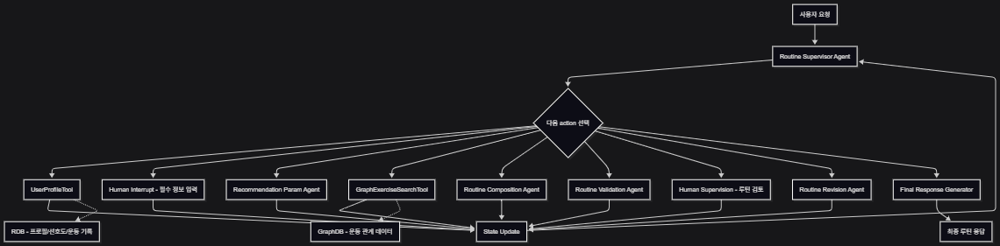
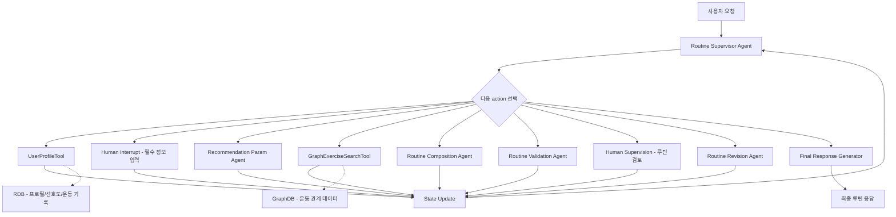
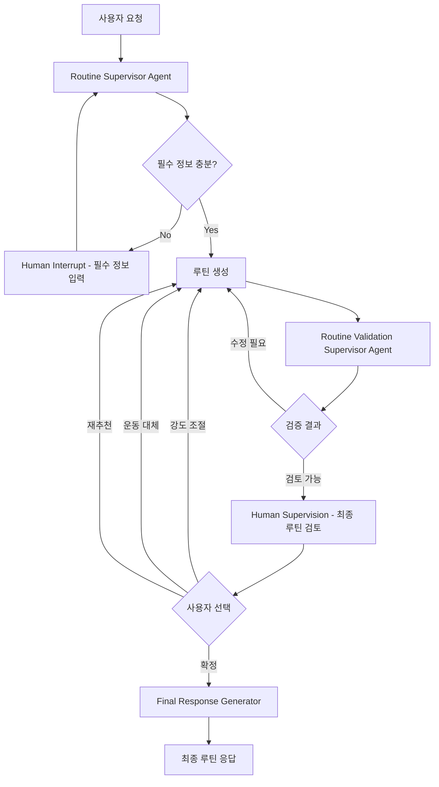

# LangChain 기반 운동 루틴 추천 시스템 기획서

## 1. 확정된 서비스 범위

본 프로젝트의 LangChain 담당 범위는 **GraphDB 기반 5분할 운동 루틴 추천 시스템**으로 한정한다.

| 구분 | 범위 | 설명 |
|---|---|---|
| 포함 | GraphDB 기반 5분할 루틴 추천 | 사용자 조건과 운동 관계 데이터를 기반으로 루틴 생성 |
| 포함 | Routine Supervisor Agent | 현재 State를 보고 다음 action 선택 |
| 포함 | Human-in-the-loop | 필수 정보 입력, 최종 루틴 검토 |
| 포함 | RDB 사용자 프로필 연동 | 목표, 수준, 장비, 부상 이력, 선호도, 운동 기록 조회 |
| 포함 | GraphDB 운동 후보 조회 | 운동-근육-장비-목표-난이도 관계 기반 후보 조회 |
| 제외 | RAG 기반 운동 챗봇 | 이번 구현 범위에서 제외 |
| 제외 | Vector DB 기반 문서 검색 | 이번 구현 범위에서 제외 |

> 기존에 논의했던 RAG 챗봇 서비스는 현재 프로젝트 범위에서 제외한다. 이후 필요 시 별도 서비스로 다시 설계할 수 있으나, 현재 LangChain 구현은 추천 시스템에 집중한다.

---

## 2. 추천 시스템 개요

GraphDB 기반 5분할 루틴 추천 서비스는 사용자의 운동 목표, 수준, 장비, 부상/통증 여부, 선호도, 운동 기록을 바탕으로 개인화된 운동 루틴을 생성한다.

핵심 흐름은 다음과 같다.

```text
사용자 요청
→ Routine Supervisor Agent
→ 필수 정보 확인
→ GraphDB 조회 조건 생성
→ 운동 후보 조회
→ 5분할 루틴 생성
→ 루틴 검증
→ Human Supervision
→ 최종 루틴 응답
```

---

## 3. 추천 시스템 상세 구조



<details>
<summary>Mermaid 원본 코드</summary>



</details>

구조도는 `Routine Supervisor Agent`가 현재 State를 기준으로 선택할 수 있는 action 공간을 표현한다. 각 Sub-Agent, Tool, Human Interrupt 실행 결과는 State에 반영되고, Supervisor Agent가 다시 다음 action을 결정한다.

---

## 4. v2 단순 구조

초기 구현은 v2 단순 구조를 우선한다.

v2는 `Routine Revision Agent`를 별도로 두지 않고, Human Supervision에서 나온 피드백을 다시 `루틴 생성` 단계에 반영한다.



v2 구조에서 `루틴 생성`은 `Recommendation Param Agent`, `GraphExerciseSearchTool`, `Routine Composition Agent`를 포함하는 묶음 단계로 본다. `Routine Validation Supervisor Agent`는 생성된 루틴의 강도, 부상 위험, 장비 조건, 부위 균형을 검증하고, 수정이 필요하면 루틴 생성 단계로 되돌린다.

---

## 5. Agent 목록

| Agent | 역할 | 입력 정보 | 정보 출처 |
|---|---|---|---|
| `Routine Supervisor Agent` | LLM 기반 Orchestration Agent. 전체 State를 보고 다음 action 선택 | 사용자 요청, 프로필, 루틴 상태, 검증 결과 | LangChain State + LLM |
| `Profile Clarification Agent` | 필수 정보 누락 판단, 추가 질문 생성, 사용자 답변 구조화 | 사용자 요청, RDB 프로필 | 사용자 입력 + RDB |
| `Recommendation Param Agent` | GraphDB 조회 조건 생성, 우선 조건/제외 조건 분리 | 사용자 요청, 프로필, 목표, 제한 조건 | LangChain + LLM |
| `Routine Composition Agent` | 운동 후보를 5분할 루틴으로 조립, 세트/반복/휴식 구성 | 운동 후보 목록, 사용자 수준, 목표 | GraphDB 결과 + LLM |
| `Routine Validation Agent` | 루틴 강도, 부상 위험, 부위 균형, 장비 조건 충돌 검증 | 생성 루틴, 사용자 프로필, 운동 관계 정보 | Rule + LLM |
| `Routine Revision Agent` | v1 고도화용. 최종 확인 피드백을 반영해 루틴 수정 | 사용자 피드백, 검증 결과, 기존 루틴 | 사용자 입력 + LLM |

> 공통 규칙: 모든 Agent는 반드시 LLM에 연결한다. 초기 구현은 Groq 기반 LLM Provider를 사용한다.

---

## 6. Tool / Node 목록

| Tool / Node | 분류 | 역할 | 입력 정보 | 정보 출처 |
|---|---|---|---|---|
| `UserProfileTool` | Tool | 목표, 수준, 장비, 부상 이력, 선호도, 운동 기록 조회 | `user_id` | RDB |
| `GraphExerciseSearchTool` | Tool | 조건에 맞는 운동 후보 조회 | 부위, 목표, 수준, 장비, 제외 조건 | GraphDB via Backend API |
| `ExerciseNameNormalizer` | Tool / Utility | 운동명/별칭을 표준 `exercise_id`로 정규화 | 운동명, 별칭 | 임시 mapping → 추후 DB |
| `ExerciseDetailLookupTool` | Tool | 운동 상세, 주의사항, 영상 URL 조회 | `exercise_id` 목록 | RDB/GraphDB/media metadata |
| `RoutineSaveTool` | Tool | 사용자가 확정한 루틴 저장 | 확정 루틴, `user_id` | RDB |
| `Human Interrupt - 필수 정보 입력` | Interrupt Node | 추천 전 필수 정보 부족 시 사용자 입력 요청 | 누락 정보 목록 | 사용자 입력 |
| `Human Supervision - 루틴 검토` | Interrupt Node | 생성 루틴을 사용자에게 제시하고 확정/수정 피드백 수집 | 루틴 초안, 검증 결과 | 사용자 입력 |
| `Final Response Generator` | Chain / Formatter | 확정 루틴, 추천 근거, 주의사항을 최종 응답으로 정리 | 확정 루틴, 검증 결과, 사용자 프로필 | Prompt + LLM |

---

## 7. Human-in-the-loop 적용 지점

| 위치 | 목적 | 발동 조건 | 이후 흐름 |
|---|---|---|---|
| 추천 시작 전 | 필수 정보 보완 | 나이, 운동 수준, 목표, 장비, 운동 가능일, 부상/통증 여부 등 누락 | 사용자 입력을 State에 반영 후 Supervisor로 복귀 |
| 루틴 생성/검증 후 | 루틴 확정 확인 및 피드백 수집 | 루틴 생성/검증 완료 후 항상 또는 위험도 높을 때 | 확정 시 최종 응답 생성, 수정 요청 시 v2는 루틴 생성으로 복귀 |

---

## 8. GraphDB 조회 방식

`GraphExerciseSearchTool`은 LLM이 Cypher Query를 직접 생성하지 않는다.

LangChain은 `Recommendation Param Agent`를 통해 사용자의 목표, 수준, 장비, 제외 조건을 구조화한 파라미터로 추출하고, 백엔드는 사전에 정의된 Cypher Query Template을 사용해 GraphDB를 조회한다.

| 구분 | 설계 내용 |
|---|---|
| LLM 역할 | 사용자 요청과 프로필을 분석해 조회 조건 구조화 |
| 백엔드 역할 | 정해진 Cypher Query Template에 파라미터를 주입해 GraphDB 조회 |
| GraphDB 역할 | 조건에 맞는 운동 후보와 관계 근거 반환 |
| 장점 | 쿼리 오류와 보안 위험 감소, LangChain과 백엔드 책임 분리 |

---

## 9. 데이터 연결 원칙

현재 RAG는 구현 범위에서 제외하지만, 운동 데이터 연결을 위해 `exercise_id`는 반드시 유지한다.

```text
GraphDB Exercise Node.exercise_id
RDB exercise metadata.exercise_id
운동 영상 metadata.exercise_id
```

이를 통해 추천 루틴에 포함된 운동별 영상, 주의사항, 상세 설명을 최종 응답에 붙일 수 있다.

---

## 10. 최종 요약

현재 LangChain 구현 범위는 **GraphDB 기반 운동 루틴 추천 시스템**이다.

RAG 챗봇과 Vector DB 문서 검색은 구현 범위에서 제외한다.

LangChain은 다음을 담당한다.

- Routine Supervisor Agent 설계 및 구현
- Agent/Tool 호출 흐름 관리
- RDB/GraphDB 연동 interface 설계
- Mock 기반 선구현
- Human-in-the-loop 적용
- 루틴 생성, 검증, 최종 응답 생성
- 모델 교체 가능한 LLM Provider 구조
