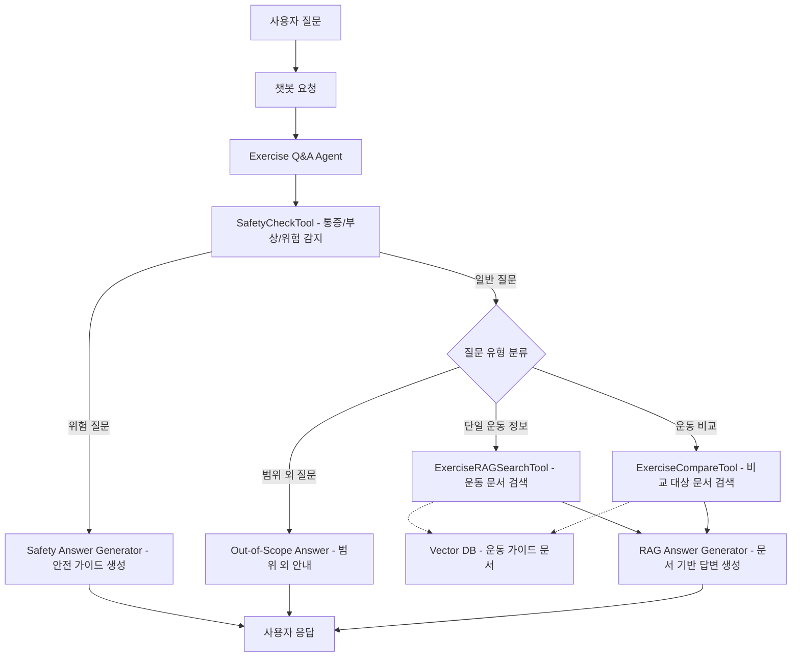
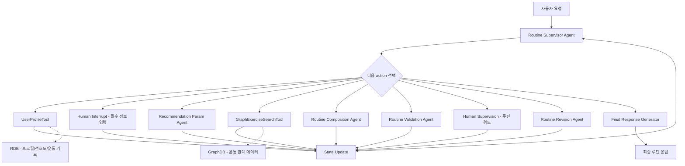

# LangChain 기반 AI 운동 서비스 기획서

## 1. 확정된 서비스 범위

본 프로젝트의 AI 기능은 다음 두 서비스로 분리하여 설계한다.

| 서비스 | 핵심 목적 | 주요 데이터 출처 | LangChain 담당 |
|---|---|---|---|
| RAG 기반 운동 챗봇 | 운동 자세, 자극 부위, 호흡법, 주의사항, 비교 질문 답변 | Vector DB | Exercise Q&A Agent, RAG 검색 Tool, 안전 응답, 답변 생성 Prompt |
| GraphDB 기반 5분할 루틴 추천 | 사용자 조건에 맞는 5분할 루틴 생성 및 추천 이유 설명 | RDB + GraphDB | Routine Supervisor Agent, Sub-Agent 호출, Human Interrupt, 루틴 구성/검증 |

> 두 서비스는 Main Router로 묶지 않는다. 각각 별도의 서비스로 동작하며, LangChain 내부에서도 Agent와 Tool 체계를 분리한다.

---

## 2. RAG 기반 운동 챗봇 서비스

운동 정보 질의응답 전용 서비스다. 사용자의 질문을 받아 안전 위험을 먼저 확인하고, 질문 유형에 따라 Vector DB의 운동 문서를 검색한 뒤 문서 기반 답변을 생성한다.


<details>
<summary>Mermaid 원본 코드</summary>



</details>

### RAG Agent / Tool 목록

| Agent / Tool | 역할 | 입력 정보 | 정보 출처 |
|---|---|---|---|
| `Exercise Q&A Agent` | RAG 챗봇 전체 흐름 제어 및 Tool 호출 판단 | 사용자 질문 | 사용자 입력 |
| `SafetyCheckTool` | 통증, 부상, 위험 표현 감지 및 안전 응답 분기 | 사용자 질문 | 사용자 입력 + LangChain Rule |
| `ExerciseRAGSearchTool` | 운동 자세, 자극 부위, 호흡법, 주의사항 관련 문서 검색 | 질문, 운동명, 부위명 | Vector DB |
| `ExerciseCompareTool` | 두 운동의 차이 비교를 위해 관련 운동 문서 조회 | 비교 대상 운동명 2개 | Vector DB |
| `RAG Answer Generator` | 검색 문서와 안전 체크 결과를 바탕으로 최종 답변 생성 | 질문, 검색 결과, 안전 판단 결과 | Prompt + LLM |

### RAG 챗봇 정보 출처

| 데이터 | 설명 | 출처 |
|---|---|---|
| 사용자 질문 | 운동 자세, 자극 부위, 호흡법, 주의사항, 비교 질문 | Frontend |
| 운동 문서 | 운동 소개, 시작 자세, 운동 동작, 호흡법, 주의사항, 유사 운동 | Vector DB |
| 안전 판단 기준 | 통증/부상/위험 키워드 및 답변 제한 규칙 | LangChain Rule / Prompt |
| 최종 답변 | 문서 기반 자연어 답변 | LLM |

### RAG 서비스 처리 흐름

```text
사용자 질문
→ 챗봇 요청
→ Exercise Q&A Agent
→ SafetyCheckTool
→ 질문 유형 분류
→ ExerciseRAGSearchTool 또는 ExerciseCompareTool
→ RAG Answer Generator
→ 사용자 응답
```

운동 비교 Tool은 모든 질문에서 호출하지 않고, 비교 질문으로 분류된 경우에만 호출한다. 통증이나 부상 위험이 높은 질문은 안전 응답을 우선 생성한다.

---

## 3. GraphDB 기반 5분할 루틴 추천 서비스

이 문서는 추천 서비스 구현을 위한 LLM 코딩용 설계도다. 구현 기준은 v1 Supervisor 구조이며, Routine Supervisor Agent가 현재 State를 보고 사전에 정의된 action 중 하나를 선택한다. 각 Agent는 독립된 LLM Chain 또는 LangGraph Node로 구현하고, 모든 Agent에는 `gemma4:e2b` LLM을 연결한다.

추천 서비스는 5분할 루틴 추천 전용 서비스다. 사용자 프로필과 선호도, 운동 기록은 RDB에서 조회하고, 운동 후보는 GraphDB의 운동-근육-장비-목표-난이도 관계를 활용해 가져온다. LLM은 자연어 이해, 조건 구조화, 루틴 조립, 검증 판단, 피드백 반영, 최종 설명 생성을 담당한다. DB 조회, 저장, 쿼리 실행은 Tool과 백엔드 API가 담당한다.

### 구현 원칙

| 원칙 | 구현 기준 |
|---|---|
| 하드코딩 배제 | 운동명, 부위별 운동 목록, 장비 매핑, 추천 결과를 코드에 고정하지 않는다. 운동 후보와 관계 정보는 GraphDB 또는 RDB에서 조회한다. |
| 모든 Agent LLM 연결 | `Routine Supervisor Agent`, `Profile Clarification Agent`, `Recommendation Param Agent`, `Routine Composition Agent`, `Routine Validation Agent`, `Routine Revision Agent`, `Final Response Generator`는 모두 `gemma4:e2b` 모델을 사용한다. |
| Supervisor 구조 유지 | 추천 흐름은 단순 파이프라인이 아니라 Supervisor가 State를 기반으로 다음 action을 선택하는 구조로 구현한다. |
| 정해진 action만 실행 | Supervisor는 자유 텍스트 명령이 아니라 JSON 형식으로 `next_action`을 반환하고, 백엔드는 허용된 action 목록만 실행한다. |
| LLM 쿼리 생성 금지 | LLM은 Cypher를 직접 생성하지 않는다. LLM은 조회 파라미터만 만들고, 백엔드는 사전 정의된 Cypher Query Template을 사용한다. |
| State 중심 구현 | 모든 Agent와 Tool의 결과는 LangGraph State에 누적하고, Supervisor는 최신 State만 보고 다음 단계를 결정한다. |

Human-in-the-loop는 별도의 Agent가 아니라 LangGraph 실행을 잠시 멈추는 interrupt 지점으로 설계한다. 추천 시작 전 필수 정보가 부족한 경우와 최종 루틴 확인이 필요한 경우에 interrupt가 발생하며, 사용자 입력을 받은 뒤 다시 Routine Supervisor Agent로 복귀한다.


<details>
<summary>Mermaid 원본 코드</summary>



</details>

구조도는 Routine Supervisor Agent가 현재 State를 기준으로 선택할 수 있는 action 공간을 표현한다. 각 Sub-Agent, Tool, Human Interrupt 실행 결과는 State에 반영되고, Supervisor Agent가 다시 다음 action을 결정한다.

### Supervisor action 제어

Supervisor Agent는 자유 텍스트로 다음 행동을 정하지 않고, 사전에 정의된 action 목록 중 하나를 선택하도록 제한한다. 이를 통해 LLM의 판단을 활용하되 실행 흐름은 안정적으로 제어한다. Supervisor 응답은 반드시 JSON으로 파싱 가능해야 한다.

```json
{
  "next_action": "CALL_VALIDATION_AGENT",
  "reason": "루틴 초안이 생성되었으므로 안전성 검증이 필요합니다."
}
```

허용 action 목록은 다음과 같다.

```text
CALL_USER_PROFILE_TOOL
REQUEST_REQUIRED_INFO
CALL_RECOMMENDATION_PARAM_AGENT
CALL_GRAPH_SEARCH_TOOL
CALL_COMPOSITION_AGENT
CALL_VALIDATION_AGENT
REQUEST_FINAL_HUMAN_REVIEW
CALL_REVISION_AGENT
CALL_FINAL_RESPONSE_GENERATOR
END
```

각 action의 실행 조건은 다음과 같다.

| Action | 실행 대상 | 실행 조건 | State 업데이트 |
|---|---|---|---|
| `CALL_USER_PROFILE_TOOL` | `UserProfileTool` | `user_id`는 있지만 프로필 정보가 State에 없을 때 | `user_profile`, `preferences`, `workout_history` |
| `REQUEST_REQUIRED_INFO` | Human Interrupt | 추천 필수 정보가 부족할 때 | `missing_fields`, `human_answers` |
| `CALL_RECOMMENDATION_PARAM_AGENT` | `Recommendation Param Agent` | 프로필과 사용자 요청이 준비되었지만 GraphDB 조회 파라미터가 없을 때 | `recommendation_params` |
| `CALL_GRAPH_SEARCH_TOOL` | `GraphExerciseSearchTool` | 조회 파라미터는 있지만 운동 후보가 없거나 재조회가 필요할 때 | `exercise_candidates` |
| `CALL_COMPOSITION_AGENT` | `Routine Composition Agent` | 운동 후보가 준비되었지만 루틴 초안이 없을 때 | `routine_draft` |
| `CALL_VALIDATION_AGENT` | `Routine Validation Agent` | 루틴 초안이 있고 검증 결과가 없거나 수정 후 재검증이 필요할 때 | `validation_result` |
| `REQUEST_FINAL_HUMAN_REVIEW` | Human Interrupt | 루틴 검증이 통과되었고 사용자 최종 확인이 필요할 때 | `human_review_result` |
| `CALL_REVISION_AGENT` | `Routine Revision Agent` | 검증 실패 또는 사용자 수정 요청이 있을 때 | `revision_request`, `routine_draft` |
| `CALL_FINAL_RESPONSE_GENERATOR` | `Final Response Generator` | 루틴이 검증되고 사용자가 확정했을 때 | `final_response` |
| `END` | 종료 | 최종 응답 생성이 완료되었을 때 | 없음 |

### LangGraph State 설계

추천 서비스 State는 Agent와 Tool 사이의 단일 공유 데이터 구조다. 구현 시 필드는 Pydantic model 또는 TypedDict로 정의한다.

```json
{
  "user_id": "string",
  "user_message": "string",
  "user_profile": {
    "age": "number | null",
    "gender": "string | null",
    "level": "beginner | intermediate | advanced | null",
    "goal": "hypertrophy | strength | fat_loss | health | null",
    "available_days": "number | null",
    "available_equipment": ["string"],
    "injuries": ["string"],
    "pain_points": ["string"],
    "preferences": ["string"],
    "disliked_exercises": ["string"]
  },
  "workout_history": [
    {
      "date": "string",
      "exercise_name": "string",
      "sets": "number",
      "reps": "string",
      "weight": "number | null"
    }
  ],
  "missing_fields": ["string"],
  "human_answers": {},
  "recommendation_params": {},
  "exercise_candidates": [],
  "routine_draft": null,
  "validation_result": null,
  "human_review_result": null,
  "revision_request": null,
  "final_response": null,
  "next_action": "string",
  "action_history": []
}
```

필수 추천 정보는 다음과 같다.

| 필드 | 설명 |
|---|---|
| `level` | 운동 수준 |
| `goal` | 운동 목표 |
| `available_days` | 주간 운동 가능일. 5분할 추천이므로 기본적으로 5일 이상이 필요하다. |
| `available_equipment` | 사용 가능한 장비 |
| `injuries` / `pain_points` | 부상 이력 또는 현재 통증 여부 |

### 루틴 추천 Agent 목록

| Agent | LLM | 역할 | 입력 정보 | 출력 |
|---|---|---|---|---|
| `Routine Supervisor Agent` | `gemma4:e2b` | 전체 State를 보고 다음 action을 선택하는 Orchestration Agent | 전체 State | `{ "next_action": "...", "reason": "..." }` |
| `Profile Clarification Agent` | `gemma4:e2b` | 필수 정보 누락 여부 판단, 추가 질문 생성, 사용자 답변 구조화 | 사용자 요청, RDB 프로필, 현재 State | `missing_fields`, `clarification_question`, `structured_answers` |
| `Recommendation Param Agent` | `gemma4:e2b` | GraphDB 조회 조건을 구조화하고 우선 조건/제외 조건 분리 | 사용자 요청, 프로필, 목표, 제한 조건 | `recommendation_params` |
| `Routine Composition Agent` | `gemma4:e2b` | 운동 후보를 5분할 루틴으로 조립하고 세트/반복/휴식 시간 구성 | 운동 후보 목록, 사용자 수준, 목표, 기록 | `routine_draft` |
| `Routine Validation Agent` | `gemma4:e2b` | 루틴 강도, 부상 위험, 부위 균형, 장비 조건 충돌 검증 | 생성 루틴, 사용자 프로필, 운동 관계 정보 | `validation_result` |
| `Routine Revision Agent` | `gemma4:e2b` | 검증 결과 또는 사용자 피드백을 반영해 루틴 수정 방향 생성 | 사용자 피드백, 검증 결과, 기존 루틴 | `revision_request`, revised `routine_draft` |
| `Final Response Generator` | `gemma4:e2b` | 확정 루틴, 추천 근거, 수행 팁, 주의사항을 사용자 응답으로 정리 | 확정 루틴, 검증 결과, 사용자 프로필 | `final_response` |

### Agent별 구현 명세

#### Routine Supervisor Agent

목적은 State 기반 action 선택이다. Supervisor는 실제 루틴 내용을 직접 생성하지 않고, 다음에 실행할 Agent 또는 Tool만 결정한다.

입력:

```json
{
  "state": "전체 추천 State"
}
```

출력:

```json
{
  "next_action": "CALL_USER_PROFILE_TOOL",
  "reason": "프로필 정보가 아직 조회되지 않았습니다."
}
```

제약:

- `next_action`은 허용된 action 목록 중 하나만 가능하다.
- 같은 action이 반복될 경우 `action_history`를 확인해 무한 루프를 방지한다.
- 최종 응답 생성 전에는 반드시 루틴 생성, 검증, 사용자 확인 단계를 통과해야 한다.
- Supervisor는 DB를 직접 조회하지 않는다.
- Supervisor는 운동 후보나 최종 루틴을 하드코딩하지 않는다.

#### Profile Clarification Agent

목적은 추천에 필요한 필수 정보가 충분한지 판단하고 부족한 정보를 사용자에게 질문하는 것이다.

출력 예시:

```json
{
  "missing_fields": ["level", "available_equipment", "injuries"],
  "clarification_question": "운동 수준, 사용 가능한 장비, 부상 또는 통증 여부를 알려주세요.",
  "structured_answers": {}
}
```

필수 정보가 충분하면 `missing_fields`는 빈 배열로 반환한다.

#### Recommendation Param Agent

목적은 GraphDB 조회에 사용할 구조화 파라미터를 생성하는 것이다. LLM은 Cypher를 생성하지 않는다.

출력 예시:

```json
{
  "split_targets": ["chest", "back", "legs", "shoulders", "arms"],
  "goal": "hypertrophy",
  "level": "intermediate",
  "available_equipment": ["barbell", "dumbbell", "machine", "cable"],
  "exclude_muscles": [],
  "exclude_exercises": ["behind neck press"],
  "avoid_conditions": ["shoulder_pain"],
  "priority_rules": [
    "compound_first",
    "match_available_equipment",
    "avoid_pain_trigger"
  ],
  "candidate_limit_per_target": 12
}
```

#### Routine Composition Agent

목적은 GraphDB에서 조회된 운동 후보를 5분할 루틴으로 조립하는 것이다. 운동 후보에 없는 운동은 생성하지 않는다.

루틴 초안 출력 예시:

```json
{
  "split_type": "5-day",
  "days": [
    {
      "day": 1,
      "target": "chest",
      "exercises": [
        {
          "exercise_id": "ex_001",
          "name": "Bench Press",
          "sets": 4,
          "reps": "8-10",
          "rest_seconds": 90,
          "intensity": "moderate",
          "reason": "가슴 주요 근육과 근비대 목표에 적합합니다."
        }
      ]
    }
  ]
}
```

구성 규칙:

- 5분할 기본 타겟은 GraphDB 또는 설정 테이블에서 가져온다.
- 각 운동은 `exercise_candidates`에 존재해야 한다.
- 세트, 반복, 휴식 시간은 사용자 수준과 목표를 기준으로 LLM이 결정하되, 허용 범위는 설정값으로 관리한다.
- 부상 또는 통증과 충돌하는 운동은 제외한다.
- 운동 순서는 복합 운동에서 보조 운동 순으로 구성한다.

#### Routine Validation Agent

목적은 루틴 초안이 사용자 조건과 안전 기준을 만족하는지 검증하는 것이다.

출력 예시:

```json
{
  "is_valid": false,
  "risk_level": "medium",
  "issues": [
    {
      "type": "injury_conflict",
      "message": "어깨 통증이 있는데 오버헤드 프레스가 포함되어 있습니다.",
      "target_day": 4,
      "exercise_id": "ex_022"
    }
  ],
  "revision_instructions": [
    "어깨 통증을 유발할 수 있는 수직 프레스 운동을 제외하고 대체 운동을 선택하세요."
  ]
}
```

검증 기준:

- 사용자 장비 조건과 운동 장비 요구사항이 일치하는가
- 부상 이력 또는 통증 부위와 충돌하지 않는가
- 사용자 수준 대비 운동 난이도와 총 운동량이 과하지 않은가
- 5분할 부위 균형이 맞는가
- 같은 부위의 고강도 운동이 과도하게 중복되지 않는가
- GraphDB 후보에 없는 운동이 포함되지 않았는가

#### Routine Revision Agent

목적은 검증 실패 또는 사용자 피드백을 반영해 루틴을 수정하는 것이다. Revision Agent는 기존 루틴 전체를 무조건 폐기하지 않고, 수정이 필요한 부분만 바꾸는 것을 우선한다.

입력:

```json
{
  "routine_draft": "기존 루틴",
  "validation_result": "검증 결과",
  "human_review_result": "사용자 피드백"
}
```

출력:

```json
{
  "revision_type": "replace_exercise",
  "revision_reason": "사용자가 어깨 부담이 적은 운동을 요청했습니다.",
  "target_day": 4,
  "target_exercise_id": "ex_022",
  "constraints": {
    "avoid_conditions": ["shoulder_pain"],
    "same_target_muscle": true,
    "available_equipment_only": true
  }
}
```

수정에 새 운동 후보가 필요하면 Supervisor가 다시 `CALL_GRAPH_SEARCH_TOOL`을 선택한다.

#### Final Response Generator

목적은 확정된 루틴을 사용자에게 보여줄 최종 응답으로 변환하는 것이다.

최종 응답에는 다음이 포함되어야 한다.

- 5일치 루틴 표
- 각 운동의 세트, 반복, 휴식 시간
- 추천 이유
- 사용자 조건 반영 내용
- 부상/통증 관련 주의사항
- 다음 수정 요청이 가능하다는 안내

### 루틴 추천 Tool / Node 목록

| Tool / Node | 분류 | LLM 사용 | 역할 | 입력 정보 | 정보 출처 |
|---|---|---|---|---|---|
| `UserProfileTool` | Tool | 사용 안 함 | 목표, 수준, 장비, 부상 이력, 선호도, 운동 기록 조회 | `user_id` | RDB |
| `GraphExerciseSearchTool` | Tool | 사용 안 함 | 조건에 맞는 운동 후보 조회 | 부위, 목표, 수준, 장비, 제외 조건 | GraphDB via Backend API |
| `RoutineSaveTool` | Tool | 사용 안 함 | 사용자가 확정한 루틴 저장 | 확정 루틴, `user_id` | RDB |
| `Human Interrupt - 필수 정보 입력` | Interrupt Node | 사용 안 함 | 추천 전 필수 정보가 부족할 때 사용자 입력 요청 | 누락 정보 목록 | 사용자 입력 |
| `Human Interrupt - 최종 루틴 확인` | Interrupt Node | 사용 안 함 | 생성된 루틴 초안을 사용자에게 확인받고 수정/확정 선택 수집 | 루틴 초안, 검증 결과 | 사용자 입력 |

Tool은 LLM Agent가 아니므로 LLM을 붙이지 않는다. 단, 모든 Agent와 Generator Chain은 `gemma4:e2b` LLM을 사용한다.

### Human-in-the-loop 적용 지점

| 위치 | 목적 | 발동 조건 | 이후 흐름 |
|---|---|---|---|
| 추천 시작 전 | 필수 정보 보완 | 나이, 운동 수준, 목표, 장비, 운동 가능일, 부상/통증 여부 등 누락 | 사용자 입력을 State에 반영 후 Routine Supervisor Agent로 복귀 |
| 최종 응답 전 | 루틴 확정 확인 및 피드백 수집 | 루틴 생성/검증 완료 후 항상 또는 위험도 높을 때 | 확정 시 최종 응답 생성, 수정 요청 시 Routine Revision Agent 호출 |

최종 루틴 확인에서 받을 수 있는 사용자 선택지는 다음과 같다.

```json
{
  "decision": "approve | adjust_intensity | replace_exercise | regenerate",
  "feedback": "string"
}
```

### 추천 서비스 실행 흐름

```text
사용자 요청
→ Routine Supervisor Agent
→ UserProfileTool
→ Routine Supervisor Agent
→ Profile Clarification Agent
→ 필수 정보 부족 시 Human Interrupt
→ Routine Supervisor Agent
→ Recommendation Param Agent
→ Routine Supervisor Agent
→ GraphExerciseSearchTool
→ Routine Supervisor Agent
→ Routine Composition Agent
→ Routine Supervisor Agent
→ Routine Validation Agent
→ 검증 실패 시 Routine Revision Agent 또는 GraphExerciseSearchTool 재호출
→ 검증 통과 시 Human Interrupt - 최종 루틴 확인
→ 수정 요청 시 Routine Revision Agent
→ 확정 시 Final Response Generator
→ END
```

### GraphDB 추천 정보 출처

| 데이터 | 설명 | 출처 |
|---|---|---|
| 사용자 요청 | 5분할 루틴 추천, 목표, 조건 입력 | Frontend |
| 사용자 프로필 | 목표, 운동 수준, 장비, 부상 이력, 선호도, 운동 기록 | RDB |
| 운동 관계 데이터 | 운동-근육-장비-목표-난이도 관계 | GraphDB |
| 5분할 기준 | 가슴/등/하체/어깨/팔 등 분할 규칙 | GraphDB 또는 RDB 설정 테이블 |
| 루틴 구성 규칙 | 세트 수, 반복 수, 휴식 시간, 운동 순서의 허용 범위 | RDB 설정 테이블 또는 환경 설정 |
| 사용자 확인/피드백 | 필수 정보 보완, 최종 루틴 확정, 강도 조절, 운동 대체 요청 | Human Interrupt |
| 최종 응답 | 추천 이유, 수행 팁, 주의사항, 확정 루틴 | Final Response Generator |

---

## 4. GraphDB 조회 방식 확정

`GraphExerciseSearchTool`은 LLM이 Cypher Query를 직접 생성하지 않는다.

LangChain은 Recommendation Param Agent를 통해 사용자의 목표, 수준, 장비, 제외 조건을 구조화한 파라미터로 추출하고, 백엔드는 사전에 정의된 Cypher Query Template을 사용해 GraphDB를 조회한다.

| 구분 | 설계 내용 |
|---|---|
| LLM 역할 | Recommendation Param Agent가 사용자 요청과 프로필을 분석해 조회 조건을 구조화한다. |
| 백엔드 역할 | 정해진 Cypher Query Template에 파라미터를 주입해 GraphDB를 조회한다. |
| GraphDB 역할 | 조건에 맞는 운동 후보와 관계 근거를 반환한다. |
| 장점 | 쿼리 오류와 보안 위험을 줄이고, 백엔드와 LangChain의 책임 범위를 명확히 한다. |

### GraphExerciseSearchTool 입력 스키마

```json
{
  "split_targets": ["chest", "back", "legs", "shoulders", "arms"],
  "goal": "hypertrophy",
  "level": "intermediate",
  "available_equipment": ["barbell", "dumbbell", "machine", "cable"],
  "exclude_exercises": ["string"],
  "avoid_conditions": ["string"],
  "candidate_limit_per_target": 12
}
```

### GraphExerciseSearchTool 출력 스키마

```json
{
  "candidates_by_target": {
    "chest": [
      {
        "exercise_id": "ex_001",
        "name": "Bench Press",
        "target_muscles": ["pectoralis_major"],
        "assist_muscles": ["triceps", "front_deltoid"],
        "equipment": ["barbell", "bench"],
        "difficulty": "intermediate",
        "goal_tags": ["hypertrophy", "strength"],
        "risk_tags": ["shoulder_load"],
        "reason_facts": [
          "matches_goal:hypertrophy",
          "matches_equipment:barbell",
          "targets:pectoralis_major"
        ]
      }
    ]
  }
}
```

### Cypher Template 원칙

- 쿼리 문자열은 백엔드 코드 또는 설정 파일에 Template으로 고정한다.
- 사용자 입력은 파라미터 바인딩으로만 전달한다.
- LLM 출력값은 enum, 배열, 숫자 범위 검증을 통과해야 Tool에 전달한다.
- 후보가 부족한 부위는 `insufficient_targets`에 기록하고 Supervisor가 재조회 또는 필수 정보 보완을 결정한다.

---

## 5. 최종 요약

RAG 기반 운동 챗봇 서비스는 Vector DB의 운동 문서를 기반으로 운동 정보 질의응답을 수행한다.

GraphDB 기반 5분할 루틴 추천 서비스는 RDB의 사용자 프로필과 GraphDB의 운동 관계 데이터를 활용해 사용자 맞춤 루틴을 생성한다. 구현 기준은 v1 Supervisor 구조이며, 모든 Agent는 `gemma4:e2b` LLM을 사용한다.

두 서비스는 독립적인 Agent와 Tool 구조를 가지며, LangChain은 각 서비스의 Tool 호출 흐름, Prompt 설계, 안전 응답, 최종 자연어 응답 생성을 담당한다.

