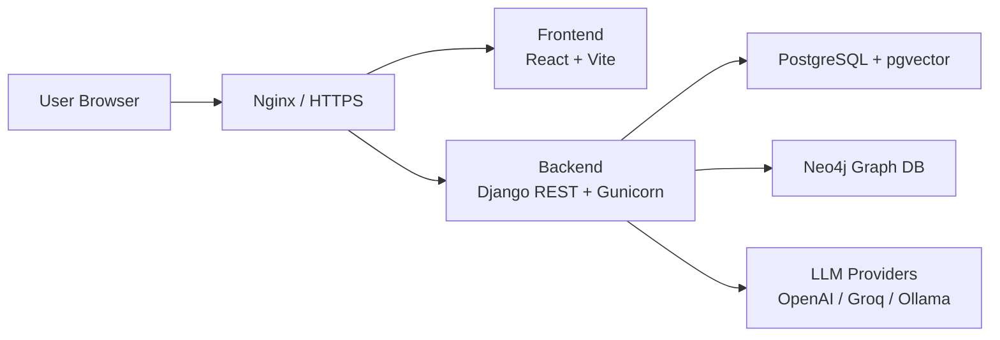

# HELBOTIN

AI 기반 운동 상담, 운동 백과, 주간 루틴 설계를 제공하는 개인 맞춤형 피트니스 웹 서비스입니다.

## Demo

- Web: https://sk-camp.cloud
- API Docs: 준비 중
- Video: 준비 중

## Features

- AI 운동 상담: 운동 목표, 통증 부위, 운동 방법에 대한 자연어 상담과 세션 기록 관리
- 운동 백과: 운동 목록, 상세 가이드, 운동 영상, 카테고리 기반 탐색 제공
- 주간 루틴 설계: 사용자 프로필과 목표를 기반으로 AI 추천 루틴 생성 및 저장
- 대체 운동 추천: 운동별 대체 운동을 확인하고 주간 루틴 안에서 교체 가능
- 회원/게스트 지원: 로그인 사용자와 `device_uuid` 기반 게스트 사용자 모두 지원

## Screenshots

이미지 준비 중

## Tech Stack

### Frontend

- React 18
- Vite
- React Router
- lucide-react
- react-markdown

### Backend

- Python 3.12
- Django 4.2
- Django REST Framework
- Gunicorn

### Database

- PostgreSQL 16
- pgvector
- Neo4j
- APOC

### AI

- OpenAI
- Groq
- Ollama
- LangGraph
- LangChain

### Infra

- Docker
- Docker Compose
- Nginx
- AWS EC2
- Certbot / Let's Encrypt

## Architecture



## Project Structure

```text
.
├── backend/
│   ├── api/
│   │   ├── auth_views.py
│   │   ├── models.py
│   │   ├── views.py
│   │   └── services/
│   │       ├── chatbot/
│   │       ├── llm/
│   │       ├── RAG/
│   │       └── routine_recommender.py
│   ├── config/
│   ├── data/
│   ├── db/
│   ├── Dockerfile
│   ├── manage.py
│   └── requirements.txt
├── frontend/
│   ├── public/
│   ├── src/
│   │   ├── api/
│   │   ├── components/
│   │   ├── pages/
│   │   └── utils/
│   ├── Dockerfile
│   ├── Dockerfile.prod
│   ├── nginx.conf
│   └── package.json
├── docker-compose.yml
├── docker-compose.prod.yml
├── .env.sample
├── .env.prod.sample
└── AWS_DEPLOY.md
```

## Installation

```bash
git clone <repository-url>
cd SKN27-4th-4team
cp .env.sample .env
```

Frontend 의존성 설치:

```bash
cd frontend
npm install
```

Backend 의존성 설치:

```bash
cd backend
python -m venv .venv
source .venv/bin/activate
pip install -r requirements.txt
```

Windows PowerShell:

```powershell
cd backend
python -m venv .venv
.\.venv\Scripts\Activate.ps1
pip install -r requirements.txt
```

## Environment Variables

`.env.sample` 또는 `.env.prod.sample`을 기준으로 환경 변수를 설정합니다.

```env
DB_HOST=db
DB_PORT=5432
DB_NAME=routinegraph
DB_USER=routinegraph
DB_PASSWORD=change-me

SECRET_KEY=change-me
DEBUG=False
ALLOWED_HOSTS=sk-camp.cloud,www.sk-camp.cloud
CORS_ALLOWED_ORIGINS=https://sk-camp.cloud,https://www.sk-camp.cloud
CSRF_TRUSTED_ORIGINS=https://sk-camp.cloud,https://www.sk-camp.cloud

OPENAI_API_KEY=change-me
OPENAI_MODEL=gpt-5-nano
LLM_PROVIDER=openai
EMBEDDING_PROVIDER=openai

NEO4J_URI=bolt://neo4j:7687
NEO4J_USER=neo4j
NEO4J_PASSWORD=change-me
NEO4J_AUTH=neo4j/change-me
```

## Run

### Docker Compose

```bash
docker compose up --build
```

Local URLs:

- Frontend: http://localhost:5173
- Backend API: http://localhost:8000
- Neo4j Browser: http://localhost:7474
- PostgreSQL: localhost:5432

### Production

```bash
cp .env.prod.sample .env.prod
docker compose --env-file .env.prod -f docker-compose.prod.yml up -d --build
```

자세한 AWS EC2 배포 절차는 `AWS_DEPLOY.md`를 참고합니다.

## API

| Method | Endpoint | Description |
| --- | --- | --- |
| `GET` | `/api/exercises/` | 운동 목록 조회 |
| `GET` | `/api/exercises/?full=1` | 운동 전체 정보 조회 |
| `GET` | `/api/exercises/featured/` | 추천 운동 목록 조회 |
| `GET` | `/api/exercises/<exercise_id>/` | 운동 상세 조회 |
| `GET` | `/api/sessions/` | 상담 세션 목록 조회 |
| `POST` | `/api/sessions/` | 상담 세션 생성 |
| `PATCH` | `/api/sessions/<session_id>/` | 상담 세션 이름 변경 |
| `DELETE` | `/api/sessions/<session_id>/` | 상담 세션 삭제 |
| `GET` | `/api/sessions/<session_id>/messages/` | 상담 메시지 조회 |
| `POST` | `/api/sessions/<session_id>/messages/` | 상담 메시지 전송 및 AI 응답 |
| `GET` | `/api/auth/csrf/` | CSRF 토큰 발급 |
| `POST` | `/api/auth/register/` | 회원가입 |
| `POST` | `/api/auth/login/` | 로그인 |
| `POST` | `/api/auth/logout/` | 로그아웃 |
| `GET` | `/api/auth/me/` | 현재 사용자 조회 |
| `GET` | `/api/auth/check-nickname/` | 닉네임 중복 확인 |
| `GET` | `/api/auth/check-email/` | 이메일 중복 확인 |
| `GET` | `/api/routines/` | 주간 루틴 조회 |
| `POST` | `/api/routines/` | 주간 루틴 저장 |
| `POST` | `/api/routines/recommend/` | AI 루틴 추천 생성 |
| `POST` | `/api/routines/recommend/review/` | 추천 루틴 검토 및 수정 요청 |

## Future Work

- API 문서 자동화 및 Swagger/OpenAPI 제공
- 루틴 추천 결과의 개인화 품질 개선
- 운동 영상/이미지 리소스 최적화
- 프론트엔드 페이지 전환 성능 개선
- RDS, S3, CloudFront 기반 운영 인프라 분리
- Neo4j 그래프 데이터 시각화 기능 추가

## Author

이재희
