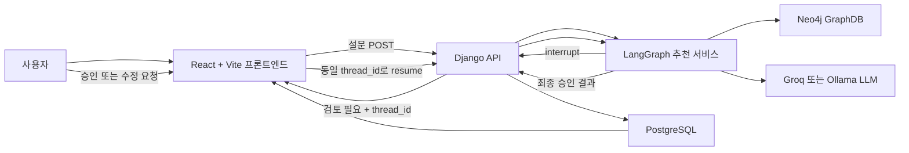
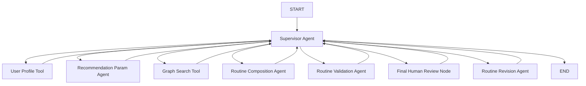
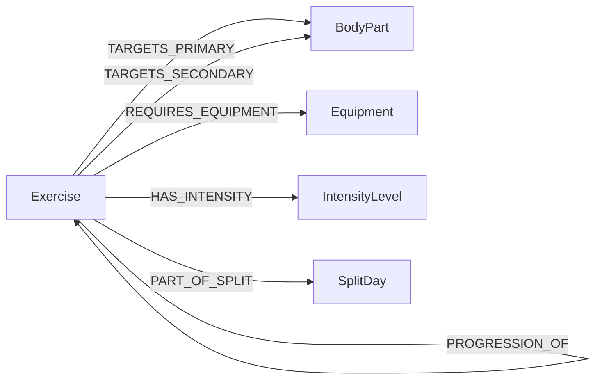

# AI 운동 루틴 추천 시스템 전체 검사 문서

작성 기준일: 2026-06-07  
대상 저장소: `SKN27-4th-4team`  
주요 기능: 설문 기반 5분할 운동 루틴 추천, Neo4j 후보 검색, LangGraph 다중 에이전트 처리, 사람 최종 검토, PostgreSQL 저장

---

## 1. 문서 목적

이 문서는 시스템 전체 검사를 위해 다음 정보를 한곳에 정리한 기술 문서입니다.

- 전체 시스템 구성
- LangGraph 실행 구조
- 에이전트와 Tool 목록
- LLM 호출 위치
- 추천 정책과 하드코딩 범위
- Neo4j GraphDB 구조와 실제 사용 방식
- PostgreSQL 저장 구조
- Django API 계약
- React 프론트엔드 연결 구조
- Human-in-the-loop 처리 방식
- 테스트 및 실행 방법
- 현재 제약, 위험 요소, 검사 체크리스트

이 문서의 설명보다 실제 코드가 최종 기준입니다. 주요 소스 파일은 마지막의 "소스 기준표"를 참고합니다.

---

## 2. 전체 시스템 구성



### 구성 요소

| 영역 | 기술 | 역할 |
|---|---|---|
| 프론트엔드 | React 18, Vite | 설문, 추천 결과, 영상, 수정 요청, 승인, 완료 처리 |
| 백엔드 | Django 4.2 | 추천 API, 검토 API, 운동 목록 API, 루틴 저장 API |
| 오케스트레이션 | LangGraph | Supervisor 기반 추천 단계 라우팅 및 상태 관리 |
| LLM | Groq 또는 Ollama | 파라미터 제안, 루틴 구성, 검증, 피드백 구조화, 최종 설명 |
| 추천 데이터 | Neo4j | 운동 후보, 신체 부위, 장비, 난이도, 대체·유사·진행 관계 |
| 서비스 데이터 | PostgreSQL + pgvector | 운동 상세, 사용자별 승인 루틴, 완료 상태, 상담 데이터 |
| 실행 환경 | Docker Compose | PostgreSQL, Django, React, Neo4j 실행 |

---

## 3. 핵심 데이터 흐름

```text
프론트 설문
→ Django 필수 필드 검사
→ user_profile 구조화
→ LangGraph State 생성
→ Supervisor
→ UserProfileTool
→ Recommendation Param Agent
→ GraphSearchTool
→ Routine Composition Agent
→ Routine Validation Agent
→ 사람 최종 검토 interrupt
→ 승인: LangGraph 종료 및 PostgreSQL 저장
→ 수정: Human Feedback Constraint 처리
→ 변경 조건으로 Neo4j 재검색
→ 루틴 재구성 및 재검증
→ 사람 재검토
→ 승인된 루틴 PostgreSQL 저장
```

프론트 입력이 비어 있으면 Django에서 추천 시작을 거부합니다. 메시지 기반 기본값으로 필수 설문값을 임의 보완하지 않습니다.

---

## 4. 프론트 설문 입력 계약

추천 시작 API가 요구하는 필수 필드는 다음과 같습니다.

| 필드 | 예시 | 용도 |
|---|---|---|
| `age` | `28` | 50세 이상 저부하 조건 및 체력 유지 기본 추천 |
| `gender` | `male`, `female` | 현재 여성은 초기 강도를 보수적으로 설정 |
| `level` | `beginner`, `intermediate`, `advanced` | GraphDB 난이도 필터 |
| `place` | `gym` 고정 | 홈트 요청 거부, 체육관 전용 계약 |
| `available_equipment` | 전체 장비 키 배열 | 목표별 제외 정책 적용 전 장비 집합 |
| `pain_parts` | `["none"]`, `["lower_back"]` | 저부하 검색 및 안전 검증 |
| `split_style` | 현재 `bodybuilding` 고정 | 저장용 분할 정보 |
| `work_days` | `["월","화","수","목","금"]` | 프론트 요일 및 저장 날짜 매핑 |
| `day_parts` | `{"월":"가슴",...}` | `CHEST/BACK/LEG/SHOULDER/ARM` 변환 |
| `goal` | `hypertrophy` 등 | 목표 정책 결정 |
| `session_min` | `30`, `45`, `60`, `90` | 부위별 운동 개수 결정 |
| `device_uuid` | UUID | 비로그인 사용자 루틴 식별 |

### 목표 값 변환

| 프론트 값 | 추천 서비스 값 |
|---|---|
| `hypertrophy` | `hypertrophy` |
| `strength` | `strength` |
| `diet` | `fat_loss` |
| `maintenance` | `health` |

### 부위 값 변환

| 설문 부위 | GraphDB 분할 |
|---|---|
| 가슴 | `CHEST` |
| 등 | `BACK` |
| 하체 | `LEG` |
| 어깨 | `SHOULDER` |
| 팔, 팔/코어, 이두, 삼두, 전완근 | `ARM` |

---

## 5. LangGraph 구조



### Supervisor 라우팅 순서

Supervisor는 정상 경로에서 LLM을 호출하지 않고 코드로 즉시 라우팅합니다.

```text
프로필 미정규화 → CALL_USER_PROFILE_TOOL
추천 파라미터 없음 → CALL_RECOMMENDATION_PARAM_AGENT
GraphDB 후보 없음 → CALL_GRAPH_SEARCH_TOOL
루틴 없음 → CALL_COMPOSITION_AGENT
검증 결과 없음 → CALL_VALIDATION_AGENT
검증 실패 → CALL_REVISION_AGENT
사람 검토 없음 → REQUEST_FINAL_HUMAN_REVIEW
사람이 수정 요청 → CALL_REVISION_AGENT
사람 승인 완료 → END
```

Supervisor LLM은 다음 상황에서만 호출되며, 이때는 결과가 실제 경로를 변경합니다.

| 호출 조건 | LLM의 실제 선택 |
|---|---|
| 사람이 수정 요청을 입력 | GraphDB 재검색 또는 현재 후보 내 수정 |
| 검증 이슈가 2개 이상 | 검색 조건 변경 또는 기존 후보 재구성 |
| State 의존관계가 비정상 | 프로필·파라미터·검색·구성·검증 중 복구 시작점 선택 |

사람 피드백에서 검색 조건 변경이 선택되면 Supervisor가 구조화 파라미터를 만들고 기존 후보와 루틴을 비운 뒤 `CALL_GRAPH_SEARCH_TOOL`로 직접 이동합니다. 단순 순서 변경이면 `CALL_REVISION_AGENT`로 이동합니다.

단일 검증 이슈처럼 처리 경로가 명확한 경우에는 Supervisor LLM을 호출하지 않고 Revision Agent로 이동합니다.

### 루프 보호

- `MAX_SUPERVISOR_STEPS` 기본값: `24`
- State의 `supervisor_step_count`로 실제 횟수 집계
- Django 호출의 LangGraph `recursion_limit`: `max(80, MAX_SUPERVISOR_STEPS * 3 + 10)`
- 최대 단계 도달 시:
  - 검증 성공 후 사람 검토 전이면 사람 검토로 이동
  - 사람 승인 후이면 즉시 종료
  - 그 외에는 안전 종료

---

## 6. LangGraph State

| State 키 | 설명 |
|---|---|
| `user_id` | 사용자 또는 `device_uuid` |
| `user_profile` | 정규화된 설문 프로필 |
| `profile_normalized` | 프로필 정규화 완료 여부 |
| `workout_history` | 운동 이력, 현재 핵심 추천에는 제한적으로 사용 |
| `recommendation_params` | GraphDB 검색 및 루틴 정책 파라미터 |
| `exercise_candidates` | 분할별 Neo4j 후보 |
| `insufficient_targets` | 후보 부족 분할 |
| `routine_draft` | 생성 중인 루틴 |
| `validation_result` | 유효성, 위험도, 문제, 수정 지시 |
| `human_review_result` | 사람의 승인 또는 수정 요청 |
| `revision_request` | 수정 Agent 결과 |
| `revision_constraints` | 피드백에서 추출한 구조화 제약 |
| `final_response` | 오류 또는 안전 중단 안내용 내부 메시지 |
| `next_action` | Supervisor 다음 행동 |
| `action_reason` | 라우팅 이유 |
| `action_history` | 행동 이력 |
| `supervisor_step_count` | Supervisor 실행 횟수 |
| `max_supervisor_steps` | 최대 Supervisor 단계 |
| `errors` | 오류 기록 |

---

## 7. 에이전트와 Tool 목록

| 구성 요소 | LLM 호출 | 외부 Tool/DB | 주요 역할 |
|---|---:|---|---|
| Supervisor Agent | 조건부 | 없음 | 수정 전략 선택, 복합 검증 분기, 비정상 State 복구 |
| User Profile Tool | 아니오 | 없음 | 구조화 설문 정규화, 누락 시 종료 |
| Recommendation Param Agent | 예 | 없음 | GraphDB 검색 파라미터 제안 |
| Graph Search Tool | 아니오 | Neo4j | 분할별 운동 후보 검색, 필수 운동 ID 조회 |
| Routine Composition Agent | 예 | Neo4j 후보 State | 후보 안에서 5분할 루틴 구성 |
| Routine Validation Agent | 예 | 후보 State | LLM 검증 후 결정적 코드 검증 추가 |
| Human Feedback Constraint Agent | 조건부 | 없음 | Supervisor를 거치지 않은 직접 Revision 호출의 보조 처리 |
| Routine Revision Agent | 예 | 후보 State | 재검색이 필요 없을 때 후보 안에서 루틴 수정 |
| Final Human Review Node | 아니오 | LangGraph `interrupt` | 사람 승인 또는 수정 요청 대기 |

### 중요한 구분

- 모든 노드가 LLM을 호출하는 구조는 아닙니다.
- 정상 생성 순서에서 Supervisor는 LLM을 호출하지 않습니다.
- Supervisor LLM은 호출되는 경우 재검색과 로컬 수정 중 실제 선택권을 가집니다.
- DB 조회, 필수값 검사, 최종 사람 검토는 결정적 Tool/Node입니다.
- 안전성과 정책은 LLM 출력에만 의존하지 않고 코드 검증을 추가합니다.

---

## 8. LLM 설정과 호출

### 지원 Provider

현재 `create_llm()`이 실제 지원하는 Provider:

- `groq`
- `ollama`

`OPENAI_API_KEY`, `OPENAI_MODEL` 설정 필드는 존재하지만 현재 `create_llm()`에는 OpenAI 분기가 없습니다.

### 필수 환경 변수

Groq 사용:

```env
LLM_PROVIDER=groq
GROQ_API_KEY=...
GROQ_MODEL=...
```

Ollama 사용:

```env
LLM_PROVIDER=ollama
OLLAMA_BASE_URL=http://localhost:11434
OLLAMA_MODEL=...
```

### 호출 정책

- Groq temperature: `0.1`
- Ollama temperature: `0.2`
- Rate limit 오류만 최대 3회 재시도
- 그 외 오류는 즉시 상위 호출자로 전달
- JSON Agent 응답은 JSON 객체 추출기를 거쳐 파싱

---

## 9. 추천 파라미터와 정규화

최종 추천 파라미터의 핵심 필드:

```json
{
  "split_targets": ["CHEST", "BACK", "LEG", "SHOULDER", "ARM"],
  "goal": "hypertrophy",
  "level": "intermediate",
  "available_equipment": ["barbell", "dumbbell", "machine"],
  "exclude_exercises": [],
  "avoid_conditions": [],
  "home_only": false,
  "session_min": 60,
  "spine": "all",
  "intensity_bias": "standard",
  "candidate_limit_per_target": 12,
  "required_exercises": {},
  "load_guidance": ""
}
```

주의: `candidate_limit_per_target` 기본 생성값은 12지만 GraphDB 검색 함수에서 최대 8로 제한합니다.

### 척추 부하 정책

다음 조건 중 하나라도 만족하면 `spine="low"`로 제한합니다.

- 나이 50세 이상
- `injuries` 존재
- `pain_points` 존재
- 위험 수준 `medium` 또는 `high`
- 사용자가 직접 저부하 요청

GraphDB의 `spine_loading="하"` 후보만 일반 운동으로 허용합니다.

---

## 10. 목표별 추천 정책

### 정책 표

| 목표 | 세트/반복/휴식 | 장비 정책 | 필수 운동 |
|---|---|---|---|
| 스트렝스 | 4세트, 3-5회, 180초 | 맨몸 제외 | 가슴·등·하체·어깨 필수 복합 운동 |
| 근비대 | 4세트, 6-8회, 90초 | 맨몸 제외 | 가슴·등·하체·어깨 필수 복합 운동 |
| 다이어트 | 3세트, 12-15회, 60초 | 맨몸 제외 | 없음, GraphDB와 Agent 추천 |
| 체력 유지 | 3세트, 10-15회, 90초 | 바벨·덤벨·케틀벨 제외, 머신 우선 | 없음, GraphDB와 Agent 추천 |

### 의도적으로 하드코딩된 정책

다음 항목은 전문가 의견에 따라 의도적으로 코드 정책으로 고정했습니다.

- 50세 이상 기준
- 목표별 장비 제외 목록
- 목표별 세트·반복·휴식
- 스트렝스·근비대 필수 운동 ID
- 세션 시간별 운동 개수

필수 운동 이름, 영상, 난이도, 장비, 척추 부하는 코드에 복제하지 않고 Neo4j ID로 조회합니다.

### 필수 운동 GraphDB ID

| 분할 | ID | 현재 Neo4j 운동명 |
|---|---:|---|
| `CHEST` | 2001 | 벤치 프레스 |
| `BACK` | 1001 | 데드리프트 |
| `LEG` | 4001 | 바벨 스쿼트 |
| `SHOULDER` | 3001 | 오버헤드 프레스 |

필수 ID가 Neo4j에서 조회되지 않으면 해당 분할을 후보 부족으로 처리하고 추천을 종료합니다.

### 중량 안내

현재 사용자 1RM을 설문에서 받지 않으므로 실제 중량을 계산하지 않습니다. 다음 값은 목표 설명용 기준 예시입니다.

- 스트렝스: 벤치 프레스 100kg 1RM 기준 예시
- 근비대: 벤치 프레스 70-80kg, 6-8회 기준 예시
- 다이어트: 벤치 프레스 50-60kg, 12-15회 기준 예시

---

## 11. 세션 시간별 운동 개수

| 사용자 세션 시간 | 분할당 운동 수 |
|---:|---:|
| 30분 | 3개 |
| 45분 | 3개 |
| 60분 | 4개 |
| 90분 이상 | 5개 |

운동 개수는 각 분할 Day에 동일하게 적용합니다.

---

## 12. 루틴 구성 로직

1. LLM이 Neo4j 후보 목록 안에서 루틴 초안을 생성합니다.
2. `_ensure_split_routine()`이 결과를 결정적으로 보정합니다.
3. 스트렝스·근비대 필수 운동을 해당 분할 첫 운동으로 배치합니다.
4. LLM이 선택한 운동 중 GraphDB 후보에 있는 운동만 유지합니다.
5. 유사한 이름 또는 같은 움직임 그룹의 반복을 가능한 범위에서 제거합니다.
6. 부족한 자리는 정렬된 GraphDB 후보로 채웁니다.
7. 모든 운동에 목표별 세트, 반복, 휴식, 강도 설명을 적용합니다.
8. 특정 부위 집중 피드백이 있으면 해당 부위 세트 수만 조정합니다.

### 중복 움직임 완화 그룹

- 프레스·푸시·딥스
- 컬
- 레이즈
- 로우·풀·다운
- 익스텐션
- 운동명이 다른 운동명에 포함되는 유사 이름

후보 수가 부족하면 목표 운동 개수를 채우기 위해 후순위 중복 후보가 사용될 수 있습니다.

---

## 13. 검증 로직

검증은 두 단계입니다.

### 1단계: LLM Validation Agent

- 전체 루틴 구성이 목표와 사용자 조건에 자연스럽게 맞는지
- 운동 후보 선택의 적절성과 분할별 균형
- 장비와 난이도가 사용자 수준에 적절한지
- 통증·부상 조건에서 정성적인 위험 요소가 있는지
- 루틴이 유효한지에 대한 의견
- `low`, `medium`, `high` 위험도 평가
- 문제가 있을 때 수정 지시 생성

Validation Agent에는 각 후보의 ID, 운동명, 장비, 난이도, 척추 부하, 칼로리 정보가 전달됩니다.

LLM Validation Agent의 결과는 최종 판정이 아닙니다. 아래 결정적 코드 검증이 LLM 결과를 다시 검사하고 필요한 문제를 추가합니다.

### 2단계: 결정적 코드 검증

- 요청한 모든 분할이 존재하는지
- 각 분할에 운동이 최소 3개인지
- 모든 운동이 GraphDB 후보에 있는지
- 목표별 필수 운동이 포함되었는지
- 목표에서 금지한 장비가 포함되지 않았는지
- 저부하 조건에서 `spine_loading="하"`인지
- 부상·통증 조건이면 최소 `medium` 위험도인지

### 필수 운동과 부상 조건 충돌

전문가 정책으로 강제한 필수 운동은 저부하 조건에서도 제거하지 않습니다.

- 필수 운동: 유지
- 위험도: 최대 `high`로 상승 가능
- 안전 경고: 전문가 확인 필요
- 일반 운동의 척추 부하 위반: 검증 실패 및 교체 요구

이 정책은 안전성 관점에서 별도 검토가 필요한 핵심 검사 항목입니다.

---

## 14. 사람 피드백 처리

### 승인

```json
{
  "thread_id": "...",
  "decision": "approve",
  "feedback": ""
}
```

승인되면 추가 LLM 호출 없이 LangGraph가 종료되고, 프론트가 구조화된 최종 루틴을 PostgreSQL에 저장합니다.

### 수정 요청

```json
{
  "thread_id": "...",
  "decision": "revise",
  "feedback": "허리에 부담이 적게 해주세요"
}
```

### 구조화 가능한 피드백

- 고강도·저강도
- 특정 부위 집중 또는 볼륨 감소
- 허리, 무릎, 손목, 어깨, 목, 발목, 팔꿈치 통증
- 척추 부하 제한
- 장비 변경
- 제외 운동
- 목표, 레벨, 운동 시간 등 검색 조건

이 판단은 정상 LangGraph 흐름에서 조건부 Supervisor LLM이 담당합니다.

피드백으로 추천 파라미터가 바뀌면:

```text
기존 후보 폐기
→ Neo4j 재검색
→ 루틴 재구성
→ 재검증
→ 사람 재검토
```

검색 조건이 바뀌지 않는 단순 순서·구성 수정은 기존 후보 안에서 Revision Agent가 처리합니다.

---

## 15. Human-in-the-loop와 Checkpointer

최종 검토 노드는 `langgraph.types.interrupt()`를 사용합니다.

### 시작 요청

1. Django가 UUID `thread_id` 생성
2. LangGraph를 `InMemorySaver` checkpointer로 실행
3. 사람 검토 지점에서 실행 중단
4. `thread_id`, `routine_draft`, `validation_result` 반환

### 검토 재개

1. 프론트가 동일 `thread_id` 전송
2. Django가 `Command(resume=review)` 호출
3. 중단된 State부터 실행 재개

### 현재 제약

- Checkpointer가 메모리 기반입니다.
- Django 서버가 재시작되면 검토 대기 State가 사라집니다.
- 다중 Django worker 또는 여러 서버 인스턴스에서 thread 상태 공유가 보장되지 않습니다.
- 시연용으로는 가능하지만 운영 환경에서는 PostgreSQL 또는 Redis 기반 checkpointer가 필요합니다.

---

## 16. Neo4j GraphDB

### 실제 DB 현황

2026-06-07 로컬 Neo4j 조회 기준:

| 항목 | 실제 수 |
|---|---:|
| Exercise | 664 |
| BodyPart | 10 |
| Equipment | 8 |
| SplitDay | 5 |
| HAS_INTENSITY | 664 |
| PART_OF_SPLIT | 664 |
| REQUIRES_EQUIPMENT | 664 |
| TARGETS_PRIMARY | 653 |
| TARGETS_SECONDARY | 899 |
| SIMILAR_TO | 4,062 |
| SUBSTITUTE_FOR | 2,169 |
| PROGRESSION_OF | 18 |

기존 README의 Exercise 667개 표기는 현재 실제 DB와 다릅니다.

### 노드 구조



### Exercise 주요 속성

- `id`
- `name_kor`, `name_eng`
- `category`, `split_day`
- `equipment`
- `difficulty`, `difficulty_label`
- `target_primary`, `target_secondary`
- `cal_per_min`, `duration_min`
- `spine_loading`
- `place_type`, `home_friendly`
- `description`, `tag`
- `video_url`, `image_url`

`build_graph.py`에는 `primary_target`, `spine_loading_level`, `is_machine_based` 생성 코드가 있으나,
2026-06-07 실행 중인 로컬 Neo4j의 실제 Exercise 속성에는 아직 존재하지 않았습니다.
현재 추천 코드는 실제 DB에 존재하는 속성과 관계를 기준으로 동작합니다.

### 메인 추천에서 실제 사용하는 쿼리

1. `get_exercises_by_split()`
   - `Exercise.split_day`
   - 척추 부하
   - 장비
   - 난이도
   - 체육관 전용으로 `home_only=false` 고정
   - `target_primary`, `target_secondary`
   - `TARGETS_PRIMARY`, `TARGETS_SECONDARY`
2. `get_exercises_by_ids()`
   - 목표별 필수 운동 메타데이터 조회
3. `get_related_exercises()`
   - 사람 피드백 재검색 시 기존 운동의 `SUBSTITUTE_FOR` 이웃을 우선 후보로 조회
   - 스트렝스 또는 고강도 요청 시 `PROGRESSION_OF` 이웃을 후보에 추가
   - 필터 결과가 부족할 때만 `SIMILAR_TO` 이웃을 보충 후보로 조회
   - 관계 후보에도 척추 부하, 장비, 난이도, 분할 조건을 동일하게 적용

### 관계 기반 추천 후처리

- GraphDB에서 분할별 최대 64개 원천 후보를 조회합니다.
- 관계 후보와 속성 필터 후보를 ID 기준으로 중복 제거합니다.
- 사용자 수정 재검색에서는 `SUBSTITUTE_FOR` 후보를 기본 후보보다 우선합니다.
- `target_primary`, 신체 부위 관계, 움직임 계열, 장비 다양성을 기준으로 내부 후보를 최대 12개 선택합니다.
- Groq 입력 한도를 고려해 Agent 프롬프트에는 다양성 정렬된 상위 8개와 필수 메타데이터만 전달합니다.
- 최종 루틴은 같은 움직임 계열만 반복하지 않도록 구성합니다.
- 가슴처럼 실제 DB의 세부 타깃이 하나뿐이고 프레스/플라이 두 계열만 충분한 경우에는 4개 운동을 2:2에 가깝게 배치합니다.

### 메인 추천에서 사용하지 않는 보조 쿼리

- 주간 칼로리 집계
- 홈트 대체
- 척추 안전 운동 전용 쿼리

기본 추천은 속성 필터와 관계 탐색을 함께 사용합니다. 다만 `SIMILAR_TO`는 현재 데이터에서
동일 분할의 거의 모든 운동을 넓게 연결하는 사례가 있어 기본 순위 결정이 아니라 후보 부족 시 보충 용도로 제한합니다.
`PROGRESSION_OF`는 18개로 희소하므로 스트렝스·고강도 후보 보강 수단으로만 사용합니다.

---

## 17. 목표별 Neo4j 후보 정렬

| 목표 | 후보 우선순위 |
|---|---|
| 스트렝스 | 바벨 → 덤벨 → 머신, 높은 난이도 우선 |
| 근비대 | 머신 → 덤벨 → 바벨, 중급 난이도 근접 우선 |
| 다이어트 | `cal_per_min` 높은 순 |
| 체력 유지 | 머신 → 맨몸 → 밴드, 이후 낮은 척추 부하와 낮은 난이도 |

원천 후보는 분할별 최대 64개를 조회하고, 다양성 후처리로 내부 후보를 최대 12개 유지합니다.
Agent 프롬프트에는 상위 8개만 전달합니다. 스트렝스·근비대 필수 운동은 첫 후보로 고정합니다.

---

## 18. PostgreSQL 역할

PostgreSQL은 추천 검색의 주 DB가 아니라 서비스 상태와 상세 화면을 위한 DB입니다.

### 주요 테이블

| 테이블 | 역할 |
|---|---|
| `users` | 로그인 사용자 |
| `user_pain_logs` | 사용자 통증 이력 |
| `exercises` | 운동 상세, 영상, 이미지, 가이드 |
| `chat_sessions` | 상담 세션 |
| `chat_messages` | 상담 메시지 |
| `weekly_schedulers` | 사용자별 주간 루틴 헤더 |
| `daily_routines` | 날짜별 운동, 세트, 반복, 완료 상태 |
| `muscles` | 근육 정보 |
| `muscle_relations` | 근육 관계 |
| `exercise_muscles` | 운동-근육 연결 |

### Neo4j와 PostgreSQL의 핵심 계약

Neo4j `Exercise.id`와 PostgreSQL `exercises.exercise_id`가 같아야 합니다.

이 ID가 일치해야 다음 기능이 정상 작동합니다.

- 추천 운동명 상세 매핑
- 영상 및 이미지 표시
- 운동 가이드 표시
- 승인 루틴 저장
- 완료 상태 관리

추천된 운동 ID가 PostgreSQL에 없으면 저장 과정에서 해당 운동이 건너뛰어질 수 있습니다.

### 저장 방식

- 같은 사용자·연도·주차 스케줄러를 조회 또는 생성
- 기존 `daily_routines`를 삭제
- 현재 화면 루틴을 다시 생성
- 중복 누적 방식이 아니라 해당 주 루틴 전체 교체 방식

---

## 19. Django API

| Method | URL | 역할 |
|---|---|---|
| GET | `/api/exercises/` | PostgreSQL 운동 상세 목록 |
| GET | `/api/routines/` | 사용자 주간 루틴 및 이전 설정 조회 |
| POST | `/api/routines/` | 승인 또는 수정된 루틴 저장 |
| POST | `/api/routines/recommend/` | 새 LangGraph 추천 시작 |
| POST | `/api/routines/recommend/review/` | 승인 또는 수정 피드백으로 추천 재개 |
| GET/POST | `/api/sessions/` | 상담 세션 |
| GET/POST | `/api/sessions/<id>/messages/` | 상담 메시지 |

### 추천 시작 응답

사람 검토 필요:

```json
{
  "ok": true,
  "thread_id": "uuid",
  "status": "needs_review",
  "message": "추천 루틴을 확인한 뒤 승인하거나 수정 요청을 입력하세요.",
  "routine_draft": {},
  "validation_result": {}
}
```

완료:

```json
{
  "ok": true,
  "thread_id": "uuid",
  "status": "completed",
  "routine_draft": {},
  "validation_result": {}
}
```

---

## 20. 프론트엔드 연결

### 추천 생성

`RoutinePage.jsx`가 설문을 구성하여 `/api/routines/recommend/`로 전송합니다.

현재 고정값:

- 장소: `gym`
- 장비: 화면이 가진 전체 장비 키
- 분할 스타일: `bodybuilding`

목표별 장비 제한은 백엔드가 다시 적용합니다.
홈트 프리셋과 장소·장비 선택 단계는 제거되었으며, API에 `place=home`이 들어오면 요청을 거부합니다.

### 50세 이상·통증 사용자

아직 목표를 선택하지 않은 상태에서 다음 조건이면 프론트가 `maintenance`를 기본 선택합니다.

- 나이 50세 이상
- `none` 이외의 통증 항목 존재

사용자가 이후 다른 목표를 직접 선택하는 것은 가능합니다.

### 추천 결과 매핑

LangGraph의 `exercise_id`로 PostgreSQL 운동 목록을 찾아 다음 정보를 결합합니다.

- 운동명
- 장비
- 영상 URL
- 이미지 URL
- 로컬 GIF
- 운동 가이드
- 주의사항
- 척추 부하

### 사람 검토

- 프론트 State에 `recommendationThreadId` 저장
- 수정 요청 시 동일 `thread_id` 전송
- 변경 전후 운동과 세트 차이를 화면에 표시
- 승인 시 최종 루틴을 PostgreSQL에 저장

### 식별 방식

비로그인 사용자는 브라우저 `localStorage`의 `fitai_device_uuid`로 식별합니다.

- 같은 브라우저 프로필: 같은 사용자로 취급
- 다른 컴퓨터: 일반적으로 다른 UUID
- UUID를 복사하거나 브라우저 저장소가 공유되면 같은 루틴이 보일 수 있음

---

## 21. 실행 환경 변수

현재 코드와 Docker Compose에서 사용하는 주요 키:

```env
DB_HOST=
DB_PORT=
DB_NAME=
DB_USER=
DB_PASSWORD=

SECRET_KEY=
DEBUG=
ALLOWED_HOSTS=

LLM_PROVIDER=groq
GROQ_API_KEY=
GROQ_MODEL=

NEO4J_URI=bolt://neo4j:7687
NEO4J_USER=neo4j
NEO4J_PASSWORD=
NEO4J_AUTH=neo4j/...

MAX_SUPERVISOR_STEPS=24
```

호스트 PowerShell에서 직접 CLI를 실행할 때 Docker 내부 주소 `neo4j:7687`은 해석되지 않을 수 있습니다.

```powershell
$env:NEO4J_URI = "bolt://localhost:7687"
```

Docker backend 컨테이너 안에서는 `bolt://neo4j:7687`을 사용합니다.

---

## 22. 실행 방법

### 전체 Docker 실행

```powershell
docker compose up --build
```

접속:

- 프론트: `http://localhost:5173`
- Django: `http://localhost:8000`
- Neo4j Browser: `http://localhost:7474`
- PostgreSQL: `localhost:5432`

### Neo4j 확인

```powershell
docker exec -it neo4j cypher-shell -u neo4j -p <password> "RETURN 1;"
```

## 23. 테스트

### Python 테스트

```powershell
.\.venv\Scripts\python.exe -m unittest discover -s tests -v
```

2026-06-07 기준 결과:

```text
43 tests passed
```

주요 검증 범위:

- Supervisor loop guard
- 정상 경로 Supervisor LLM 미호출
- 사람 피드백의 재검색·로컬 수정 분기
- 복합 검증 이슈의 Supervisor 판단
- 비정상 State LLM 복구
- 필수 설문 누락 차단
- 목표별 장비 정책
- 필수 운동 ID 정책
- Neo4j 필수 운동 주입
- 필수 운동 누락 감지
- 세션 시간별 운동 개수
- 고강도·부위 집중 피드백
- 부상 피드백 정규화
- Validation Agent 후보 안전 메타데이터 전달
- 저척추 부하 검증
- 사람 승인 alias
- 승인 후 추가 LLM 없이 즉시 종료
- 관계 seed 기반 `SUBSTITUTE_FOR` 재검색
- 두 움직임 계열의 균형 배치
- 회피 가능한 동일 움직임 편중 Validation 차단

### 프론트 빌드

```powershell
cd frontend
npm ci
npm run build
```

2026-06-07 기준 Vite production build 성공을 확인했습니다.

### 실제 통합 확인

실제 Neo4j와 Groq를 사용한 시나리오 0 자동 승인 실행에서 다음을 확인했습니다.

- 벤치 프레스 포함
- 데드리프트 포함
- 바벨 스쿼트 포함
- 오버헤드 프레스 포함
- 근비대 4세트, 6-8회, 90초 적용
- 검증 성공
- 사람 검토 interrupt
- 승인 후 구조화 루틴 즉시 반환
- 실제 Neo4j의 세부 타깃·신체 부위 관계 조회
- Human feedback seed의 `SUBSTITUTE_FOR` 후보 우선 반영
- 가슴 4개 운동의 프레스 2개·플라이 2개 균형 구성
- 등·하체·어깨·팔의 움직임 계열 분산

### 웹 응답시간 확인

2026-06-07 실제 Django 서비스 함수, Neo4j, Groq 기준 단일 측정:

- 추천 시작부터 사람 검토 화면: `45.058초`
- 사람 승인부터 완료 응답: `0.0027초`
- 완료 응답 필드: `ok`, `thread_id`, `status`, `routine_draft`, `validation_result`

승인 후 사용되지 않던 Markdown 최종 응답 LLM 호출을 제거하여, 기존 약 40초였던 승인 처리가 즉시 완료되는 수준으로 줄었습니다.

---

## 24. 현재 확인된 제한 및 위험 요소

### 높은 우선순위

1. 메모리 Checkpointer
   - 서버 재시작 시 사람 검토 thread 소실
   - 다중 worker 환경에 부적합

2. 필수 운동과 부상 정책 충돌
   - 부상 상태에서도 전문가 필수 운동을 유지하도록 합의됨
   - 안전 경고는 생성하지만 실제 의료적 적합성을 보장하지 않음

3. Graph 관계 데이터 품질
   - `SIMILAR_TO`가 지나치게 넓게 연결된 분할이 있어 보충 후보로만 제한
   - `PROGRESSION_OF`가 18개로 희소하여 모든 운동의 단계별 진행을 제공하지 못함
   - 실행 DB와 `build_graph.py`의 신규 속성 반영 상태를 배포 시 확인해야 함

4. Neo4j와 PostgreSQL ID 동기화
   - ID가 불일치하면 영상 매핑 또는 루틴 저장 누락 가능

### 중간 우선순위

5. OpenAI 설정 불일치
   - OpenAI 환경 변수는 있지만 LLM 생성 함수는 Groq와 Ollama만 지원

6. 운동 반복 범위 저장 손실
   - 프론트가 `"6-8"`을 PostgreSQL에 저장할 때 첫 숫자 `6`으로 정규화
   - 추천 원문의 범위가 DB 정수 필드에서 보존되지 않음

7. 요일 매핑
   - 프론트가 `routine.days[index]`와 `workDays[index]`를 순서로 연결
   - LangGraph Day 순서와 사용자 요일 순서가 달라지면 잘못 매핑될 수 있음

8. 부상 정보 상세도
   - 현재 부위 중심이며 진단명, 수술 이력, 재활 단계, 현재 통증 강도는 받지 않음

9. 인증 및 CSRF
   - 추천 API가 `csrf_exempt`
   - 비로그인 식별은 `device_uuid`에 의존

10. 여성 강도 보정
   - 여성인 경우 초기 강도를 보수적으로 조정하는 정책이 존재
   - 성별만으로 강도를 낮추는 정책의 적절성은 별도 검토 필요

### 낮은 우선순위

11. 문서와 실제 DB 개수 차이
   - README의 GraphDB 개수가 현재 DB와 다름

12. 프론트 자동 추천
   - 50세 이상·통증 시 체력 유지를 기본 선택하지만 사용자가 변경 가능
   - 백엔드가 목표를 강제 변경하지는 않음

13. RAG
   - 현재 시스템에는 문서 RAG가 없음
   - 운동 후보 검색은 Neo4j 구조화 쿼리 기반

---

## 25. 전체 시스템 검사 체크리스트

### 환경

- [ ] `.env`에 DB, Neo4j, Groq/Ollama 값이 존재한다.
- [ ] 비밀키가 Git에 커밋되지 않았다.
- [ ] Docker 서비스가 모두 healthy 상태다.
- [ ] 호스트 실행과 Docker 실행의 Neo4j URI가 구분되어 있다.

### LangGraph

- [ ] 모든 노드가 Supervisor로 정상 복귀한다.
- [ ] 허용되지 않은 LLM 라우팅이 코드 라우팅으로 교정된다.
- [ ] 최대 단계 도달 시 무한 루프 없이 종료한다.
- [ ] 승인 후 추가 LLM 호출 없이 END로 이동한다.
- [ ] 수정 요청 후 재검색 또는 기존 후보 수정으로 이동한다.

### LLM

- [ ] 각 JSON Agent가 파싱 가능한 JSON을 반환한다.
- [ ] Rate limit 재시도가 정상 작동한다.
- [ ] API 키 소진·인증 오류가 사용자에게 명확히 반환된다.
- [ ] 동일 입력에서 지나친 결과 변동이 없는지 확인한다.

### GraphDB

- [ ] 필수 운동 ID 2001, 1001, 4001, 3001이 존재한다.
- [ ] Neo4j와 PostgreSQL 운동 ID가 일치한다.
- [ ] 각 분할에 최소 3개 이상의 조건 적합 후보가 존재한다.
- [ ] `spine_loading`, `equipment`, `difficulty_label` 값이 정규화되어 있다.
- [ ] 영상 URL이 필요한 운동에 존재한다.
- [ ] 관계 개수와 고립 노드를 점검한다.

### 추천 정책

- [ ] 스트렝스·근비대에서 맨몸 운동이 제외된다.
- [ ] 다이어트에서 맨몸 운동이 제외된다.
- [ ] 체력 유지에서 바벨·덤벨·케틀벨이 제외된다.
- [ ] 스트렝스·근비대 필수 운동이 포함된다.
- [ ] 세션 시간에 따라 운동 개수가 달라진다.
- [ ] 부상·통증 시 일반 운동은 저부하 후보만 사용한다.

### 검증

- [ ] 후보 외 운동을 거부한다.
- [ ] 필수 분할과 최소 운동 개수를 검사한다.
- [ ] 금지 장비를 검사한다.
- [ ] 필수 운동 누락을 검사한다.
- [ ] 부상 조건의 위험도가 `low`로 유지되지 않는다.

### 사람 검토

- [ ] 추천 후 반드시 사람 검토에서 중단된다.
- [ ] `thread_id`가 프론트에서 유지된다.
- [ ] 승인 시 루프가 종료된다.
- [ ] 자연어 피드백이 구조화 조건으로 반영된다.
- [ ] 변경 전후 운동 차이가 사용자에게 표시된다.

### 저장

- [ ] 승인 전에는 주간 루틴을 저장하지 않는다.
- [ ] 같은 주차 재저장 시 중복 누적되지 않는다.
- [ ] 저장된 운동 수가 화면 운동 수와 일치한다.
- [ ] 세트·반복 범위 손실 여부를 확인한다.
- [ ] 다른 `device_uuid` 사용자에게 루틴이 노출되지 않는다.

---

## 26. 검사 시 권장 시나리오

1. 중급 남성, 통증 없음, 근비대, 60분
   - 필수 4종 포함
   - 분할당 4개
   - 맨몸 제외

2. 상급, 통증 없음, 스트렝스, 90분
   - 필수 4종 포함
   - 분할당 5개
   - 3-5회, 180초

3. 중급, 통증 없음, 다이어트, 45분
   - 맨몸 제외
   - 12-15회
   - 높은 칼로리 후보 우선

4. 55세 또는 부상 이력, 체력 유지, 30분
   - 체력 유지 기본 선택
   - 머신 우선
   - 바벨·덤벨·케틀벨 제외
   - 위험도 최소 medium 확인

5. 허리 피드백
   - "허리에 부담이 적게 해주세요"
   - `spine=low`, `avoid_conditions=["lower_back"]`
   - GraphDB 재검색

6. 부위 집중 피드백
   - "가슴에 좀 더 집중하고 싶어요"
   - `focus_targets=["CHEST"]`
   - 가슴 세트만 증가

7. 승인 종료
   - `approve` 또는 `accept`
   - 사람 승인 후 구조화 루틴을 유지한 채 즉시 종료
   - PostgreSQL 저장 확인

---

## 27. 소스 기준표

| 기능 | 소스 파일 |
|---|---|
| LangGraph 구성 | `recommendation_service/workflow.py` |
| State 및 Action | `recommendation_service/state.py` |
| Agent 및 검증 | `recommendation_service/agents.py` |
| 목표 정책 | `recommendation_service/policies.py` |
| Neo4j 후보 검색 | `recommendation_service/graph_tools.py` |
| Cypher 쿼리 | `queries.py` |
| GraphDB 구축 | `build_graph.py` |
| LLM Provider | `recommendation_service/llm.py` |
| 설문 변환·시나리오 | `recommendation_service/survey_scenarios.py` |
| CLI 테스트 | `recommendation_service/cli.py` |
| Django 추천 연결 | `backend/api/services/routine_recommender.py` |
| Django API | `backend/api/views.py`, `backend/config/urls.py` |
| PostgreSQL 모델 | `backend/api/models.py` |
| PostgreSQL DDL | `backend/db/schema.sql` |
| React 설문·추천 화면 | `frontend/src/pages/RoutinePage.jsx` |
| Docker 구성 | `docker-compose.yml` |
| 자동 테스트 | `tests/test_survey_scenarios.py`, `tests/test_supervisor_loop_guard.py` |

---

## 28. 최종 판단 기준

현재 시스템은 미니프로젝트 기준으로 다음 핵심 흐름을 갖추고 있습니다.

- 구조화 설문
- LangGraph Supervisor
- LLM 기반 다중 Agent
- Neo4j 후보 검색
- 결정적 추천 정책
- LLM + 코드 이중 검증
- 사람 최종 승인 및 수정
- PostgreSQL 영속 저장
- 프론트 영상·운동 상세 연결

다만 운영 수준 판정에는 다음 개선이 선행되어야 합니다.

- 영속 Checkpointer
- `SIMILAR_TO` 및 `PROGRESSION_OF` 관계 품질·커버리지 개선
- 부상 정책의 전문 안전 검토
- Neo4j/PostgreSQL 데이터 동기화 검증 자동화
- 반복 범위 저장 스키마 개선
- 인증·권한·CSRF 보강
- 다중 worker 및 장애 복구 테스트
