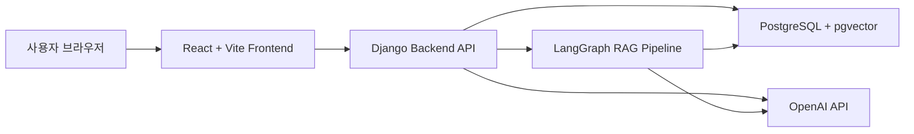
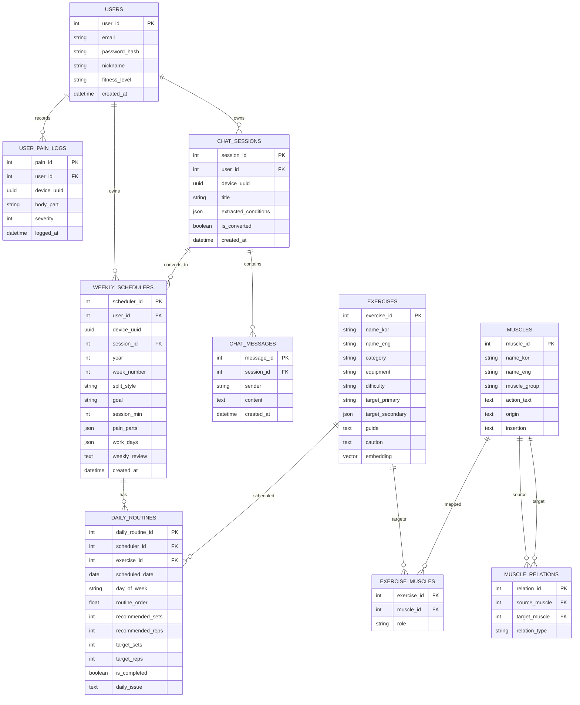
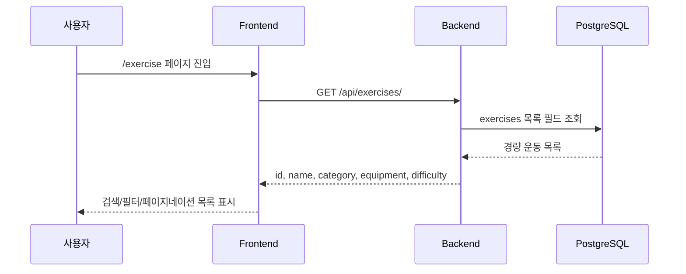
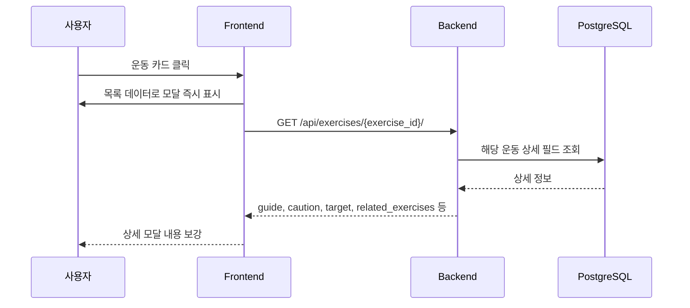
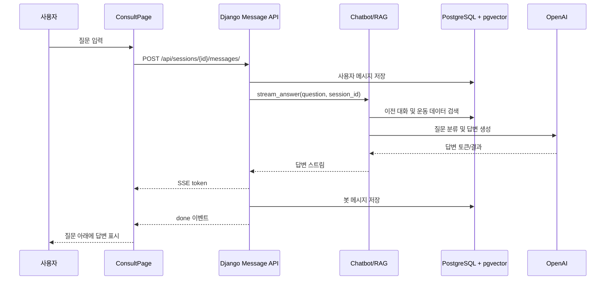
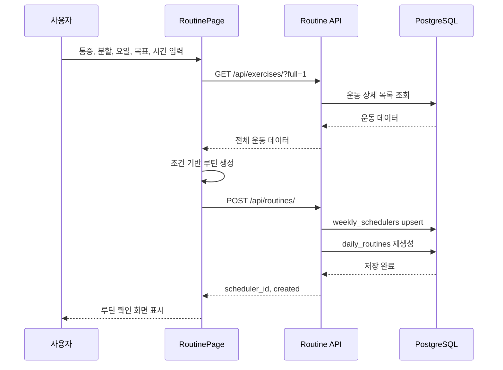

# 시스템 아키텍처

## 전체 구조

## 주요 컴포넌트

| 컴포넌트 | 역할 |
|---|---|
| Frontend | 화면 렌더링, 라우팅, 사용자 입력 처리 |
| Backend API | 운동 데이터, 상담 세션, 메시지, 루틴 API 제공 |
| PostgreSQL | 사용자, 운동, 상담, 루틴 데이터 저장 |
| pgvector | 운동 임베딩 기반 벡터 검색 |
| LangGraph RAG | 질문 분류, 검색, 답변 생성 흐름 관리 |
| OpenAI | LLM 답변 생성 및 임베딩 생성 |

## ERD

## 시퀀스 다이어그램

### 운동 목록 조회

### 운동 상세 조회

### AI 운동 상담

### 주간 루틴 저장

