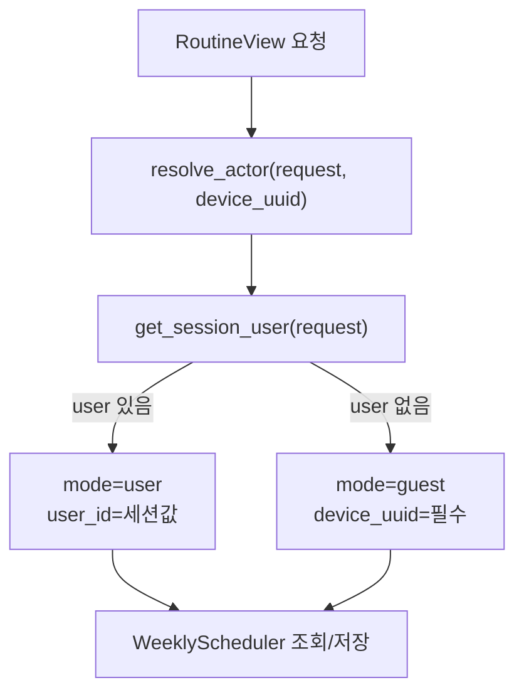
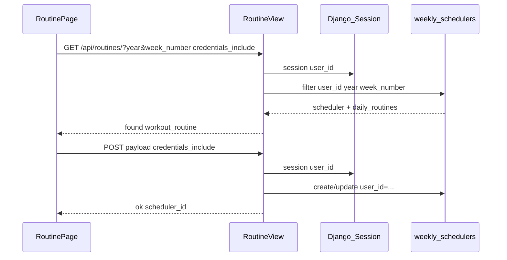

# 에픽 01 — 루틴 회원 저장 및 로그인 상태 표시

주간 운동 루틴(`/api/routines/`)을 로그인 사용자 `user_id`에 귀속시키고, [`RoutinePage.jsx`](../frontend/src/pages/RoutinePage.jsx)에 로그인 상태를 표시하기 위한 구현 가이드다.

**선행 조건:** [에픽00-로그인-인증구현.md](에픽00-로그인-인증구현.md) Day 1~4 완료 (회원가입·로그인·세션·Navbar 연동)

**다음 에픽:** [에픽02-챗봇-회원-전환.md](에픽02-챗봇-회원-전환.md) · 시리즈: [에픽05](에픽05-dev-머지-및-동작-수정.md) · [에픽06](에픽06-폴더-구조-및-경로-정리.md)

**구현 상태:** ✅ 완료 (2026-06-07) — 백엔드·프론트 코드 반영 완료. §8 브라우저 수동 검증은 팀별 진행.

관련 파일:

- 모델: [`backend/api/models.py`](../backend/api/models.py) — `WeeklyScheduler`, `DailyRoutine`
- 뷰: [`backend/api/views.py`](../backend/api/views.py) — `RoutineView`
- 서비스(신규): [`backend/api/services/actor_service.py`](../backend/api/services/actor_service.py)
- 인증 서비스: [`backend/api/services/auth_service.py`](../backend/api/services/auth_service.py)
- 프론트: [`frontend/src/pages/RoutinePage.jsx`](../frontend/src/pages/RoutinePage.jsx) — `RoutinePage` + 하위 `RoutineCheckView`(상단 요약 카드·저장)
- 프론트 API: [`frontend/src/api/auth.js`](../frontend/src/api/auth.js)
- UUID 유틸(권장): [`frontend/src/utils/deviceUuid.js`](../frontend/src/utils/deviceUuid.js)
- 전역 Navbar: [`frontend/src/components/Navbar.jsx`](../frontend/src/components/Navbar.jsx) — 에픽00에서 이미 로그인 표시 완료

---

## 1. 개요 및 설계 결정 요약

### 전체 목표와 본 에픽 범위

서비스 전체에서 **로그인 사용자는 Django 세션의 동일 `user_id`** 로 루틴·챗봇 데이터를 식별한다. 이 목표는 **에픽01 + 에픽02** 를 모두 완료해야 달성된다.

| 에픽 | 담당 API·화면 | DB 귀속 |
|------|--------------|---------|
| **에픽00** (완료) | `/api/auth/*`, Navbar | 세션 `user_id` 발급 |
| **에픽01 (본 문서)** | `/api/routines/*`, RoutinePage | `weekly_schedulers.user_id` |
| **에픽02** | `/api/sessions/*`, ConsultPage, LoginPage `device_uuid` | `chat_sessions.user_id` + 게스트 마이그레이션 |

본 에픽은 **루틴 API와 RoutinePage만** 수정한다. 챗봇 API·ConsultPage·로그인 시 데이터 이전은 에픽02 담당이다.

### 목적

- 로그인 사용자가 루틴을 저장·조회할 때 `weekly_schedulers.user_id`에 귀속
- 게스트는 기존과 동일하게 `device_uuid`만으로 동작
- RoutinePage에 **페이지 단위** 로그인 상태 표시 (닉네임 또는 「게스트」)

### 로그인 상태 표시 — 화면별 역할

| 화면 | 담당 에픽 | 표시 내용 |
|------|----------|----------|
| **Navbar** (전역) | 에픽00 ✅ | `{nickname}님` / 로그인·로그아웃 버튼 |
| **RoutinePage** | **에픽01** | 상단 요약 카드에 닉네임 또는 「게스트」 (ConsultPage 사이드바와 톤 통일) |
| **ConsultPage** | 에픽02 | 사이드바 프로필 영역 |

RoutinePage에는 ConsultPage처럼 사이드바가 없다. 프로필 표시는 **상단 `WEEKLY ROUTINE OVERVIEW` 요약 카드** 우측(「루틴 다시 설계하기」 버튼 인근)에 배치한다. Navbar와 중복되더라도 페이지 컨텍스트용 로컬 표시를 유지한다.

### 고정 전제 4가지

| # | 결정 | 이유 |
|---|------|------|
| 1 | 로그인 시 **식별자는 `user_id` 우선** | DB에 이미 `weekly_schedulers.user_id` FK 존재, `managed=False`라 스키마 변경 불필요 |
| 2 | 게스트는 **`device_uuid` 필수 유지** | 로그인 전 기존 UX 보존 — 세션 초기화 전까지 동작 방식 변경 없음 |
| 3 | `RoutineView`만 수정 (sessions API는 에픽 2) | 채팅·루틴은 RDB상 독립 테이블. `actor_service`는 에픽2에서 재사용 |
| 4 | `credentials: 'include'`로 세션 쿠키 전송 | Django `request.session['user_id']` 조회에 `sessionid` 필요 |

### models.py / schema.sql 변경 없음

`WeeklyScheduler`, `DailyRoutine`은 `managed = False`이며 기존 테이블을 그대로 쓴다. `WeeklyScheduler`는 `user_id`, `device_uuid`, `session_id`(ChatSession FK) 컬럼을 이미 갖고 있다. **본 에픽에서 `session_id` 연계는 다루지 않는다** (향후 루틴↔상담 연동 시 별도 에픽).

```python
# backend/api/models.py — 변경하지 않음 (참고)
class WeeklyScheduler(models.Model):
    scheduler_id = models.AutoField(primary_key=True)
    user = models.ForeignKey(AppUser, ..., db_column='user_id', null=True, blank=True)
    device_uuid = models.UUIDField(null=True, blank=True)
    session = models.ForeignKey(ChatSession, ..., null=True, blank=True)
    year = models.IntegerField()
    week_number = models.IntegerField()
    # ...
```

---

## 2. 현재 상태 vs 목표

| 항목 | 현재 | 목표 |
|------|------|------|
| `RoutineView` GET | `device_uuid`만 필터 | 로그인 → `user_id` 필터, 게스트 → `device_uuid` |
| `RoutineView` POST | `device_uuid`만 저장, `user_id` 미설정 | 로그인 → `user_id` 저장 + `device_uuid` optional, 게스트 → `device_uuid` 필수 |
| `RoutinePage` fetch | `credentials` 없음 | 모든 `/api/routines/` 요청에 `credentials: 'include'` |
| `RoutinePage` UI | 로그인 상태 표시 없음 | `getMe()`로 닉네임/게스트 표시 (상단 요약 카드) |
| `RoutinePage` 로그인 후 | — | `authUser` 확정 시 루틴 **재조회** (게스트 데이터 → 회원 데이터 전환) |
| UUID 저장소 | `localStorage` only | `deviceUuid.js`로 쿠키·localStorage 동기화 (에픽02 E2E 전제) |
| Navbar | `getMe()` 닉네임 표시 ✅ | 변경 없음 |

### 구현 완료 상태 (2026-06-07)

| 항목 | 결과 |
|------|------|
| `actor_service.py` | ✅ `resolve_actor`, `scheduler_filter_kwargs`, `scheduler_owner_filter` |
| `RoutineView` GET/POST | ✅ 로그인 `user_id` / 게스트 `device_uuid` 분기 |
| `deviceUuid.js` | ✅ 쿠키·localStorage 양방향 동기화 |
| `RoutinePage` | ✅ `credentials: 'include'`, `getMe`, `authUser` 재조회 |
| `RoutineCheckView` | ✅ 상단 요약 카드 프로필 UI, `saveRoutineToDb` credentials |
| Navbar | ✅ 변경 없음 (에픽00 유지) |

### device_uuid 통일 FAQ

| 상황 | UUID 통일 필요? |
|------|----------------|
| 게스트가 RoutinePage만 사용 (로그인 전) | **불필요** — localStorage UUID 그대로 |
| 로그인 후 회원 루틴 조회 | **불필요** — `user_id`가 식별 키 |
| 로그인 시 게스트 루틴을 회원으로 이전 | **필요** — 에픽02 `migrate_guest_routines_to_user` + `deviceUuid.js` |
| 채팅↔루틴 게스트 마이그레이션 E2E | **필요** — 동일 `device_uuid` 전제 (에픽01 Step 3 + 에픽02) |

**본 에픽:** RoutinePage 게스트 동작은 유지한다. `deviceUuid.js`는 에픽01에서 적용 완료이며, 에픽02 통합 테스트 전제로 유지한다.

---

## 3. 아키텍처

### Actor 해석 (로그인 vs 게스트)



**핵심 규칙:** `mode=user`일 때 GET·POST 모두 `device_uuid`만으로 조회·저장하지 않는다. 세션 `user_id`가 소유권 기준이다.

### 로그인 사용자 루틴 저장 시퀀스



---

## 4. 백엔드 구현 — 타이핑 순서

### 4-1. `backend/api/services/actor_service.py` (신규)

게스트 API와 인증 API 사이의 **공통 식별자 해석** 레이어다. 에픽 2에서 sessions API도 재사용한다.

```python
# backend/api/services/actor_service.py
from dataclasses import dataclass
from typing import Optional

from django.http import HttpRequest

from api.services.auth_service import get_session_user


@dataclass(frozen=True)
class Actor:
    mode: str  # 'user' | 'guest'
    user_id: Optional[int] = None
    device_uuid: Optional[str] = None


class ActorError(ValueError):
    """식별자 해석 실패. 메시지를 API error로 반환한다."""


def resolve_actor(request: HttpRequest, device_uuid: Optional[str] = None) -> Actor:
    """
    요청의 Django 세션과 device_uuid로 현재 행위자를 결정한다.

    - 로그인: mode='user', user_id=세션값 (device_uuid는 마이그레이션·추적용으로만 허용)
    - 게스트: mode='guest', device_uuid 필수
    """
    user = get_session_user(request)
    device_uuid = (device_uuid or '').strip() or None

    if user:
        return Actor(mode='user', user_id=user.user_id, device_uuid=device_uuid)

    if not device_uuid:
        raise ActorError('device_uuid is required')

    return Actor(mode='guest', device_uuid=device_uuid)


def scheduler_filter_kwargs(actor: Actor, year: int, week_number: int) -> dict:
    """WeeklyScheduler 조회용 filter kwargs."""
    base = {'year': year, 'week_number': week_number}
    if actor.mode == 'user':
        return {**base, 'user_id': actor.user_id}
    return {**base, 'device_uuid': actor.device_uuid}


def scheduler_owner_filter(actor: Actor) -> dict:
    """해당 행위자 소유 스케줄러 전체 조회용 (latest preferences 등)."""
    if actor.mode == 'user':
        return {'user_id': actor.user_id}
    return {'device_uuid': actor.device_uuid}
```

**완료 기준:** `RoutineView`에서 import 오류 없음. 에픽2가 `session_owner_filter` 등을 **추가**할 수 있도록 시그니처를 변경하지 않는다.

**구현 시 주의:** `Actor` dataclass 필드는 `user_id: Optional[int] = None`처럼 **콜론 타입 어노테이션**을 쓴다. `user_id = Optional[int] = None`은 런타임 `TypeError`를 유발한다 (부록 B 참고).

---

### 4-2. `backend/api/views.py` — `RoutineView` 수정

파일 상단 import 추가:

```python
from .services.actor_service import (
    ActorError,
    resolve_actor,
    scheduler_filter_kwargs,
    scheduler_owner_filter,
)
```

#### GET 수정

`device_uuid` 단독 필수 검사를 `resolve_actor`로 교체한다. **이하 `found` / `preferences` 분기·DailyRoutine 파싱 로직은 기존 그대로 유지.**

```python
def get(self, request):
    device_uuid = request.GET.get('device_uuid')
    try:
        actor = resolve_actor(request, device_uuid)
    except ActorError as exc:
        return JsonResponse({'error': str(exc)}, status=400)

    now = datetime.datetime.now()
    current_year, current_week, _ = now.isocalendar()

    year_str = request.GET.get('year')
    week_str = request.GET.get('week_number')

    target_year = int(year_str) if year_str else current_year
    target_week = int(week_str) if week_str else current_week

    scheduler = WeeklyScheduler.objects.filter(
        **scheduler_filter_kwargs(actor, target_year, target_week)
    ).order_by('-created_at').first()

    if scheduler:
        # ... 기존 routines_qs → workout_routine / daily_notes 빌드 ...
        pass
    else:
        latest_scheduler = WeeklyScheduler.objects.filter(
            **scheduler_owner_filter(actor)
        ).order_by('-created_at').first()
        # ... 기존 preferences 분기 ...
```

#### POST 수정

로그인 시 `user_id`를 저장하고, 게스트는 `device_uuid` 필수를 유지한다. **DailyRoutine 생성 루프는 기존과 동일.**

```python
def post(self, request):
    try:
        data = json.loads(request.body)
    except json.JSONDecodeError:
        return JsonResponse({'error': 'Invalid JSON'}, status=400)

    device_uuid = data.get('device_uuid')
    try:
        actor = resolve_actor(request, device_uuid)
    except ActorError as exc:
        return JsonResponse({'error': str(exc)}, status=400)

    # year, week_number, split_style 등 기존 파싱 유지 ...

    with transaction.atomic():
        schedulers = WeeklyScheduler.objects.filter(
            **scheduler_filter_kwargs(actor, year, week_number)
        ).order_by('-created_at')

        created = False
        if schedulers.exists():
            scheduler = schedulers[0]
            # 중복 제거: 동일 owner + year + week
            dup_filter = scheduler_filter_kwargs(actor, year, week_number)
            WeeklyScheduler.objects.filter(**dup_filter).exclude(
                scheduler_id=scheduler.scheduler_id
            ).delete()

            scheduler.split_style = split_style
            scheduler.goal = goal
            scheduler.session_min = session_min
            scheduler.pain_parts = pain_parts
            scheduler.work_days = work_days_db
            scheduler.weekly_review = weekly_review
            if actor.mode == 'user':
                scheduler.user_id = actor.user_id
            scheduler.save()
        else:
            create_kwargs = dict(
                year=year,
                week_number=week_number,
                split_style=split_style,
                goal=goal,
                session_min=session_min,
                pain_parts=pain_parts,
                work_days=work_days_db,
                weekly_review=weekly_review,
            )
            # 로그인: user_id 필수. device_uuid는 body에 있을 때만 (에픽02 마이그레이션·추적용)
            if actor.mode == 'user':
                create_kwargs['user_id'] = actor.user_id
            if actor.device_uuid:
                create_kwargs['device_uuid'] = actor.device_uuid

            scheduler = WeeklyScheduler.objects.create(**create_kwargs)
            created = True

        DailyRoutine.objects.filter(scheduler=scheduler).delete()
        # ... 기존 workout_routine 루프 ...
```

**`create_kwargs` 소유자 필드 — 두 if로 충분한 이유**

| 분기 | 동작 |
|------|------|
| `if actor.mode == 'user'` | 로그인 시에만 `user_id` 추가. 게스트는 `resolve_actor` 이후에도 `user_id` 키를 넣지 않음 |
| `if actor.device_uuid` | 값이 있을 때만 추가. 게스트는 `resolve_actor`에서 `device_uuid` 필수이므로 항상 들어감. 로그인+body 미전송 시 `actor.device_uuid`는 `None` → 키 자체를 넣지 않음 (DB `device_uuid` NULL) |

`if/else`로 게스트·로그인을 나눌 필요 없다. 게스트 `device_uuid` 보장은 **`resolve_actor`가 담당**하고, create 쪽은 “있는 값만 kwargs에 넣기”면 된다.

**주의**

- `WeeklyScheduler.objects.create(**create_kwargs)` 한 번만 호출한다. `create_kwargs`를 만든 뒤 예전처럼 필드를 나열한 `create(...)`를 또 쓰면 `user_id` 분기가 무시된다.
- update 분기(`schedulers.exists()`)의 `scheduler.user_id = actor.user_id`는 로그인 전용이므로 `if actor.mode == 'user'`를 유지한다.
- `WeeklyScheduler.user` FK는 ORM에서 `scheduler.user_id = actor.user_id`로 assign 가능.

---

## 5. 프론트엔드 구현 — 타이핑 순서

### 5-1. `frontend/src/utils/deviceUuid.js` (적용 완료, 에픽02 전제)

쿠키(ConsultPage)와 localStorage(RoutinePage)를 **양방향 동기화**한다. 기존 값이 한쪽에만 있으면 다른 쪽에 복사한다. **이미 양쪽에 다른 값이 있으면 덮어쓰지 않음** — §2 device_uuid 통일 FAQ·부록 B 「Consult와 Routine UUID 불일치」 참고.

```javascript
// frontend/src/utils/deviceUuid.js
const KEY = 'fitai_device_uuid'

function readCookie() {
  const match = document.cookie.split('; ').find((r) => r.startsWith(`${KEY}=`))
  return match ? match.split('=')[1] : ''
}

function writeCookie(uuid) {
  document.cookie = `${KEY}=${uuid}; max-age=${60 * 60 * 24 * 365}; path=/`
}

/**
 * @returns {string} device UUID (쿠키·localStorage 동기화)
 */
export function getOrCreateDeviceUuid() {
  if (typeof window === 'undefined') return ''

  let uuid = readCookie() || localStorage.getItem(KEY) || ''

  if (!uuid) {
    uuid =
      typeof crypto !== 'undefined' && crypto.randomUUID
        ? crypto.randomUUID()
        : Math.random().toString(36).slice(2) + Math.random().toString(36).slice(2)
  }

  if (!readCookie()) writeCookie(uuid)
  if (!localStorage.getItem(KEY)) localStorage.setItem(KEY, uuid)

  return uuid
}
```

---

### 5-2. `frontend/src/pages/RoutinePage.jsx` 수정

#### (1) import·device UUID

기존 `getDeviceUuid` / `deviceUuid` 상단 정의를 교체:

```javascript
import { useNavigate } from 'react-router-dom'
import { getMe } from '../api/auth'
import { getOrCreateDeviceUuid } from '../utils/deviceUuid'

const deviceUuid = getOrCreateDeviceUuid()
```

#### (2) 로그인 상태 state

`RoutinePage` 함수 내부에 추가:

```javascript
const navigate = useNavigate()
const [authUser, setAuthUser] = useState(null) // null = 게스트 또는 로딩 전

useEffect(() => {
  getMe()
    .then((u) => setAuthUser(u))
    .catch(() => setAuthUser(null))
}, [])
```

#### (3) 주간 루틴 fetch — credentials + 재조회 함수

`RoutinePage` 함수 내부에서, 기존 마운트 `useEffect` 안의 루틴 fetch를 `loadWeeklyRoutine` 함수로 분리하고 `credentials`를 추가한다.

```javascript
const loadWeeklyRoutine = () => {
  setLoadingRoutine(true)
  const { year, weekNumber } = getISOWeekAndYear(new Date())
  fetch(
    `${API_URL}/api/routines/?device_uuid=${deviceUuid}&year=${year}&week_number=${weekNumber}`,
    { credentials: 'include' },
  )
    .then((r) => r.json())
    .then((data) => {
      // 기존 found / preferences 분기 그대로
    })
    .catch((err) => {
      console.error('Error fetching weekly routine:', err)
    })
    .finally(() => {
      setLoadingRoutine(false)
    })
}

useEffect(() => {
  // exercises fetch는 기존 유지
  loadWeeklyRoutine()
}, [])

// 로그인 직후 같은 탭에 머문 경우 — ConsultPage loadSessions() 패턴과 동일
useEffect(() => {
  if (authUser) {
    loadWeeklyRoutine()
  }
}, [authUser])
```

#### (4) saveRoutineToDb — credentials 추가

`saveRoutineToDb`는 **`RoutineCheckView` 컴포넌트** 안에 있다. POST에 `credentials`를 추가한다.

```javascript
fetch(`${API_URL}/api/routines/`, {
  method: 'POST',
  headers: { 'Content-Type': 'application/json' },
  credentials: 'include',
  body: JSON.stringify(payload),
})
```

로그인 사용자도 body에 `device_uuid`를 **유지해도 된다**(마이그레이션·추적용). 백엔드는 `user_id` 우선으로 처리한다.

#### (5) 로그인 상태 UI — 상단 요약 카드

상단 `WEEKLY ROUTINE OVERVIEW` 카드는 **`RoutineCheckView`** JSX 안에 있다. `authUser` state는 부모 **`RoutinePage`** 에 두고, 자식에 props로 넘긴다.

**`RoutinePage` → `RoutineCheckView` 호출부:**

```jsx
<RoutineCheckView
  {/* 기존 workDays, goal, ... */}
  authUser={authUser}
  onLoginClick={() => navigate('/login')}
/>
```

**`RoutineCheckView` 상단 요약 카드 — 오른쪽 영역** (제목 블록과 「루틴 다시 설계하기」 버튼 사이):

ConsultPage 542행 패턴을 참고한다. `RoutineCheckView`는 `navigate`를 직접 쓰지 않고 `onLoginClick`을 호출한다.

```jsx
<div style={{ display: 'flex', alignItems: 'center', gap: 10 }}>
  <button
    onClick={() => { if (!authUser) onLoginClick() }}
    style={{
      display: 'flex', alignItems: 'center', gap: 8,
      padding: '8px 14px', borderRadius: 4,
      background: 'rgba(255,255,255,0.03)',
      border: '1px solid rgba(255,255,255,0.06)',
      cursor: authUser ? 'default' : 'pointer',
    }}
  >
    <span style={{ fontSize: 13 }}>👤</span>
    <span style={{ fontSize: 13, color: 'rgba(226,226,226,0.75)', fontWeight: 500 }}>
      {authUser ? authUser.nickname : '게스트'}
    </span>
  </button>
  {/* 기존 「루틴 다시 설계하기」 버튼 */}
</div>
```

게스트일 때만 클릭 시 `/login`으로 이동. 로그인 사용자는 닉네임만 표시.

---

## 6. API 계약

### GET `/api/routines/`

| 항목 | 게스트 | 로그인 |
|------|--------|--------|
| Query `device_uuid` | **필수** | optional (있으면 저장 시 함께 기록) |
| 쿠키 `sessionid` | 없음 | **필수** (`credentials: 'include'`) |
| 조회 키 | `device_uuid` + year + week | `user_id` + year + week |

성공 응답은 기존과 동일: `{ found, scheduler_id?, workout_routine?, ... }` 또는 `{ found: false, preferences? }`.

### POST `/api/routines/`

| 항목 | 게스트 | 로그인 |
|------|--------|--------|
| Body `device_uuid` | **필수** | optional |
| 쿠키 `sessionid` | 없음 | **필수** |
| 저장 시 | `device_uuid`만, `user_id` NULL | `user_id` 설정 + (optional) `device_uuid` |

에러:

| 상황 | 상태코드 | error |
|------|----------|-------|
| 게스트인데 `device_uuid` 없음 | 400 | `device_uuid is required` |
| JSON 파싱 실패 | 400 | `Invalid JSON` |

### 로그인·게스트 동시 쿠키가 있을 때

세션에 `user_id`가 있으면 **항상 `mode=user`**. query/body의 `device_uuid`는 조회 키가 아니라 부가 정보로만 취급한다. 이 동작은 에픽02 sessions API와 동일 규칙이다.

---

## 7. 환경변수·설정 및 사전 점검

본 에픽은 **신규 환경변수 없음**.

| 항목 | 확인 |
|------|------|
| `CORS_ALLOW_CREDENTIALS = True` | 에픽00 설정 유지 |
| `CSRF_TRUSTED_ORIGINS` | 프론트 origin 포함 |
| `VITE_API_URL` | 기본 `http://localhost:8000`. 프론트·백엔드 **동일 사이트가 아니면** 쿠키 `SameSite`·도메인 이슈 없는지 확인 |
| `/api/routines/` | `@csrf_exempt` — CSRF 헤더 불필요, `sessionid` 쿠키만으로 로그인 식별 |

**사전 점검 (에픽01 시작 전):**

1. 에픽00 curl로 로그인 → `GET /api/auth/me/` 200 + `sessionid` 쿠키 확인
2. Navbar에서 로그인 후 `{nickname}님` 표시 확인
3. 로그아웃 후 `GET /api/auth/me/` 401 확인

위 3가지가 통과하지 않으면 RoutinePage `credentials` 연동 전에 에픽00을 먼저 마무리한다.

---

## 8. 수동 검증

### 8-0. 검증 전 준비

- 테스트 계정 1개 (예: `testuser` / `testpass1234`)
- 고정 `DEVICE_UUID` (curl·브라우저 SQL 대조용)
- PostgreSQL에서 `weekly_schedulers` 조회 가능한 환경
- 브라우저 DevTools → Network → `/api/routines/` 요청의 **Request Cookies** 확인 습관

### 8-1. curl — 게스트 (회귀: 기존 동작 유지)

```bash
DEVICE_UUID="550e8400-e29b-41d4-a716-446655440000"

curl "http://localhost:8000/api/routines/?device_uuid=${DEVICE_UUID}&year=2026&week_number=23"

curl -X POST http://localhost:8000/api/routines/ \
  -H "Content-Type: application/json" \
  -d "{\"device_uuid\":\"${DEVICE_UUID}\",\"year\":2026,\"week_number\":23,\"split_style\":\"bodybuilding\",\"goal\":\"hypertrophy\",\"session_min\":60,\"pain_parts\":[],\"work_days\":[\"월\",\"수\",\"금\"],\"day_parts\":{},\"workout_routine\":{},\"daily_notes\":{}}"
```

**기대:**

| 확인 | 기대값 |
|------|--------|
| HTTP | 200 |
| DB `user_id` | `NULL` |
| DB `device_uuid` | 요청 UUID와 일치 |

```sql
SELECT scheduler_id, user_id, device_uuid, year, week_number
FROM weekly_schedulers
WHERE device_uuid = '550e8400-e29b-41d4-a716-446655440000';
```

### 8-2. curl — 로그인 사용자

`/api/auth/login/`·`/api/auth/register/`는 CSRF가 필요하다 (`/api/routines/`와 달리 `@csrf_exempt` 아님). 브라우저에서 로그인한 뒤 쿠키를 추출하거나, [에픽00](에픽00-로그인-인증구현.md)처럼 `GET /api/auth/csrf/` 후 `X-CSRFToken` 헤더로 로그인한다.

[에픽00](에픽00-로그인-인증구현.md)과 동일하게 `cookies.txt` 확보 후:

```bash
# 로그인 후 — device_uuid 없이 조회·저장 가능해야 함
curl -b cookies.txt \
  "http://localhost:8000/api/routines/?year=2026&week_number=23"

curl -b cookies.txt -X POST http://localhost:8000/api/routines/ \
  -H "Content-Type: application/json" \
  -d '{"year":2026,"week_number":23,"split_style":"bodybuilding","goal":"hypertrophy","session_min":60,"pain_parts":[],"work_days":["월"],"day_parts":{},"workout_routine":{},"daily_notes":{}}'
```

**기대:**

| 확인 | 기대값 |
|------|--------|
| HTTP | 200 |
| DB `user_id` | 로그인한 `users.user_id`와 일치 |
| 동일 user + year + week 재POST | update (중복 row 폭증 없음) |

```sql
SELECT scheduler_id, user_id, device_uuid, year, week_number
FROM weekly_schedulers
WHERE user_id = 1;  -- 실제 로그인 user_id로 교체
```

### 8-3. curl — 소유권 격리 (로그인 우선)

로그인 쿠키를 들고 **타인의 `device_uuid`만** 넣어 GET/POST해도, 응답은 **세션 `user_id` 소유 데이터**만 다룬다. 타인 게스트 UUID로 회원 데이터를 덮어쓰지 않아야 한다.

```bash
# 로그인 상태 + 다른 사람 게스트 UUID (조회 키로 사용되면 안 됨)
curl -b cookies.txt \
  "http://localhost:8000/api/routines/?device_uuid=00000000-0000-0000-0000-000000000099&year=2026&week_number=23"
```

**기대:** 본인 `user_id` 루틴만 반환. 타인 `device_uuid` 루틴이 섞이지 않음.

### 8-4. 브라우저 — RoutinePage 단독 E2E

| # | 시나리오 | 기대 결과 |
|---|----------|----------|
| 1 | 로그아웃 → RoutinePage 진입 | 상단 카드 「게스트」, Navbar 「로그인」 |
| 2 | 게스트 상태 루틴 설계·저장 | 저장 성공, DB `user_id` NULL |
| 3 | 로그인 → RoutinePage 이동 | Navbar 닉네임 + 상단 카드 닉네임 |
| 4 | 로그인 상태 새 루틴 저장 | DB `user_id` 채워짐 |
| 5 | 새로고침·탭 닫았다 재접속 | 동일 루틴 유지 |
| 6 | **다른 브라우저** 동일 계정 로그인 | 동일 주차 루틴 조회 (기기 무관) |
| 7 | DevTools Network | `/api/routines/` Request에 `sessionid` 포함 |
| 8 | 로그아웃 후 RoutinePage | 「게스트」+ 게스트 UUID 기준 데이터 (회원 루틴과 분리) |

### 8-5. 브라우저 — 로그인 전후 데이터 분리 (에픽01 단독 시나리오)

에픽02 루틴 마이그레이션 **미적용** 상태에서 반드시 확인한다.

1. 로그아웃 → RoutinePage에서 주차 N 루틴 저장 (게스트)
2. 로그인 → RoutinePage 재진입
3. **기대 (마이그레이션 없음):** 주차 N에 **빈 루틴 또는 preferences만** 보일 수 있음 — `user_id` 조회와 `device_uuid` 게스트 데이터가 분리되기 때문
4. 로그인 상태에서 주차 N 다시 저장
5. DB에 게스트 row(`user_id` NULL)와 회원 row(`user_id` 있음)가 **공존할 수 있음** 확인

이 시나리오는 **의도된 제약**이다. 게스트 루틴 연속성이 필요하면 에픽02 `migrate_guest_routines_to_user`를 필수로 적용한다 (§10 참고).

### 8-6. 에픽01+02 통합 스모크 (에픽02 완료 후)

에픽02까지 끝난 뒤 한 번 더 실행한다.

| # | 시나리오 | 기대 결과 |
|---|----------|----------|
| 1 | 로그아웃 → RoutinePage 게스트 루틴 저장 | `user_id` NULL |
| 2 | ConsultPage에서 동일 브라우저 UUID로 채팅 | `chat_sessions.user_id` NULL |
| 3 | LoginPage 로그인 (`device_uuid` body 포함) | `migrated_sessions >= 0`, 루틴은 `migrate_guest_routines_to_user` 적용 시 `user_id` 이전 |
| 4 | RoutinePage | 로그인 전 게스트 루틴이 보임 (마이그레이션 적용 시) |
| 5 | ConsultPage | 로그인 전 게스트 세션 유지 |
| 6 | SQL | 동일 `user_id`로 `weekly_schedulers`·`chat_sessions` 각각 조회 가능 |

```sql
-- 동일 회원에 루틴·채팅이 모두 귀속되었는지 (에픽02 완료 후)
SELECT 'routine' AS kind, scheduler_id AS id, user_id, device_uuid
FROM weekly_schedulers WHERE user_id = :uid
UNION ALL
SELECT 'chat', session_id, user_id, device_uuid::text
FROM chat_sessions WHERE user_id = :uid;
```

---

## 9. 구현 순서 치트시트

| Step | 작업 | 코드 | 검증 |
|------|------|------|------|
| **0** | 에픽00 사전 점검 (§7) | — | `/api/auth/me/`·Navbar 로그인 표시 OK |
| **1** | `actor_service.py` 생성 | ✅ 2026-06-07 | import 오류 없음, 에픽2 확장 여지 확보 |
| **2** | `RoutineView` GET/POST 수정 | ✅ 2026-06-07 | §8-1·8-2 curl + §8-3 소유권 격리 |
| **3** | `deviceUuid.js` | ✅ 2026-06-07 | 쿠키·localStorage 동일 UUID |
| **4** | `RoutinePage` + `RoutineCheckView` credentials·getMe·UI·재조회 | ✅ 2026-06-07 | §8-4 체크리스트 |
| **5** | §8-5 분리 시나리오 | — | 제약 이해·문서화된 동작과 일치 |
| **6** | (에픽02 후) §8-6 통합 스모크 | — | 루틴·채팅 동일 `user_id` |

---

## 10. 알려진 제약 및 다음 에픽 연계

### 제약

1. **게스트 루틴 → 로그인 자동 이전은 본 에픽 범위 밖**  
   로그인 전 `device_uuid`로 저장한 데이터는 로그인 후 `user_id` 조회에 안 잡힐 수 있다. §8-5로 반드시 검증한다.  
   **연속성이 필요하면** [에픽02](에픽02-챗봇-회원-전환.md)의 `migrate_guest_routines_to_user`를 **필수**로 채택하고, `LoginView`·`LoginPage`에서 `device_uuid`를 전달한다.

2. **`weekly_schedulers`에 (user_id, year, week) UNIQUE 없음**  
   앱 레벨 중복 제거 로직 유지 필요 (현재 `RoutineView.post` 패턴).

3. **CSRF**  
   `/api/routines/`는 `@csrf_exempt`이므로 CSRF 헤더 불필요. 세션 쿠키만으로 로그인 식별 가능.

4. **Navbar vs RoutinePage 표시 불일치**  
   Navbar는 마운트 시 `getMe()` 1회. RoutinePage도 동일. 로그인 직후 같은 페이지에 머물면 §5-2 **(3)** `authUser` 재조회로 루틴 데이터만 보완한다. Navbar 갱신은 페이지 이동·새로고침 시 자연스럽게 맞춰진다.

### 다음 에픽

- [에픽02](에픽02-챗봇-회원-전환.md): `ChatSession.user_id`, 게스트 세션 마이그레이션, ConsultPage UI, `LoginPage` `device_uuid`
- 에픽02 완료 후 §8-6 통합 스모크 실행

---

## 부록 A: 구현 히스토리

| 일자 | 내용 |
|------|------|
| 2026-06-07 | 에픽01 코드 반영 완료 — `actor_service.py` 신규, `RoutineView` actor 연동, `deviceUuid.js`, `RoutinePage`/`RoutineCheckView` 로그인 UI·credentials |
| 2026-06-07 | 구현 중 수정: `Actor` dataclass 필드 타입 어노테이션(`user_id:` 콜론), `deviceUuid.js` 쿠키 `max-age` 템플릿 리터럴 오타, React 훅을 `RoutinePage` 함수 **내부**로 이동, 프로필 UI를 `RoutineCheckView`에 두고 `authUser`·`onLoginClick` props 전달 |

---

## 부록 B: 트러블슈팅

| 증상 | 원인 | 해결 |
|------|------|------|
| 로그인 후에도 게스트 루틴만 보임 | `credentials: 'include'` 누락 | RoutinePage 모든 routines fetch 수정 |
| 로그인 후 빈 루틴 (게스트 때 저장했음) | `user_id`/`device_uuid` 데이터 분리 (§8-5) | 정상. 에픽02 루틴 마이그레이션 적용 |
| DB에 `user_id` NULL (로그인 POST 후) | 세션 만료 또는 쿠키 미전송 | 재로그인, Network Request Cookies 확인 |
| 게스트 POST 400 | `device_uuid` 누락 | payload에 UUID 포함 |
| Consult와 Routine UUID 불일치 | 저장소 분리 (쿠키 vs localStorage) | `deviceUuid.js` 적용. **이미 다른 값이면** 한쪽 삭제 후 재동기화 |
| 로그인 사용자가 타인 UUID 데이터 조회 | `resolve_actor` user 모드에서 `device_uuid`로 filter | GET은 `user_id` filter만 사용하는지 확인 (§8-3) |
| CORS 에러 + 쿠키 안 붙음 | `CORS_ALLOW_CREDENTIALS` 또는 origin 불일치 | 에픽00 CORS 설정·`VITE_API_URL` 재확인 |
| curl 로그인은 되는데 브라우저만 실패 | 프론트 origin이 `CSRF_TRUSTED_ORIGINS`에 없음 | settings.py origin 추가 |
| 상단 카드 「게스트」인데 Navbar는 닉네임 | RoutinePage `getMe` 실패 또는 state 미반영 | `/api/auth/me/` 응답·RoutinePage effect 확인 |
| 앱 기동 실패 / Invalid hook call | `useNavigate`·`useState`·`useEffect`를 컴포넌트 **밖**에 선언 | `RoutinePage()` 함수 내부로 이동 (§5-2 (2)) |
| 백엔드 import 시 `TypeError: '_SpecialForm'...` | `Actor` dataclass에서 `user_id = Optional[int]` (`=` 사용) | `user_id: Optional[int] = None` (콜론 타입 어노테이션) |
| UUID 쿠키가 이상한 값 | `deviceUuid.js`의 `` max-age=$${...} `` 오타 | `` max-age=${60 * 60 * 24 * 365} `` |
| `RoutineCheckView`에서 `authUser`/`navigate` 미정의 | state는 부모, UI는 자식 컴포넌트 | `authUser`·`onLoginClick` props 전달 (§5-2 (5)) |

---

## 부록 C: `actor_service` 재사용 (에픽 2 예고)

에픽 2에서 `SessionListView`, `MessageListView`도 동일한 `resolve_actor` / `Actor` 타입을 import한다. 에픽 1에서 **인터페이스·에러 메시지·user 우선 규칙**을 안정적으로 고정해 두면 이후 수정이 줄어든다.

에픽 2가 추가하는 함수 예: `session_owner_filter`, `session_belongs_to_actor` — 에픽 1 파일에 **추가**하되 기존 루틴용 함수 시그니처는 변경하지 않는다.

---

## 부록 D: 완료 정의 (Definition of Done)

에픽01을 “완료”로 볼 수 있는 조건:

**코드 구현 (2026-06-07 반영 완료)**

- [x] `actor_service.py` 존재 — 에픽02에서 import 가능
- [x] `RoutineView` GET/POST actor 연동
- [x] `deviceUuid.js` 적용
- [x] `RoutinePage` credentials + `getMe` + `authUser` 재조회
- [x] `RoutineCheckView` 상단 요약 카드 프로필 UI + `saveRoutineToDb` credentials

**수동 검증 (팀별 진행)**

- [ ] §8-1 게스트 curl 회귀 통과
- [ ] §8-2 로그인 curl 통과 (`user_id` DB 확인)
- [ ] §8-3 소유권 격리 통과
- [ ] §8-4 브라우저 체크리스트 전항목 통과
- [ ] §8-5 분리 시나리오 동작이 팀이 이해한 제약과 일치

에픽02 완료 후 추가:

- [ ] §8-6 통합 스모크 통과
- [ ] (팀 결정 시) 게스트 루틴 로그인 이전까지 포함
