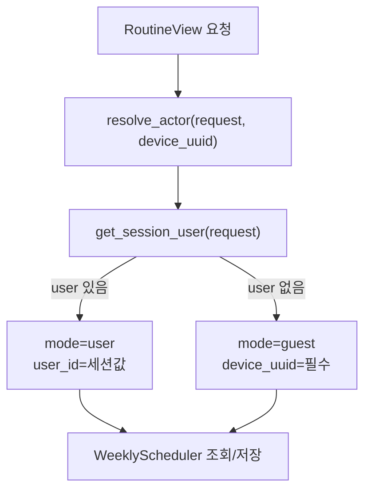
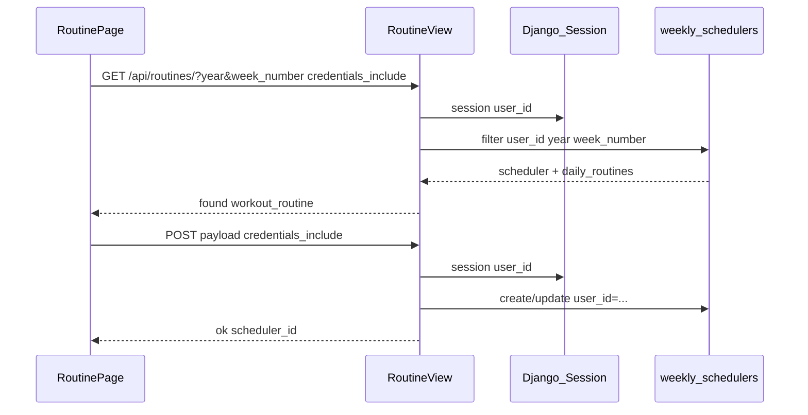

# 에픽 01 — 루틴 회원 저장 및 로그인 상태 표시

주간 운동 루틴(`/api/routines/`)을 로그인 사용자 `user_id`에 귀속시키고, [`RoutinePage.jsx`](../frontend/src/pages/RoutinePage.jsx)에 로그인 상태를 표시하기 위한 구현 가이드다.

**선행 조건:** [에픽00-로그인-인증구현.md](에픽00-로그인-인증구현.md) Day 1~4 완료 (회원가입·로그인·세션·Navbar 연동)

**다음 에픽:** [에픽02-챗봇-회원-전환.md](에픽02-챗봇-회원-전환.md)

관련 파일:

- 모델: [`backend/api/models.py`](../backend/api/models.py) — `WeeklyScheduler`, `DailyRoutine`
- 뷰: [`backend/api/views.py`](../backend/api/views.py) — `RoutineView`
- 서비스(신규): [`backend/api/services/actor_service.py`](../backend/api/services/actor_service.py)
- 인증 서비스: [`backend/api/services/auth_service.py`](../backend/api/services/auth_service.py)
- 프론트: [`frontend/src/pages/RoutinePage.jsx`](../frontend/src/pages/RoutinePage.jsx)
- 프론트 API: [`frontend/src/api/auth.js`](../frontend/src/api/auth.js)
- UUID 유틸(권장): [`frontend/src/utils/deviceUuid.js`](../frontend/src/utils/deviceUuid.js)

---

## 1. 개요 및 설계 결정 요약

### 목적

- 로그인 사용자가 루틴을 저장·조회할 때 `weekly_schedulers.user_id`에 귀속
- 게스트는 기존과 동일하게 `device_uuid`만으로 동작
- RoutinePage 사이드바/헤더에 **닉네임 또는 「게스트」** 표시

### 고정 전제 4가지

| # | 결정 | 이유 |
|---|------|------|
| 1 | 로그인 시 **식별자는 `user_id` 우선** | DB에 이미 `weekly_schedulers.user_id` FK 존재, `managed=False`라 스키마 변경 불필요 |
| 2 | 게스트는 **`device_uuid` 필수 유지** | 로그인 전 기존 UX 보존 — 세션 초기화 전까지 동작 방식 변경 없음 |
| 3 | `RoutineView`만 수정 (sessions API는 에픽 2) | 채팅·루틴은 RDB상 독립 테이블 |
| 4 | `credentials: 'include'`로 세션 쿠키 전송 | Django `request.session['user_id']` 조회에 `sessionid` 필요 |

### models.py / schema.sql 변경 없음

`WeeklyScheduler`, `DailyRoutine`은 `managed = False`이며 기존 테이블을 그대로 쓴다.

```python
# backend/api/models.py — 변경하지 않음 (참고)
class WeeklyScheduler(models.Model):
    scheduler_id = models.AutoField(primary_key=True)
    user = models.ForeignKey(AppUser, ..., db_column='user_id', null=True, blank=True)
    device_uuid = models.UUIDField(null=True, blank=True)
    session = models.ForeignKey(ChatSession, ..., null=True, blank=True)
    year = models.IntegerField()
    week_number = models.IntegerField()
    # ...
```

---

## 2. 현재 상태 vs 목표

| 항목 | 현재 | 목표 |
|------|------|------|
| `RoutineView` GET | `device_uuid`만 필터 | 로그인 → `user_id` 필터, 게스트 → `device_uuid` |
| `RoutineView` POST | `device_uuid`만 저장, `user_id` 미설정 | 로그인 → `user_id` 저장 + `device_uuid` optional, 게스트 → `device_uuid` 필수 |
| `RoutinePage` fetch | `credentials` 없음 | `credentials: 'include'` 추가 |
| `RoutinePage` UI | 로그인 상태 표시 없음 | `getMe()`로 닉네임/게스트 표시 |
| UUID 저장소 | `localStorage` only | (권장) 쿠키·localStorage 동기화 유틸 |

### device_uuid 통일 FAQ

| 상황 | UUID 통일 필요? |
|------|----------------|
| 게스트가 RoutinePage만 사용 (로그인 전) | **불필요** — localStorage UUID 그대로 |
| 로그인 후 회원 루틴 조회 | **불필요** — `user_id`가 PK |
| 로그인 시 게스트 루틴을 회원으로 이전 | **권장** — 에픽 2 마이그레이션과 함께 `deviceUuid.js`로 쿠키·localStorage 동기화 |
| 채팅↔루틴 `session_id` 연계 | **필요** (향후) — 동일 UUID 전제 |

**본 에픽 범위:** RoutinePage 게스트 동작은 유지. `deviceUuid.js`는 **권장 선행 소절**로만 문서화한다.

---

## 3. 아키텍처

### Actor 해석 (로그인 vs 게스트)



### 로그인 사용자 루틴 저장 시퀀스



---

## 4. 백엔드 구현 — 타이핑 순서

### 4-1. `backend/api/services/actor_service.py` (신규)

게스트 API와 인증 API 사이의 **공통 식별자 해석** 레이어다. 에픽 2에서 sessions API도 재사용한다.

```python
# backend/api/services/actor_service.py
from dataclasses import dataclass
from typing import Optional

from django.http import HttpRequest

from api.services.auth_service import get_session_user


@dataclass(frozen=True)
class Actor:
    mode: str  # 'user' | 'guest'
    user_id: Optional[int] = None
    device_uuid: Optional[str] = None


class ActorError(ValueError):
    """식별자 해석 실패. 메시지를 API error로 반환한다."""


def resolve_actor(request: HttpRequest, device_uuid: Optional[str] = None) -> Actor:
    """
    요청의 Django 세션과 device_uuid로 현재 행위자를 결정한다.

    - 로그인: mode='user', user_id=세션값 (device_uuid는 마이그레이션·추적용으로만 허용)
    - 게스트: mode='guest', device_uuid 필수
    """
    user = get_session_user(request)
    device_uuid = (device_uuid or '').strip() or None

    if user:
        return Actor(mode='user', user_id=user.user_id, device_uuid=device_uuid)

    if not device_uuid:
        raise ActorError('device_uuid is required')

    return Actor(mode='guest', device_uuid=device_uuid)


def scheduler_filter_kwargs(actor: Actor, year: int, week_number: int) -> dict:
    """WeeklyScheduler 조회용 filter kwargs."""
    base = {'year': year, 'week_number': week_number}
    if actor.mode == 'user':
        return {**base, 'user_id': actor.user_id}
    return {**base, 'device_uuid': actor.device_uuid}


def scheduler_owner_filter(actor: Actor) -> dict:
    """해당 행위자 소유 스케줄러 전체 조회용 (latest preferences 등)."""
    if actor.mode == 'user':
        return {'user_id': actor.user_id}
    return {'device_uuid': actor.device_uuid}
```

---

### 4-2. `backend/api/views.py` — `RoutineView` 수정

파일 상단 import 추가:

```python
from .services.actor_service import (
    ActorError,
    resolve_actor,
    scheduler_filter_kwargs,
    scheduler_owner_filter,
)
```

#### GET 수정

`device_uuid` 단독 필수 검사를 `resolve_actor`로 교체한다.

```python
def get(self, request):
    device_uuid = request.GET.get('device_uuid')
    try:
        actor = resolve_actor(request, device_uuid)
    except ActorError as exc:
        return JsonResponse({'error': str(exc)}, status=400)

    now = datetime.datetime.now()
    current_year, current_week, _ = now.isocalendar()

    year_str = request.GET.get('year')
    week_str = request.GET.get('week_number')

    target_year = int(year_str) if year_str else current_year
    target_week = int(week_str) if week_str else current_week

    scheduler = WeeklyScheduler.objects.filter(
        **scheduler_filter_kwargs(actor, target_year, target_week)
    ).order_by('-created_at').first()

    # ... 이하 found / preferences 분기는 기존 로직 유지 ...
    # latest_scheduler 조회 시:
    # WeeklyScheduler.objects.filter(**scheduler_owner_filter(actor)).order_by('-created_at').first()
```

#### POST 수정

로그인 시 `user_id`를 저장하고, 게스트는 `device_uuid` 필수를 유지한다.

```python
def post(self, request):
    try:
        data = json.loads(request.body)
    except json.JSONDecodeError:
        return JsonResponse({'error': 'Invalid JSON'}, status=400)

    device_uuid = data.get('device_uuid')
    try:
        actor = resolve_actor(request, device_uuid)
    except ActorError as exc:
        return JsonResponse({'error': str(exc)}, status=400)

    # year, week_number, split_style 등 기존 파싱 유지 ...

    with transaction.atomic():
        schedulers = WeeklyScheduler.objects.filter(
            **scheduler_filter_kwargs(actor, year, week_number)
        ).order_by('-created_at')

        created = False
        if schedulers.exists():
            scheduler = schedulers[0]
            # 중복 제거: 동일 owner + year + week
            dup_filter = scheduler_filter_kwargs(actor, year, week_number)
            WeeklyScheduler.objects.filter(**dup_filter).exclude(
                scheduler_id=scheduler.scheduler_id
            ).delete()

            scheduler.split_style = split_style
            # ... 기존 필드 업데이트 ...
            if actor.mode == 'user':
                scheduler.user_id = actor.user_id
            scheduler.save()
        else:
            create_kwargs = dict(
                year=year,
                week_number=week_number,
                split_style=split_style,
                goal=goal,
                session_min=session_min,
                pain_parts=pain_parts,
                work_days=work_days_db,
                weekly_review=weekly_review,
            )
            if actor.mode == 'user':
                create_kwargs['user_id'] = actor.user_id
                if actor.device_uuid:
                    create_kwargs['device_uuid'] = actor.device_uuid
            else:
                create_kwargs['device_uuid'] = actor.device_uuid

            scheduler = WeeklyScheduler.objects.create(**create_kwargs)
            created = True

        # DailyRoutine 생성 루프는 기존과 동일
```

**주의:** `WeeklyScheduler.user` FK 필드명은 Django ORM에서 `user_id`로 assign 가능 (`scheduler.user_id = actor.user_id`).

---

## 5. 프론트엔드 구현 — 타이핑 순서

### 5-1. (권장) `frontend/src/utils/deviceUuid.js` (신규)

쿠키(ConsultPage)와 localStorage(RoutinePage)를 **양방향 동기화**한다. 기존 값이 있으면 덮어쓰지 않는다.

```javascript
// frontend/src/utils/deviceUuid.js
const KEY = 'fitai_device_uuid'

function readCookie() {
  const match = document.cookie.split('; ').find((r) => r.startsWith(`${KEY}=`))
  return match ? match.split('=')[1] : ''
}

function writeCookie(uuid) {
  document.cookie = `${KEY}=${uuid}; max-age=${60 * 60 * 24 * 365}; path=/`
}

/**
 * @returns {string} device UUID (쿠키·localStorage 동기화)
 */
export function getOrCreateDeviceUuid() {
  if (typeof window === 'undefined') return ''

  let uuid = readCookie() || localStorage.getItem(KEY) || ''

  if (!uuid) {
    uuid =
      typeof crypto !== 'undefined' && crypto.randomUUID
        ? crypto.randomUUID()
        : Math.random().toString(36).slice(2) + Math.random().toString(36).slice(2)
  }

  if (!readCookie()) writeCookie(uuid)
  if (!localStorage.getItem(KEY)) localStorage.setItem(KEY, uuid)

  return uuid
}
```

---

### 5-2. `frontend/src/pages/RoutinePage.jsx` 수정

#### (1) device UUID 유틸 import

기존 `getDeviceUuid` / `deviceUuid` 상단 정의를 교체:

```javascript
import { getMe } from '../api/auth'
import { getOrCreateDeviceUuid } from '../utils/deviceUuid'

const deviceUuid = getOrCreateDeviceUuid()
```

#### (2) 로그인 상태 state

컴포넌트 내부(또는 최상위 RoutinePage 함수)에 추가:

```javascript
const [authUser, setAuthUser] = useState(null) // null = 게스트 또는 로딩 전

useEffect(() => {
  getMe()
    .then((u) => setAuthUser(u))
    .catch(() => setAuthUser(null))
}, [])
```

#### (3) fetch에 credentials 추가

GET·POST 모두:

```javascript
fetch(`${API_URL}/api/routines/?device_uuid=${deviceUuid}&year=${year}&week_number=${weekNumber}`, {
  credentials: 'include',
})

fetch(`${API_URL}/api/routines/`, {
  method: 'POST',
  headers: { 'Content-Type': 'application/json' },
  credentials: 'include',
  body: JSON.stringify(payload),
})
```

로그인 사용자도 **body에 `device_uuid`를 유지**해도 된다(마이그레이션·추적용). 백엔드는 `user_id` 우선으로 처리한다.

#### (4) 로그인 상태 UI

ConsultPage 542행 패턴을 참고해 사이드바 또는 헤더에 프로필 영역 추가:

```jsx
<span style={{ fontSize: 13, color: 'rgba(226,226,226,0.75)', fontWeight: 500 }}>
  {authUser ? authUser.nickname : '게스트'}
</span>
```

로그인 유도: 게스트일 때 클릭 시 `/login`으로 이동 (ConsultPage와 동일 UX).

---

## 6. API 계약

### GET `/api/routines/`

| 항목 | 게스트 | 로그인 |
|------|--------|--------|
| Query `device_uuid` | **필수** | optional (있으면 저장 시 함께 기록) |
| 쿠키 `sessionid` | 없음 | **필수** (`credentials: 'include'`) |
| 조회 키 | `device_uuid` + year + week | `user_id` + year + week |

성공 응답은 기존과 동일: `{ found, scheduler_id?, workout_routine?, ... }` 또는 `{ found: false, preferences? }`.

### POST `/api/routines/`

| 항목 | 게스트 | 로그인 |
|------|--------|--------|
| Body `device_uuid` | **필수** | optional |
| 쿠키 `sessionid` | 없음 | **필수** |
| 저장 시 | `device_uuid`만 | `user_id` + (optional) `device_uuid` |

에러:

| 상황 | 상태코드 | error |
|------|----------|-------|
| 게스트인데 `device_uuid` 없음 | 400 | `device_uuid is required` |
| JSON 파싱 실패 | 400 | `Invalid JSON` |

---

## 7. 환경변수·설정

본 에픽은 **신규 환경변수 없음**.

- 백엔드: [에픽00](에픽00-로그인-인증구현.md)의 `CORS_ALLOW_CREDENTIALS`, `CSRF_TRUSTED_ORIGINS` 유지
- 프론트: `VITE_API_URL` (기본 `http://localhost:8000`)

---

## 8. 수동 검증

### 8-1. curl — 게스트 (기존 동작 유지)

```bash
DEVICE_UUID="550e8400-e29b-41d4-a716-446655440000"

curl "http://localhost:8000/api/routines/?device_uuid=${DEVICE_UUID}&year=2026&week_number=23"

curl -X POST http://localhost:8000/api/routines/ \
  -H "Content-Type: application/json" \
  -d "{\"device_uuid\":\"${DEVICE_UUID}\",\"year\":2026,\"week_number\":23,\"split_style\":\"bodybuilding\",\"goal\":\"hypertrophy\",\"session_min\":60,\"pain_parts\":[],\"work_days\":[\"월\",\"수\",\"금\"],\"day_parts\":{},\"workout_routine\":{},\"daily_notes\":{}}"
```

DB 확인:

```sql
SELECT scheduler_id, user_id, device_uuid, year, week_number
FROM weekly_schedulers
WHERE device_uuid = '550e8400-e29b-41d4-a716-446655440000';
-- user_id IS NULL 이어야 함
```

### 8-2. curl — 로그인 사용자

[에픽00](에픽00-로그인-인증구현.md)과 동일하게 `cookies.txt` + CSRF 후:

```bash
# 로그인 후
curl -b cookies.txt \
  "http://localhost:8000/api/routines/?year=2026&week_number=23"

curl -b cookies.txt -X POST http://localhost:8000/api/routines/ \
  -H "Content-Type: application/json" \
  -d '{"year":2026,"week_number":23,"split_style":"bodybuilding","goal":"hypertrophy","session_min":60,"pain_parts":[],"work_days":["월"],"day_parts":{},"workout_routine":{},"daily_notes":{}}'
```

```sql
SELECT scheduler_id, user_id, device_uuid
FROM weekly_schedulers
WHERE user_id = 1;  -- 로그인한 user_id
-- user_id가 채워져 있어야 함
```

### 8-3. 브라우저 체크리스트

- [ ] 로그아웃 상태 RoutinePage → 「게스트」 표시, 루틴 저장·불러오기 정상
- [ ] 로그인 후 RoutinePage → 닉네임 표시
- [ ] 로그인 후 저장한 루틴이 새로고침·재접속 후에도 유지
- [ ] 다른 브라우저에서 동일 계정 로그인 시 동일 루틴 조회 (user_id 기준)
- [ ] DevTools Network → `/api/routines/` 요청에 `credentials` 포함 확인

---

## 9. 구현 순서 치트시트

| Step | 작업 | 완료 기준 |
|------|------|-----------|
| **1** | `actor_service.py` 생성 | import 오류 없음 |
| **2** | `RoutineView` GET/POST 수정 | curl 게스트·로그인 각각 DB `user_id` 확인 |
| **3** | `deviceUuid.js` (권장) | 쿠키·localStorage 동일 UUID |
| **4** | `RoutinePage` credentials + getMe UI | 닉네임/게스트 표시 |
| **5** | 브라우저 E2E | 로그인 전후 루틴 분리·연속성 확인 |

---

## 10. 알려진 제약 및 다음 에픽 연계

### 제약

1. **게스트 루틴 → 로그인 자동 이전은 본 에픽 범위 밖**  
   로그인 전 `device_uuid`로 저장한 데이터는 로그인 후 `user_id` 조회에 안 잡힐 수 있다. 에픽 2에서 `session_migration_service`와 유사한 **루틴 마이그레이션**을 추가할지 팀에서 결정한다.

2. **`weekly_schedulers`에 (user_id, year, week) UNIQUE 없음**  
   앱 레벨에서 중복 제거 로직 유지 필요 (현재 `RoutineView.post` 패턴).

3. **CSRF**  
   `/api/routines/`는 `@csrf_exempt`이므로 CSRF 헤더 불필요. 세션 쿠키만으로 로그인 식별 가능.

### 다음 에픽

- [에픽02](에픽02-챗봇-회원-전환.md): `ChatSession.user_id`, 게스트 세션 마이그레이션, ConsultPage UI

---

## 부록 A: 트러블슈팅

| 증상 | 원인 | 해결 |
|------|------|------|
| 로그인 후에도 게스트 루틴만 보임 | `credentials: 'include'` 누락 | RoutinePage fetch 수정 |
| DB에 `user_id` NULL | 세션 만료 또는 POST 시 쿠키 미전송 | 재로그인, Network 탭 확인 |
| 게스트 POST 400 | `device_uuid` 누락 | payload에 UUID 포함 |
| Consult와 Routine UUID 불일치 | 저장소 분리 | `deviceUuid.js` 동기화 적용 |
| 로그인 사용자가 다른 사람 UUID로 저장 | 소유권 검증 누락 | `resolve_actor`가 user 모드면 `device_uuid`만으로 조회하지 않음 — GET은 `user_id` 필터 확인 |

---

## 부록 B: `actor_service` 재사용 (에픽 2 예고)

에픽 2에서 `SessionListView`, `MessageListView`도 동일한 `resolve_actor` / `Actor` 타입을 import한다. **에픽 1에서 인터페이스를 안정적으로 고정**해 두면 이후 수정이 줄어든다.
