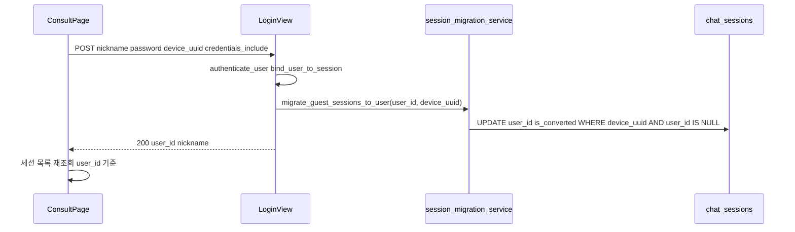
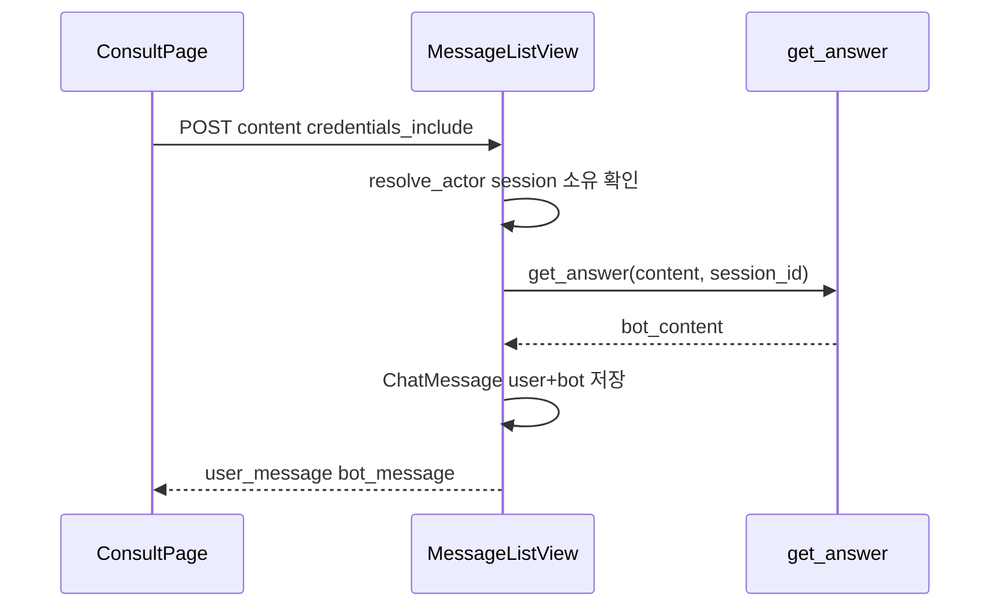

# 에픽 02 — 챗봇 게스트 → 회원 전환

챗봇 상담 API(`/api/sessions/*`)를 로그인 `user_id` 기준으로 동작하게 하고, 로그인 시 게스트 `device_uuid` 데이터를 회원에게 이전한다. [`ConsultPage.jsx`](../frontend/src/pages/ConsultPage.jsx)에 로그인 상태를 표시한다.

**선행 조건:** [에픽00](에픽00-로그인-인증구현.md) 완료 후 [에픽01](에픽01-루틴-회원-저장.md) 완료 (`actor_service.py` 존재)

**다음 에픽:** [에픽03-JWT-LLM-게이트.md](에픽03-JWT-LLM-게이트.md)

관련 파일:

- 모델: [`backend/api/models.py`](../backend/api/models.py) — `ChatSession`, `ChatMessage`
- 뷰: [`backend/api/views.py`](../backend/api/views.py) — `SessionListView`, `SessionDetailView`, `MessageListView`
- 서비스: [`backend/api/services/actor_service.py`](../backend/api/services/actor_service.py)
- 마이그레이션(신규): [`backend/api/services/session_migration_service.py`](../backend/api/services/session_migration_service.py)
- 로그인 뷰: [`backend/api/auth_views.py`](../backend/api/auth_views.py)
- 프론트: [`frontend/src/pages/ConsultPage.jsx`](../frontend/src/pages/ConsultPage.jsx)
- 프론트 API: [`frontend/src/api/auth.js`](../frontend/src/api/auth.js)
- UUID 유틸: [`frontend/src/utils/deviceUuid.js`](../frontend/src/utils/deviceUuid.js)

---

## 1. 개요 및 설계 결정 요약

### 전체 목표와 본 에픽 범위

루틴·챗봇 모두 **동일 Django 세션 `user_id`** 로 식별한다. 에픽01이 `weekly_schedulers`를, **본 에픽**이 `chat_sessions`를 담당한다. 에픽01+02 완료 후 [에픽01](에픽01-루틴-회원-저장.md) §8-6 통합 스모크로 한 번에 검증한다.

### 목적

- 로그인 사용자의 채팅 세션·메시지를 `chat_sessions.user_id`에 귀속
- 로그인 **직후** 게스트 `device_uuid`로 쌓인 세션을 해당 `user_id`로 이전 (`is_converted=True`)
- ConsultPage 사이드바 「게스트」→ 로그인 시 **닉네임** 표시

### 고정 전제 4가지

| # | 결정 | 이유 |
|---|------|------|
| 1 | 에픽 1의 `resolve_actor` 재사용 | sessions·routines 식별 규칙 통일 |
| 2 | 마이그레이션은 **LoginView 성공 시 1회** | 별도 마이그레이션 API 없이 UX 단순화 |
| 3 | `device_uuid`는 로그인 body에 **optional** 전달 | 프론트가 `getOrCreateDeviceUuid()`로 전달 |
| 4 | `chat_messages` 스키마 변경 없음 | `session_id` FK로 user 귀속이 자동 전파 |

### DB 컬럼 (변경 없음)

```sql
-- chat_sessions (schema.sql 참고)
user_id              INT REFERENCES users(user_id) ON DELETE CASCADE,
device_uuid          UUID,
is_converted         BOOLEAN DEFAULT FALSE,
extracted_conditions JSONB  -- 향후 LLM 조건 추출용, 본 에픽에서 필수 아님
```

---

## 2. 현재 상태 vs 목표

| 항목 | 현재 | 목표 |
|------|------|------|
| `SessionListView` GET | `device_uuid` 필수 | 로그인 → `user_id` 필터 |
| `SessionListView` POST | `device_uuid`만 저장 | 로그인 → `user_id` + optional `device_uuid` |
| `SessionDetailView` | `session_id` + `device_uuid` 소유 검증 | 로그인 → `user_id` 소유 검증 |
| `MessageListView` | 동일 | 동일 + `credentials`로 세션 인식 |
| `LoginView` | JWT·세션만 | + `migrate_guest_sessions_to_user` |
| ConsultPage | 하드코딩 「게스트」 | `getMe()` 분기 |
| ConsultPage fetch | `credentials` 없음 | `credentials: 'include'` |

---

## 3. 아키텍처

### 로그인 시 게스트 세션 이전



### 메시지 전송 (회원)



---

## 4. 백엔드 구현 — 타이핑 순서

### 4-1. `backend/api/services/session_migration_service.py` (신규)

```python
# backend/api/services/session_migration_service.py
from typing import Optional

from api.models import ChatSession


def migrate_guest_sessions_to_user(user_id: int, device_uuid: Optional[str] = None) -> int:
    """
    device_uuid로만 묶인 게스트 세션을 회원 user_id에 귀속한다.

    Returns:
        이전된 세션 수
    """
    if not device_uuid:
        return 0

    return ChatSession.objects.filter(
        device_uuid=device_uuid,
        user_id__isnull=True,
    ).update(user_id=user_id, is_converted=True)
```

**선택 확장 (루틴 게스트 데이터):** 에픽 1 FAQ에서 언급한 대로, 동일 함수 파일에 `migrate_guest_routines_to_user`를 추가해 `WeeklyScheduler`도 이전할 수 있다. 본 문서 **필수 범위는 chat_sessions만**이다.

```python
# 선택 — weekly_schedulers 이전
from api.models import WeeklyScheduler

def migrate_guest_routines_to_user(user_id: int, device_uuid: Optional[str] = None) -> int:
    if not device_uuid:
        return 0
    return WeeklyScheduler.objects.filter(
        device_uuid=device_uuid,
        user_id__isnull=True,
    ).update(user_id=user_id)
```

---

### 4-2. `backend/api/auth_views.py` — `LoginView` 수정

```python
from api.services.session_migration_service import migrate_guest_sessions_to_user

class LoginView(View):
    def post(self, request):
        data = _parse_json(request)
        try:
            user = authenticate_user(
                nickname=data.get('nickname', ''),
                password=data.get('password', ''),
            )
            bind_user_to_session(request, user)

            # 게스트 채팅 세션 이전 (device_uuid optional)
            device_uuid = (data.get('device_uuid') or '').strip() or None
            migrated = migrate_guest_sessions_to_user(user.user_id, device_uuid)

        except AuthError as exc:
            return JsonResponse({'error': str(exc)}, status=401)

        return JsonResponse({
            'user_id': user.user_id,
            'nickname': user.nickname,
            'migrated_sessions': migrated,  # 디버깅·UI용 (0이어도 OK)
        })
```

---

### 4-3. `backend/api/services/actor_service.py` — 세션용 헬퍼 추가

에픽 1 파일에 아래 함수를 **추가**한다.

```python
def session_owner_filter(actor: Actor) -> dict:
    """ChatSession 목록/소유권 검증용."""
    if actor.mode == 'user':
        return {'user_id': actor.user_id}
    return {'device_uuid': actor.device_uuid}


def session_belongs_to_actor(session: 'ChatSession', actor: Actor) -> bool:
    """세션 한 건이 현재 actor 소유인지 확인."""
    from api.models import ChatSession  # noqa: F401 — type hint only
    if actor.mode == 'user':
        return session.user_id == actor.user_id
    return str(session.device_uuid) == str(actor.device_uuid)
```

---

### 4-4. `backend/api/views.py` — Sessions API 수정

import 추가:

```python
from .services.actor_service import (
    ActorError,
    resolve_actor,
    session_owner_filter,
    session_belongs_to_actor,
)
```

#### `SessionListView`

```python
class SessionListView(View):
    def get(self, request):
        device_uuid = request.GET.get('device_uuid')
        try:
            actor = resolve_actor(request, device_uuid)
        except ActorError as exc:
            return JsonResponse({'error': str(exc)}, status=400)

        sessions = ChatSession.objects.filter(
            **session_owner_filter(actor)
        ).order_by('-created_at').values('session_id', 'title', 'created_at')

        return JsonResponse(list(sessions), safe=False)

    def post(self, request):
        data = json.loads(request.body)
        device_uuid = data.get('device_uuid')
        title = data.get('title', '새 상담')
        try:
            actor = resolve_actor(request, device_uuid)
        except ActorError as exc:
            return JsonResponse({'error': str(exc)}, status=400)

        create_kwargs = {'title': title}
        if actor.mode == 'user':
            create_kwargs['user_id'] = actor.user_id
            if actor.device_uuid:
                create_kwargs['device_uuid'] = actor.device_uuid
        else:
            create_kwargs['device_uuid'] = actor.device_uuid

        session = ChatSession.objects.create(**create_kwargs)
        return JsonResponse(
            {'session_id': session.session_id, 'title': session.title},
            status=201,
        )
```

#### `SessionDetailView`

`_get_session`을 actor 기반으로 교체:

```python
def _get_session(self, session_id, actor):
    try:
        session = ChatSession.objects.get(session_id=session_id)
    except ChatSession.DoesNotExist:
        return None
    if not session_belongs_to_actor(session, actor):
        return None
    return session

def patch(self, request, session_id):
    data = json.loads(request.body)
    try:
        actor = resolve_actor(request, data.get('device_uuid'))
    except ActorError as exc:
        return JsonResponse({'error': str(exc)}, status=400)
    session = self._get_session(session_id, actor)
    # ... 이하 동일
```

`delete`도 동일 패턴.

#### `MessageListView`

```python
def get(self, request, session_id):
    try:
        actor = resolve_actor(request, request.GET.get('device_uuid'))
    except ActorError as exc:
        return JsonResponse({'error': str(exc)}, status=400)

    try:
        session = ChatSession.objects.get(session_id=session_id)
    except ChatSession.DoesNotExist:
        return JsonResponse({'error': 'not found'}, status=404)

    if not session_belongs_to_actor(session, actor):
        return JsonResponse({'error': 'not found'}, status=404)

    messages = ChatMessage.objects.filter(session_id=session_id).order_by('created_at').values(
        'message_id', 'sender', 'content', 'created_at'
    )
    return JsonResponse(list(messages), safe=False)

def post(self, request, session_id):
    data = json.loads(request.body)
    try:
        actor = resolve_actor(request, data.get('device_uuid'))
    except ActorError as exc:
        return JsonResponse({'error': str(exc)}, status=400)

    try:
        session = ChatSession.objects.get(session_id=session_id)
    except ChatSession.DoesNotExist:
        return JsonResponse({'error': 'not found'}, status=404)

    if not session_belongs_to_actor(session, actor):
        return JsonResponse({'error': 'not found'}, status=404)

    # content 검증 + get_answer + ChatMessage 저장 — 기존 로직 유지
```

---

## 5. 프론트엔드 구현 — 타이핑 순서

### 5-1. `frontend/src/api/auth.js` — login에 device_uuid

```javascript
/**
 * @param {{ nickname: string, password: string, device_uuid?: string }} params
 */
export function login({ nickname, password, device_uuid }) {
  const body = { nickname, password }
  if (device_uuid) body.device_uuid = device_uuid
  return authFetch('/api/auth/login/', {
    method: 'POST',
    body: JSON.stringify(body),
  })
}
```

[`LoginPage.jsx`](../frontend/src/pages/LoginPage.jsx)에서 로그인 호출 시 UUID 전달:

```javascript
import { getOrCreateDeviceUuid } from '../utils/deviceUuid'

await login({
  nickname: userId,
  password,
  device_uuid: getOrCreateDeviceUuid(),
})
```

---

### 5-2. `frontend/src/pages/ConsultPage.jsx` 수정

#### (1) UUID 유틸·auth import

기존 `getOrCreateUUID` 함수를 유틸로 교체:

```javascript
import { getMe } from '../api/auth'
import { getOrCreateDeviceUuid } from '../utils/deviceUuid'

// 컴포넌트 내부
const uuid = useRef(getOrCreateDeviceUuid())
```

#### (2) 로그인 상태

```javascript
const [authUser, setAuthUser] = useState(null)

useEffect(() => {
  getMe()
    .then((u) => setAuthUser(u))
    .catch(() => setAuthUser(null))
}, [])
```

#### (3) 모든 sessions API에 credentials

```javascript
fetch(`${API_URL}/api/sessions/?device_uuid=${uuid.current}`, {
  credentials: 'include',
})

fetch(`${API_URL}/api/sessions/${activeId}/messages/?device_uuid=${uuid.current}`, {
  credentials: 'include',
})

fetch(`${API_URL}/api/sessions/`, {
  method: 'POST',
  credentials: 'include',
  headers: { 'Content-Type': 'application/json' },
  body: JSON.stringify({ device_uuid: uuid.current, title: '새 상담' }),
})

// PATCH, DELETE, POST messages 동일
```

로그인 사용자는 query/body의 `device_uuid`를 **유지해도 됨**. 백엔드가 `user_id` 우선 처리.

#### (4) 프로필 UI (542행 교체)

```jsx
<span style={{ fontSize: 13, color: 'rgba(226,226,226,0.75)', fontWeight: 500 }}>
  {authUser ? authUser.nickname : '게스트'}
</span>
```

게스트일 때만 `/login` 이동. 로그인 사용자는 클릭 시 `/` 또는 프로필(향후) — 최소 구현은 닉네임만 표시.

#### (5) 로그인 후 세션 목록 갱신

Navbar에서 로그인 후 ConsultPage로 돌아올 때 목록이 비어 보이면, `authUser` 변경 시 `loadSessions()`를 다시 호출:

```javascript
useEffect(() => {
  loadSessions() // 기존 세션 목록 fetch 함수
}, [authUser])
```

---

## 6. API 계약

### 변경된 엔드포인트

| 엔드포인트 | 변경点 |
|------------|--------|
| `POST /api/auth/login/` | Body에 `device_uuid` optional 추가. 응답에 `migrated_sessions` (int) |
| `GET/POST /api/sessions/` | 로그인 시 `user_id` 기준, 게스트 시 `device_uuid` 필수 |
| `PATCH/DELETE /api/sessions/:id/` | 소유권: actor 기준 |
| `GET/POST /api/sessions/:id/messages/` | 소유권: actor 기준 |

### `POST /api/auth/login/` Body (확장)

```json
{
  "nickname": "testuser",
  "password": "testpass1234",
  "device_uuid": "550e8400-e29b-41d4-a716-446655440000"
}
```

성공 응답:

```json
{
  "user_id": 1,
  "nickname": "testuser",
  "migrated_sessions": 2
}
```

### 소유권 오류

타인 세션 접근 시 **404 `not found`** (존재 여부 노출 최소화).

---

## 7. 환경변수·설정

본 에픽은 **신규 환경변수 없음**.

- [에픽00](에픽00-로그인-인증구현.md)의 CORS·CSRF·세션 설정 유지
- `/api/sessions/*`는 `@csrf_exempt` — CSRF 헤더 불필요, `credentials: 'include'`만 필요

---

## 8. 수동 검증

### 8-1. 게스트 → 로그인 마이그레이션 E2E

1. 로그아웃 상태 ConsultPage에서 새 상담 2개 + 메시지 몇 개 전송
2. DB 확인: `chat_sessions.user_id IS NULL`, `device_uuid` 일치
3. LoginPage에서 로그인 (`device_uuid` body 포함)
4. 응답 `migrated_sessions >= 1`
5. ConsultPage 새로고침 → **이전 세션·메시지 유지**
6. DB: `user_id` 채워짐, `is_converted = true`

```sql
SELECT session_id, user_id, device_uuid, is_converted, title
FROM chat_sessions
ORDER BY created_at DESC
LIMIT 5;
```

### 8-2. curl

```bash
DEVICE="550e8400-e29b-41d4-a716-446655440000"

# 게스트 세션 생성
curl -X POST http://localhost:8000/api/sessions/ \
  -H "Content-Type: application/json" \
  -d "{\"device_uuid\":\"${DEVICE}\",\"title\":\"테스트 상담\"}"

# 로그인 + 마이그레이션 (cookies.txt, CSRF는 에픽00 참고)
curl -b cookies.txt -c cookies.txt \
  -H "Content-Type: application/json" \
  -H "X-CSRFToken: $CSRF" \
  -d "{\"nickname\":\"testuser\",\"password\":\"testpass1234\",\"device_uuid\":\"${DEVICE}\"}" \
  http://localhost:8000/api/auth/login/

# 로그인 후 세션 목록 (device_uuid 없이도 OK)
curl -b cookies.txt http://localhost:8000/api/sessions/
```

### 8-3. 브라우저 체크리스트

- [ ] 게스트 ConsultPage → 「게스트」 표시, 채팅·세션 CRUD 정상
- [ ] 로그인 후 → 닉네임 표시
- [ ] 게스트 때 만든 세션이 로그인 후에도 목록에 있음
- [ ] 다른 계정으로 로그인 시 타인 세션 접근 불가 (404)
- [ ] 로그아웃 후 게스트 UUID로 새 세션 생성 가능 (회원 데이터와 분리)

### 8-4. 에픽01+02 통합 스모크

에픽01·본 에픽 모두 완료 후 실행한다. 시나리오·SQL·기대 결과는 [에픽01](에픽01-루틴-회원-저장.md) §8-6을 따른다.

**루틴 게스트 이전:** `migrate_guest_routines_to_user`를 팀에서 **필수**로 채택한 경우에만 §8-6 3~4번(로그인 후 게스트 루틴 유지)이 통과한다. 미적용 시 채팅만 이전되고 루틴은 에픽01 §8-5 제약대로 분리된다.

---

## 9. 구현 순서 치트시트

| Step | 작업 | 완료 기준 |
|------|------|-----------|
| **1** | `session_migration_service.py` | 단위 테스트 또는 SQL로 update 확인 |
| **2** | `LoginView` + `auth.js` device_uuid | `migrated_sessions` 응답 |
| **3** | `actor_service` 세션 헬퍼 추가 | import OK |
| **4** | `SessionListView` / `Detail` / `MessageListView` | curl 게스트·로그인 |
| **5** | `ConsultPage` credentials + getMe + UI | E2E 마이그레이션 |
| **6** | `LoginPage` device_uuid 전달 | 로그인 시 이전 세션 유지 |
| **7** | (선택) `migrate_guest_routines_to_user` | 팀 결정 시 LoginView에서 호출 |
| **8** | [에픽01](에픽01-루틴-회원-저장.md) §8-6 통합 스모크 | 루틴·채팅 동일 `user_id` |

---

## 10. 알려진 제약 및 다음 에픽 연계

### 제약

1. **마이그레이션은 `device_uuid` 일치 데이터만**  
   Consult(쿠키)와 Routine(localStorage) UUID가 다르면 채팅만 이전된다. [에픽01](에픽01-루틴-회원-저장.md) `deviceUuid.js`를 에픽02 착수 전에 적용한다. 루틴 게스트 이전은 `migrate_guest_routines_to_user` **필수 여부를 팀이 결정**한다 (에픽01 §10).

2. **`extracted_conditions` 미사용**  
   스키마에 있으나 현재 챗봇 파이프라인에서 채우지 않음. 향후 루틴 연계 시 활용.

3. **동시 로그인·다중 기기**  
   `user_id` 기준 목록은 모든 기기에서 동일. `device_uuid` 마이그레이션은 **로그인한 기기의 UUID**에 묶인 게스트 데이터만 이전.

### 다음 에픽

- [에픽03](에픽03-JWT-LLM-게이트.md): `CHATBOT_REQUIRE_AUTH`로 LLM 호출 게이트

---

## 부록 A: 트러블슈팅

| 증상 | 원인 | 해결 |
|------|------|------|
| 로그인 후 세션 목록 비음 | 마이그레이션 0건 (UUID 불일치) | Login body `device_uuid`, `deviceUuid.js` 확인 |
| `migrated_sessions: 0`인데 게스트 세션 있음 | 이미 `user_id` 설정됨 또는 다른 UUID | SQL로 `device_uuid` 대조 |
| 로그인 후에도 게스트 세션만 조회 | `credentials` 누락 | fetch에 `include` |
| 메시지 POST 404 | 세션 소유권 actor 불일치 | 로그인 후 목록 재조회, `activeId` 갱신 |
| 로그인 API 403 | CSRF | `auth.js` `ensureCsrfCookie` |

---

## 부록 B: 회원 전용 새 세션 생성 규칙

로그인 상태에서 `POST /api/sessions/` 시:

- `user_id` = 세션 사용자
- `device_uuid` = body에 있으면 기록 (없어도 됨)
- 이후 GET 목록은 `user_id`만으로 조회 → **다른 기기에서도 보임**

게스트 상태:

- `device_uuid` **필수**
- `user_id` NULL
