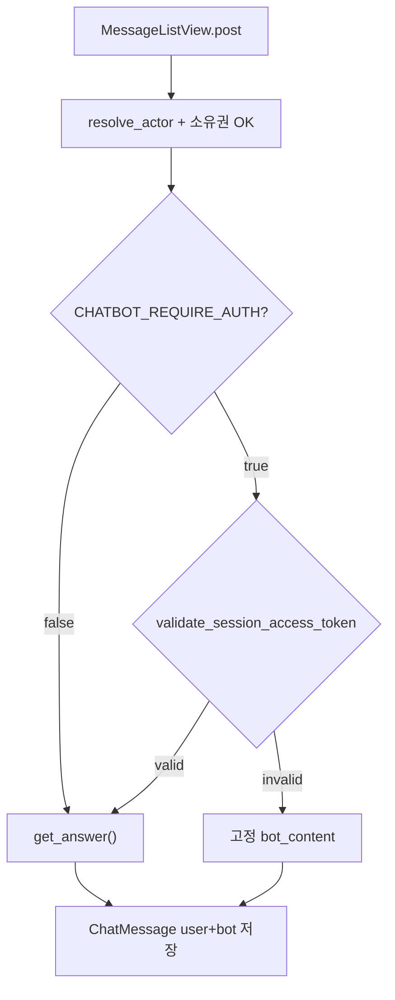
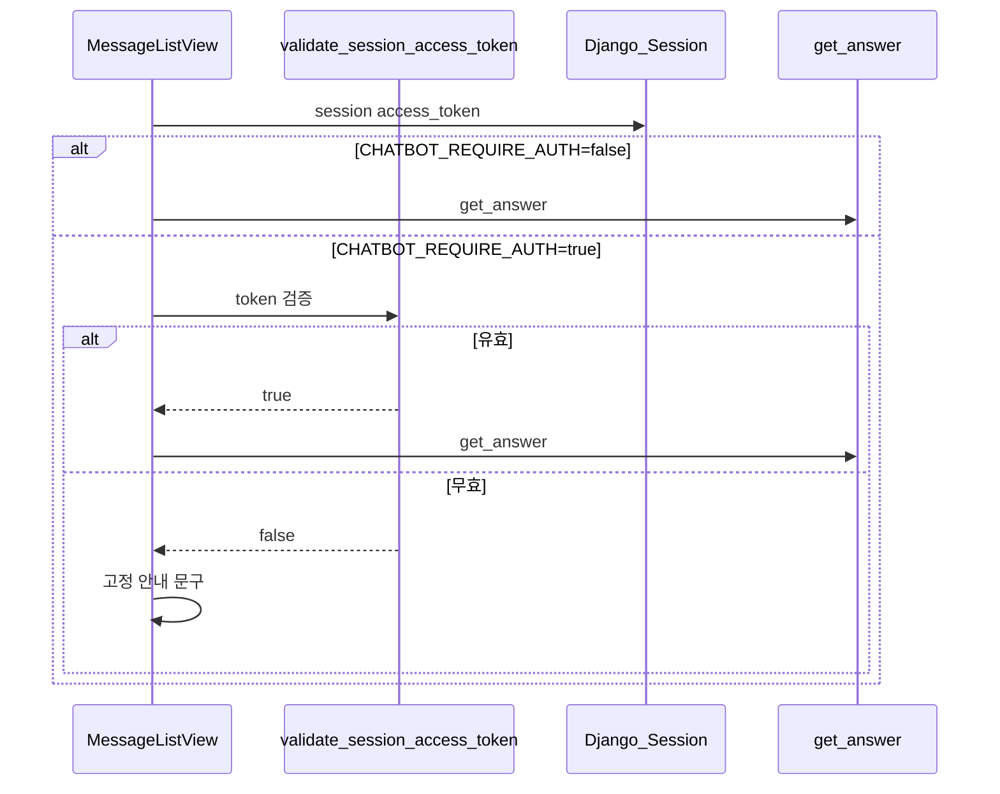

# 에픽 03 — JWT 인증 LLM 게이트

환경변수 `CHATBOT_REQUIRE_AUTH`로 챗봇 LLM(`get_answer`) 호출 전 **세션 JWT 유효성**을 검사한다. 미인증·만료 시 LLM을 실행하지 않고 고정 안내 메시지를 반환한다.

**선행 조건:** [에픽02-챗봇-회원-전환.md](에픽02-챗봇-회원-전환.md) 완료 (세션 API + 로그인·JWT 세션 저장)

**다음 에픽:** [에픽04-로컬-LLM-연동.md](에픽04-로컬-LLM-연동.md) (병행 가능)

관련 파일:

- 상수: [`backend/api/services/chatbot/constants.py`](../backend/api/services/chatbot/constants.py)
- 인증 서비스: [`backend/api/services/auth_service.py`](../backend/api/services/auth_service.py)
- 게이트(신규 권장): [`backend/api/services/chatbot/llm_gate.py`](../backend/api/services/chatbot/llm_gate.py)
- 뷰: [`backend/api/views.py`](../backend/api/views.py) — `MessageListView.post`
- 설정: [`backend/config/settings.py`](../backend/config/settings.py) — `SIMPLE_JWT`

**범위 외:** [`RoutineView`](../backend/api/views.py) (LLM 미사용), RAG 배치, 임베딩

---

## 1. 개요 및 설계 결정 요약

### 목적

- 운영·개발 환경에서 **`.env` 한 줄**로 「로그인+유효 JWT 없으면 LLM 차단」 on/off
- 기본값 `false` → 기존 게스트 챗봇 동작 유지

### 고정 전제 4가지

| # | 결정 | 이유 |
|---|------|------|
| 1 | JWT는 **세션 `access_token`** 검증 | [에픽00](에픽00-로그인-인증구현.md) 패턴(세션-JWT 종속)과 일치, Authorization 헤더 불필요 |
| 2 | 차단 시 **HTTP 201 + 고정 bot 메시지** | 사용자 메시지는 DB에 저장, 채팅 UX 끊김 최소화 (403 미사용) |
| 3 | `CHATBOT_REQUIRE_AUTH=false`면 게이트 **완전 우회** | 에픽 1·2 이전 동작 보존 |
| 4 | 게이트는 `get_answer()` **직전**만 | actor·세션 소유권 검증은 에픽 2 로직 유지 |

### 에픽 04와 환경변수 분리

| 환경변수 | 에픽 | 역할 |
|----------|------|------|
| `CHATBOT_REQUIRE_AUTH` | **본 에픽** | JWT 없/만료 시 LLM 차단 |
| `LLM_PROVIDER` | 에픽 04 | OpenAI vs 로컬 모델 선택 |

두 변수는 **독립**. 예: `CHATBOT_REQUIRE_AUTH=true` + `LLM_PROVIDER=local` 동시 설정 가능.

---

## 2. 현재 상태 vs 목표

| 항목 | 현재 | 목표 |
|------|------|------|
| `MessageListView.post` | 무조건 `get_answer()` | `CHATBOT_REQUIRE_AUTH` 시 JWT 검증 후 분기 |
| JWT 검증 함수 | 없음 | `validate_session_access_token(request)` |
| 미인증 응답 | — | 고정 한국어 안내 bot 메시지 |
| env 토글 | 없음 | `.env` + `constants.py` |

---

## 3. 아키텍처



### 로그인·JWT·LLM 관계



---

## 4. 백엔드 구현 — 타이핑 순서

### 4-1. `backend/api/services/chatbot/constants.py` 추가

```python
# backend/api/services/chatbot/constants.py — 추가

CHATBOT_REQUIRE_AUTH = os.getenv("CHATBOT_REQUIRE_AUTH", "False") == "True"

AUTH_REQUIRED_MESSAGE = (
    "AI 답변을 이용하려면 로그인이 필요합니다. "
    "로그인 후 다시 질문해 주세요."
)
```

`.env` 예시:

```env
# false(기본): 게스트도 LLM 사용 가능
# true: 세션 access_token JWT 유효할 때만 LLM 실행
CHATBOT_REQUIRE_AUTH=False
```

---

### 4-2. `backend/api/services/auth_service.py` — JWT 검증 함수

```python
from rest_framework_simplejwt.exceptions import InvalidToken, TokenError
from rest_framework_simplejwt.tokens import AccessToken


def validate_session_access_token(request) -> bool:
    """
    Django 세션에 저장된 access_token JWT가 유효한지 검사한다.

    - 토큰 없음 / 만료 / 서명 오류 → False
    - 유효 → True
    """
    raw = request.session.get('access_token')
    if not raw:
        return False
    try:
        AccessToken(raw)
    except (InvalidToken, TokenError):
        return False
    return True
```

**참고:** 로그인 시 `bind_user_to_session`이 `access_token`을 저장한다 ([`auth_service.py`](../backend/api/services/auth_service.py)). 로그아웃 시 `clear_session`으로 제거된다.

---

### 4-3. `backend/api/services/chatbot/llm_gate.py` (신규, 권장)

뷰에서 비즈니스 분기를 분리한다.

```python
# backend/api/services/chatbot/llm_gate.py
from django.http import HttpRequest

from api.services.auth_service import validate_session_access_token
from .constants import CHATBOT_REQUIRE_AUTH, AUTH_REQUIRED_MESSAGE
from .chatbot import get_answer


def should_run_llm(request: HttpRequest) -> bool:
    """LLM 실행 허용 여부."""
    if not CHATBOT_REQUIRE_AUTH:
        return True
    return validate_session_access_token(request)


def generate_bot_content(request: HttpRequest, user_content: str, session_id: int) -> str:
    """
    게이트 통과 시 get_answer, 차단 시 고정 안내 문구.
    """
    if not should_run_llm(request):
        return AUTH_REQUIRED_MESSAGE
    try:
        return get_answer(user_content, session_id)
    except Exception as exc:
        print(f'[chatbot] answer generation failed: {exc}')
        return '답변을 생성하는 중 오류가 발생했습니다. 잠시 후 다시 시도해 주세요.'
```

---

### 4-4. `backend/api/views.py` — `MessageListView.post` 수정

기존 `get_answer` 직접 호출을 `generate_bot_content`로 교체:

```python
from .services.chatbot.llm_gate import generate_bot_content

# MessageListView.post 내부 — content 검증·소유권 확인 이후:

bot_content = generate_bot_content(request, content, session_id)

user_msg = ChatMessage.objects.create(
    session_id=session_id,
    sender='user',
    content=content,
)
bot_msg = ChatMessage.objects.create(
    session_id=session_id,
    sender='bot',
    content=bot_content,
)
# ... JsonResponse 동일
```

`from .services.chatbot.chatbot import get_answer` import는 뷰에서 **제거** 가능 (게이트가 위임).

---

## 5. 프론트엔드 구현

### 변경 최소화

본 에픽은 **백엔드 env 토글** 중심이다. 프론트 변경 필수 사항 없음.

| `CHATBOT_REQUIRE_AUTH` | 프론트 동작 |
|------------------------|-------------|
| `false` | 기존과 동일 |
| `true` | 미로그인 시 bot이 「로그인이 필요합니다」 안내 — ConsultPage 로그인 버튼 UX 권장 |

**권장 (선택):** `CHATBOT_REQUIRE_AUTH=true` 운영 시 ConsultPage 입력창 placeholder에 「로그인 후 AI 답변 이용 가능」 표시. env를 프론트에 노출하지 않고, 401/me 실패로 게스트임을 이미 알고 있으면 안내 링크만 추가해도 충분하다.

---

## 6. API 계약

### `POST /api/sessions/:id/messages/`

동작은 `CHATBOT_REQUIRE_AUTH`에 따름.

| 모드 | user 메시지 저장 | bot 응답 | LLM 호출 |
|------|------------------|----------|----------|
| `REQUIRE_AUTH=false` | O | `get_answer()` 결과 | O |
| `REQUIRE_AUTH=true` + 유효 JWT | O | `get_answer()` 결과 | O |
| `REQUIRE_AUTH=true` + 무효 JWT | O | `AUTH_REQUIRED_MESSAGE` | X |

HTTP 상태코드: **201** (기존과 동일). 차단이어도 403으로 바꾸지 않는다.

응답 body 예 (차단 시):

```json
{
  "user_message": { "message_id": 10, "sender": "user", "content": "오늘 운동 추천", "created_at": "..." },
  "bot_message": {
    "message_id": 11,
    "sender": "bot",
    "content": "AI 답변을 이용하려면 로그인이 필요합니다. 로그인 후 다시 질문해 주세요.",
    "created_at": "..."
  }
}
```

---

## 7. 환경변수·설정

### `.env`

```env
CHATBOT_REQUIRE_AUTH=False
```

| 값 | 의미 |
|----|------|
| `False` (기본) | 게스트 포함 누구나 LLM 사용 |
| `True` | `session['access_token']` 유효 시에만 LLM |

### Docker / 재시작

`constants.py`는 import 시점에 env를 읽는다. `.env` 변경 후 **백엔드 프로세스 재시작** 필요.

```bash
docker compose restart backend
# 또는
python manage.py runserver
```

### JWT 만료

[`settings.py`](../backend/config/settings.py):

```python
SIMPLE_JWT = {
    'ACCESS_TOKEN_LIFETIME': timedelta(minutes=30),
    ...
}
```

30분 경과 후 `CHATBOT_REQUIRE_AUTH=true`이면 LLM 차단 + 안내 메시지. **재로그인**으로 새 `access_token` 발급. (refresh API는 향후 확장)

---

## 8. 수동 검증

### 8-1. `CHATBOT_REQUIRE_AUTH=False` (기본)

```bash
# 게스트 — device_uuid만으로 메시지 POST (에픽 2 actor 적용 후)
curl -X POST http://localhost:8000/api/sessions/1/messages/ \
  -H "Content-Type: application/json" \
  -d '{"device_uuid":"YOUR-UUID","content":"스쿼트 자세 알려줘"}'
```

기대: bot 응답이 LLM 생성 내용 (고정 안내 아님).

### 8-2. `CHATBOT_REQUIRE_AUTH=True` — 게스트

`.env` 설정 후 백엔드 재시작.

```bash
curl -X POST http://localhost:8000/api/sessions/1/messages/ \
  -H "Content-Type: application/json" \
  -d '{"device_uuid":"YOUR-UUID","content":"스쿼트 자세 알려줘"}'
```

기대: `bot_message.content` == `AUTH_REQUIRED_MESSAGE`, 서버 로그에 OpenAI/LangGraph 호출 없음.

### 8-3. `CHATBOT_REQUIRE_AUTH=True` — 로그인

```bash
# 에픽00대로 login → sessionid + access_token 세션 저장
curl -b cookies.txt -X POST http://localhost:8000/api/sessions/1/messages/ \
  -H "Content-Type: application/json" \
  -d '{"content":"스쿼트 자세 알려줘"}'
```

기대: 정상 LLM 답변.

### 8-4. JWT 만료 시뮬레이션

1. 로그인 후 `CHATBOT_REQUIRE_AUTH=True`
2. Django admin 또는 DB에서 `django_session`의 `access_token` 값을 임의로 깨뜨리거나 31분 대기
3. 메시지 POST → 고정 안내 메시지

### 8-5. 브라우저 체크리스트

- [ ] `False`: 게스트 채팅 LLM 정상
- [ ] `True`: 게스트 → 안내 문구만, user 메시지는 히스토리에 남음
- [ ] `True`: 로그인 → LLM 정상
- [ ] 로그아웃 후 `True` → 다시 안내 문구

---

## 9. 구현 순서 치트시트

| Step | 작업 | 완료 기준 |
|------|------|-----------|
| **1** | `constants.py` env + 메시지 상수 | import OK |
| **2** | `validate_session_access_token` | 만료 토큰 False |
| **3** | `llm_gate.py` | 단위 분기 확인 |
| **4** | `MessageListView.post` 연동 | curl 3케이스 |
| **5** | `.env` 문서화 + Docker 재시작 | 토글 동작 |

---

## 10. 알려진 제약 및 다음 에픽 연계

### 제약

1. **Authorization Bearer 헤더 미지원**  
   본 에픽은 세션 `access_token`만 검증. SPA가 헤더로 JWT를 보내는 패턴은 범위 밖.

2. **Refresh token 미사용**  
   access 만료 시 재로그인 필요. `session['refresh_token']`으로 갱신 API는 [에픽00 §9](에픽00-로그인-인증구현.md) 향후 확장.

3. **세션 로그인 vs JWT 유효 불일치**  
   `user_id` 세션은 있는데 access_token만 만료된 경우 → actor는 user, LLM은 차단. 의도된 동작.

4. **`get_session_user`와 JWT 게이트는 별개**  
   에픽 2 actor는 Django `user_id` 세션. 에픽 3 게이트는 JWT 문자열 유효성. 로그인 직후 둘 다 true.

### 다음 에픽

- [에픽04](에픽04-로컬-LLM-연동.md): `LLM_PROVIDER`로 OpenAI/로컬 분기

---

## 부록 A: 트러블슈팅

| 증상 | 원인 | 해결 |
|------|------|------|
| `True`인데 게스트도 LLM 됨 | env 미반영 | 재시작, `load_dotenv` 경로 확인 |
| `True`인데 로그인도 차단 | access_token 세션 없음 | 재로그인, `bind_user_to_session` 확인 |
| 항상 차단 | `SIMPLE_JWT` SECRET 변경·토큰 손상 | 재로그인 |
| 403 발생 | 잘못된 구현 | 본 가이드는 201 유지 — 403 제거 |
| OpenAI 비용 계속 발생 | 게이트 우회 | `generate_bot_content` 경로 확인, 로그 |

---

## 부록 B: 운영 권장 조합

| 환경 | `CHATBOT_REQUIRE_AUTH` | `LLM_PROVIDER` |
|------|------------------------|----------------|
| 로컬 개발 (게스트 테스트) | `False` | `openai` |
| 스테이징 | `True` | `openai` |
| 로컬 LLM 서버 연동 중 | `False` | `local` |
| 운영 | `True` | `openai` 또는 `local` |
