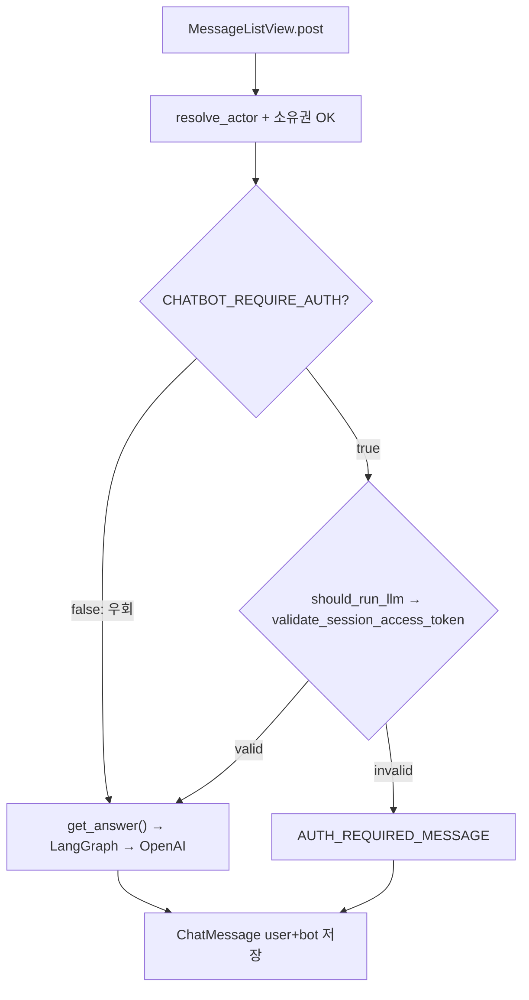
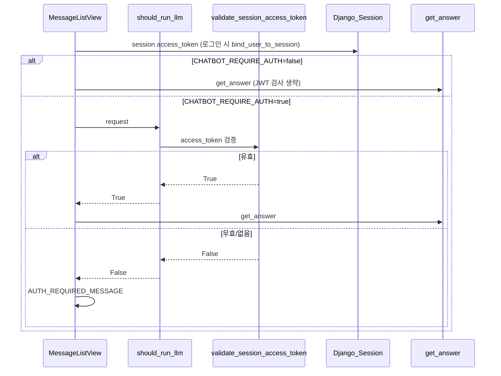

# 에픽 03 — JWT 인증 LLM 게이트

유료 LLM(OpenAI API 등)을 호출하는 **런타임 API** 앞에서 세션 JWT 유효성을 검사한다.  
환경변수 `CHATBOT_REQUIRE_AUTH=False`(기본)이면 검사를 **완전히 우회**하여, 팀원 코드가 아직 합쳐지지 않은 개발 단계에서도 기존 게스트 챗봇이 그대로 동작한다.

**선행 조건:** [에픽02-챗봇-회원-전환.md](에픽02-챗봇-회원-전환.md) 완료 (세션 API + 로그인 시 `access_token` 세션 저장)

**다음 에픽:** [에픽04-로컬-LLM-연동.md](에픽04-로컬-LLM-연동.md) (병행 가능)

---

## 0. 구현 전 검증 요약 (체크리스트)

에픽 03 착수 전 아래 4가지를 코드베이스 기준으로 확인했다.

| # | 요구사항 | 현재 코드 상태 | 본 에픽 대응 |
|---|----------|----------------|--------------|
| 1 | 유료 LLM 호출 전 JWT 인증 | `MessageListView.post`가 **무조건** `get_answer()` 호출 ([`views.py` L199–203](../backend/api/views.py)) | `generate_bot_content()` 앞단에서 JWT 검사 |
| 2 | 제어 대상 기능 수 파악 | **런타임 API 1곳** (챗봇 메시지 POST). 루틴 API·운동 목록은 LLM 미사용 | §1 인벤토리 표 참고 |
| 3 | 토큰 검사 유틸 1개 + 기능 앞단 체크 | `validate_session_access_token` **미구현** | `auth_service.py`에 유틸, `llm_gate.py`의 `should_run_llm()`이 진입점 |
| 4 | `.env` on/off로 검사 우회 | env 토글 **없음** | `CHATBOT_REQUIRE_AUTH=False` → `should_run_llm()`이 항상 `True` 반환 |

**핵심:** 게이트는 `get_answer()` **진입 전**에만 건다. `get_answer()` 내부의 분류·추출·생성·임베딩 LLM 호출은 모두 한 번에 차단된다.

---

## 1. 유료 LLM 기능 인벤토리 (전수 조사)

### 1-1. 런타임 API — **게이트 필수** (현재 1곳)

| API | View | LLM 진입 함수 | 내부 LLM 호출 (게이트 통과 시) | 비고 |
|-----|------|---------------|--------------------------------|------|
| `POST /api/sessions/:id/messages/` | `MessageListView.post` | `get_answer()` | 아래 §1-2 참고 | **유일한 사용자 대면 LLM API** |

### 1-2. `get_answer()` 체인 내부 LLM (API 노출 없음, 게이트로 일괄 차단)

`get_answer()` → LangGraph → [`nodes.py`](../backend/api/services/chatbot/nodes.py):

| 단계 | 노드 | LLM/유료 API | 모델 |
|------|------|--------------|------|
| 1 | `classify` | `classify_llm` (Chat Completions) | gpt-4o-mini |
| 2a | `retrieve_specific` | `llm` — 운동명 추출 | gpt-4o-mini |
| 2b | `retrieve_injury` | `llm` — 부상 부위 추출 | gpt-4o-mini |
| 2c | `retrieve_general` / `keyword_search` | 임베딩 `embed_query` ([`db.py`](../backend/api/services/chatbot/db.py)) | text-embedding-3-small |
| 3 | `generate` | `llm` — 최종 답변 생성 | gpt-4o-mini |
| — | `out_of_scope` | 분류 LLM은 이미 실행됨 | — |

> **비용 포인트:** 게이트가 `False`를 반환하면 `get_answer()` 자체가 호출되지 않으므로 **Chat Completions + Embedding API 모두 0회**다.

### 1-3. 게이트 **불필요** (범위 외)

| 구분 | 파일/경로 | 이유 |
|------|-----------|------|
| 루틴 CRUD | `RoutineView` GET/POST | DB 읽기·쓰기만, LLM 없음 |
| 운동 목록 | `ExerciseListView` | DB 조회만 |
| 세션 CRUD | `SessionListView`, `SessionDetailView` | LLM 없음 |
| 인증 API | `auth_views.py` | JWT **발급** 경로 (검증 대상 아님) |
| RAG 배치 | `api/services/RAG/` | 오프라인 임베딩 적재, 사용자 API 아님 |
| 레거시 | `api/services/chat.py` | `parse_user_conditions`, `generate_routine` 존재하나 **urls.py 미연결**, 현재 미사용 |

### 1-4. 향후 추가 예정 (팀원 코드 합류 시)

| 예상 기능 | 예상 진입점 | 적용 방법 |
|-----------|-------------|-----------|
| 루틴 AI 생성 API | 새 View `post` | `should_run_llm(request)` → 실패 시 4xx 또는 고정 메시지 |
| 기타 LLM API | 각 View `post`/`get` | 동일 패턴 — §4-5 참고 |

변수명이 `CHATBOT_REQUIRE_AUTH`이지만, **의미는 「런타임 LLM 전역 게이트」**다. 챗봇 외 API가 생기면 같은 `should_run_llm()`을 재사용한다.

---

## 2. 개요 및 설계 결정

### 목적

- 운영·개발 환경에서 **`.env` 한 줄**로 「유효 JWT 없으면 LLM 차단」 on/off
- 기본값 `False` → 에픽 1·2 이전 게스트 챗봇 동작 유지 (팀 병행 개발 대비)

### 고정 전제 5가지

| # | 결정 | 이유 |
|---|------|------|
| 1 | JWT는 **세션 `access_token`** 검증 | [에픽00](에픽00-로그인-인증구현.md) 패턴(세션-JWT 종속). Authorization Bearer 헤더 불필요 |
| 2 | 차단 시 **HTTP 201 + 고정 bot 메시지** | user 메시지는 DB 저장, 채팅 UX 끊김 최소화 (403 미사용) |
| 3 | `CHATBOT_REQUIRE_AUTH=False`면 게이트 **완전 우회** | env off 시 `validate_session_access_token`도 호출하지 않음 |
| 4 | 게이트는 `get_answer()` **직전**만 | actor·세션 소유권 검증은 에픽 2 [`resolve_actor`](../backend/api/services/actor_service.py) 유지 |
| 5 | 검사 유틸은 **2계층** | ① `validate_session_access_token` (JWT만) ② `should_run_llm` (env + JWT) |

### 에픽 04와 환경변수 분리

| 환경변수 | 에픽 | 역할 |
|----------|------|------|
| `CHATBOT_REQUIRE_AUTH` | **본 에픽** | JWT 없/만료 시 LLM 차단 on/off |
| `LLM_PROVIDER` | 에픽 04 | OpenAI vs 로컬 모델 선택 |

두 변수는 **독립**. 예: `CHATBOT_REQUIRE_AUTH=True` + `LLM_PROVIDER=local` 동시 설정 가능.

### 관련 파일

| 역할 | 경로 |
|------|------|
| env 상수 | [`backend/api/services/chatbot/constants.py`](../backend/api/services/chatbot/constants.py) |
| JWT 검증 유틸 (신규) | [`backend/api/services/auth_service.py`](../backend/api/services/auth_service.py) |
| LLM 게이트 (신규) | [`backend/api/services/chatbot/llm_gate.py`](../backend/api/services/chatbot/llm_gate.py) |
| 연동 대상 뷰 | [`backend/api/views.py`](../backend/api/views.py) — `MessageListView.post` |
| JWT 만료 설정 | [`backend/config/settings.py`](../backend/config/settings.py) — `SIMPLE_JWT` |
| env 샘플 | [`.env.sample`](../.env.sample) |

---

## 3. 현재 코드 vs 목표

### 3-1. `MessageListView.post` — 변경 전 (현재)

[`backend/api/views.py`](../backend/api/views.py) L176–229:

```python
    def post(self, request, session_id):
        data = json.loads(request.body)

        try: 
            actor = resolve_actor(request, data.get('device_uuid'))
        except ActorError as exc:
            return JsonResponse({'error': str(exc)}, status=400)

        try:
            session = ChatSession.objects.get(session_id=session_id)
        except ChatSession.DoesNotExist:
            return JsonResponse({'error': 'not found'}, status=404)

        if not session_belongs_to_actor(session, actor):
            return JsonResponse({'error': 'not found'}, status=404)

        content = data.get('content', '').strip()
        if not content:
            return JsonResponse({'error': 'content required'}, status=400)

        # ★ 현재: JWT 검사 없이 무조건 LLM 호출
        try:
            bot_content = get_answer(content, session_id)
        except Exception as exc:
            print(f'[chatbot] answer generation failed: {exc}')
            bot_content = '답변을 생성하는 중 오류가 발생했습니다. 잠시 후 다시 시도해 주세요.'

        user_msg = ChatMessage.objects.create(
            session_id=session_id,
            sender='user',
            content=content,
        )
        bot_msg = ChatMessage.objects.create(
            session_id=session_id,
            sender='bot',
            content=bot_content,
        )

        return JsonResponse({
            'user_message': { ... },
            'bot_message': { ... },
        }, status=201)
```

### 3-2. 목표

| 항목 | 현재 | 목표 |
|------|------|------|
| `MessageListView.post` | 무조건 `get_answer()` | `generate_bot_content()` 경유 |
| JWT 검증 함수 | 없음 | `validate_session_access_token(request)` |
| env 토글 | 없음 | `CHATBOT_REQUIRE_AUTH` |
| 미인증 응답 | — | `constants`의 `AUTH_REQUIRED_MESSAGE` |

---

## 4. 아키텍처



### 로그인·JWT·LLM 시퀀스



### 유틸 함수 역할 분리

```
validate_session_access_token(request)   ← JWT 문자열만 검사 (재사용 가능한 저수준 유틸)
        ↑
should_run_llm(request)                  ← env off면 True 즉시 반환 / on이면 위 함수 호출
        ↑
generate_bot_content(request, ...)       ← 챗봇 전용: 게이트 + get_answer + 에러 처리
```

---

## 5. 백엔드 구현 — 타이핑 순서

아래 순서대로 파일을 수정한다. **Step 1 → 5** 완료 후 §8 수동 검증.

---

### Step 1. `constants.py` — env 상수 + 안내 메시지

파일: [`backend/api/services/chatbot/constants.py`](../backend/api/services/chatbot/constants.py)

파일 하단(예: `OUT_OF_SCOPE_MESSAGE` 정의 아래)에 **섹션 주석과 함께** 추가:

```python
# ────────────────────────────────────────────
# LLM 인증 게이트 (에픽 03)
# ────────────────────────────────────────────
# False(기본): JWT 검사 없이 LLM 실행 — 개발·게스트 테스트용
# True: 세션 access_token JWT가 유효할 때만 LLM 실행
CHATBOT_REQUIRE_AUTH = os.getenv("CHATBOT_REQUIRE_AUTH", "False") == "True"

AUTH_REQUIRED_MESSAGE = (
    "AI 답변을 이용하려면 로그인이 필요합니다. "
    "로그인 후 다시 질문해 주세요."
)

LLM_ERROR_MESSAGE = "답변을 생성하는 중 오류가 발생했습니다. 잠시 후 다시 시도해 주세요."
```

> `import os`와 `load_dotenv()`는 파일 상단에 **이미 있음**. 추가 import 불필요.
>
> **안내 문구 원칙:** 사용자에게 보이는 고정 문구(`AUTH_REQUIRED_MESSAGE`, `LLM_ERROR_MESSAGE` 등)는 **이 파일에만** 정의한다. `llm_gate.py`·`views.py` 등에서는 문자열을 직접 쓰지 않고 상수를 import해 반환한다.

`.env` 및 `.env.sample`에 추가:

```env
# ── LLM 인증 게이트 (에픽 03) ───────────────────
# False(기본): 게스트도 LLM 사용 가능
# True: 로그인 + 유효 JWT(access_token) 있을 때만 LLM 실행
CHATBOT_REQUIRE_AUTH=False
```

**완료 기준:** Django shell에서 `from api.services.chatbot.constants import CHATBOT_REQUIRE_AUTH, AUTH_REQUIRED_MESSAGE, LLM_ERROR_MESSAGE` import 성공.

---

### Step 2. `auth_service.py` — JWT 검증 유틸

파일: [`backend/api/services/auth_service.py`](../backend/api/services/auth_service.py)

#### 2-1. import 추가 (파일 상단)

```python
from rest_framework_simplejwt.exceptions import InvalidToken, TokenError
from rest_framework_simplejwt.tokens import AccessToken
```

#### 2-2. 함수 추가 (`get_session_user` 함수 **아래**)

```python
def validate_session_access_token(request) -> bool:
    """
    Django 세션에 저장된 access_token JWT가 유효한지 검사한다.

    - 토큰 없음 / 만료 / 서명 오류 → False
    - 유효 → True

    CHATBOT_REQUIRE_AUTH=False일 때는 호출하지 않는 것이 원칙이나,
    다른 경로에서 단독 호출해도 안전하다.
    """
    raw = request.session.get('access_token')
    if not raw:
        return False
    try:
        AccessToken(raw)
    except (InvalidToken, TokenError):
        return False
    return True
```

**세션 키 출처:** 로그인 시 [`bind_user_to_session`](../backend/api/services/auth_service.py)이 `access_token` 저장. 로그아웃 시 [`clear_session`](../backend/api/services/auth_service.py)이 `flush()`로 제거.

#### 2-3. Django shell 빠른 검증 (선택)

```bash
cd backend
python manage.py shell
```

```python
from django.test import RequestFactory
from api.services.auth_service import validate_session_access_token

rf = RequestFactory()
req = rf.get('/')
req.session = {}  # 실제로는 middleware가 붙이지만 shell에서는 수동
# 토큰 없음 → False 기대
validate_session_access_token(req)  # False

# 로그인 API로 실제 세션 쿠키 받은 뒤 테스트하는 것이 확실함 (§8-3)
```

---

### Step 3. `llm_gate.py` — 신규 파일 생성

파일: [`backend/api/services/chatbot/llm_gate.py`](../backend/api/services/chatbot/llm_gate.py) (**새로 생성**)

```python
"""
런타임 LLM 호출 전 JWT 게이트.

- should_run_llm: env 토글 + JWT 검사 (다른 LLM API에서도 재사용)
- generate_bot_content: 챗봇 MessageListView.post 전용
"""
from django.http import HttpRequest

from api.services.auth_service import validate_session_access_token
from .constants import CHATBOT_REQUIRE_AUTH, AUTH_REQUIRED_MESSAGE, LLM_ERROR_MESSAGE
from .chatbot import get_answer


def should_run_llm(request: HttpRequest) -> bool:
    """
    LLM 실행 허용 여부.

    CHATBOT_REQUIRE_AUTH=False → 검사 없이 True (즉시 통과).
    CHATBOT_REQUIRE_AUTH=True  → validate_session_access_token 결과.
    """
    if not CHATBOT_REQUIRE_AUTH:
        return True
    return validate_session_access_token(request)


def generate_bot_content(
    request: HttpRequest,
    user_content: str,
    session_id: int,
) -> str:
    """
    게이트 통과 시 get_answer(), 차단·오류 시 constants 안내 문구.
    get_answer 예외는 여기서 처리 (뷰 try/except 중복 제거).
    """
    if not should_run_llm(request):
        print('[llm_gate] LLM blocked: auth required (CHATBOT_REQUIRE_AUTH=True)')
        return AUTH_REQUIRED_MESSAGE

    try:
        return get_answer(user_content, session_id)
    except Exception as exc:
        print(f'[chatbot] answer generation failed: {exc}')
        return LLM_ERROR_MESSAGE
```

**완료 기준:** `from api.services.chatbot.llm_gate import should_run_llm, generate_bot_content` import OK.

---

### Step 4. `views.py` — `MessageListView.post` 연동

파일: [`backend/api/views.py`](../backend/api/views.py)

#### 4-1. import 변경

**삭제:**

```python
from .services.chatbot.chatbot import get_answer
```

**추가:**

```python
from .services.chatbot.llm_gate import generate_bot_content
```

#### 4-2. `post` 메서드 내부 변경

`content` 검증 직후 블록을 아래처럼 교체:

**변경 전:**

```python
        try:
            bot_content = get_answer(content, session_id)
        except Exception as exc:
            print(f'[chatbot] answer generation failed: {exc}')
            bot_content = '답변을 생성하는 중 오류가 발생했습니다. 잠시 후 다시 시도해 주세요.'
```

**변경 후:**

```python
        bot_content = generate_bot_content(request, content, session_id)
```

나머지 `ChatMessage.objects.create` ~ `JsonResponse`는 **그대로**.

#### 4-3. 변경 후 `post` 전체 참고

```python
    def post(self, request, session_id):
        data = json.loads(request.body)

        try: 
            actor = resolve_actor(request, data.get('device_uuid'))
        except ActorError as exc:
            return JsonResponse({'error': str(exc)}, status=400)

        try:
            session = ChatSession.objects.get(session_id=session_id)
        except ChatSession.DoesNotExist:
            return JsonResponse({'error': 'not found'}, status=404)

        if not session_belongs_to_actor(session, actor):
            return JsonResponse({'error': 'not found'}, status=404)

        content = data.get('content', '').strip()
        if not content:
            return JsonResponse({'error': 'content required'}, status=400)

        bot_content = generate_bot_content(request, content, session_id)

        user_msg = ChatMessage.objects.create(
            session_id=session_id,
            sender='user',
            content=content,
        )
        bot_msg = ChatMessage.objects.create(
            session_id=session_id,
            sender='bot',
            content=bot_content,
        )

        return JsonResponse({
            'user_message': {
                'message_id': user_msg.message_id,
                'sender': user_msg.sender,
                'content': user_msg.content,
                'created_at': user_msg.created_at.isoformat(),
            },
            'bot_message': {
                'message_id': bot_msg.message_id,
                'sender': bot_msg.sender,
                'content': bot_msg.content,
                'created_at': bot_msg.created_at.isoformat(),
            },
        }, status=201)
```

---

### Step 5. `.env` 반영 + 서버 재시작

`constants.py`는 **import 시점**에 env를 읽는다. `.env` 변경 후 반드시 백엔드 재시작:

```bash
docker compose restart backend
# 또는
cd backend && python manage.py runserver
```

---

### Step 6 (참고). 향후 LLM API 추가 시 패턴

팀원이 새 LLM API를 추가할 때 **뷰 진입 직후** (actor/권한 검증 이후):

```python
from api.services.chatbot.llm_gate import should_run_llm
from api.services.chatbot.constants import AUTH_REQUIRED_MESSAGE

# 예: 새 RoutineGenerateView.post
if not should_run_llm(request):
    return JsonResponse({'error': AUTH_REQUIRED_MESSAGE}, status=403)
    # 또는 챗봇처럼 201 + 고정 메시지 — API 성격에 맞게 선택

# ... 실제 LLM 호출 ...
```

챗봇은 UX상 201+고정 bot 메시지. 다른 API는 403 JSON이 자연스러울 수 있다.

---

## 6. 프론트엔드

### 변경 최소화

본 에픽은 **백엔드 env 토글** 중심. 프론트 변경 **필수 사항 없음**.

| `CHATBOT_REQUIRE_AUTH` | 프론트 동작 |
|------------------------|-------------|
| `false` | 기존과 동일 |
| `true` | 미로그인 시 bot이 「로그인이 필요합니다」 안내 |

**권장 (선택):** `true` 운영 시 [`ConsultPage.jsx`](../frontend/src/pages/ConsultPage.jsx) 입력창 placeholder에 「로그인 후 AI 답변 이용 가능」. env를 프론트에 노출하지 않고, `/api/auth/me` 실패(게스트)일 때만 안내 문구 표시해도 됨.

---

## 7. API 계약

### `POST /api/sessions/:id/messages/`

| 모드 | user 메시지 저장 | bot 응답 | LLM/Embedding 호출 |
|------|------------------|----------|-------------------|
| `REQUIRE_AUTH=false` | O | `get_answer()` 결과 | O |
| `REQUIRE_AUTH=true` + 유효 JWT | O | `get_answer()` 결과 | O |
| `REQUIRE_AUTH=true` + 무효 JWT | O | `AUTH_REQUIRED_MESSAGE` | **X (0회)** |
| LLM 호출 중 예외 | O | `LLM_ERROR_MESSAGE` | 시도 후 실패 |

HTTP 상태코드: **201** (차단 시에도 403 사용 안 함).

응답 body 예 (차단 시):

```json
{
  "user_message": {
    "message_id": 10,
    "sender": "user",
    "content": "오늘 운동 추천",
    "created_at": "2026-06-07T12:00:00+09:00"
  },
  "bot_message": {
    "message_id": 11,
    "sender": "bot",
    "content": "AI 답변을 이용하려면 로그인이 필요합니다. 로그인 후 다시 질문해 주세요.",
    "created_at": "2026-06-07T12:00:01+09:00"
  }
}
```

---

## 8. 환경변수·JWT 설정

### `.env`

```env
CHATBOT_REQUIRE_AUTH=False
```

| 값 | 의미 |
|----|------|
| `False` (기본) | `should_run_llm()` 항상 True — 게스트 포함 LLM 사용 |
| `True` | `session['access_token']` 유효 시에만 LLM |

### JWT 만료 ([`settings.py`](../backend/config/settings.py))

```python
SIMPLE_JWT = {
    'ACCESS_TOKEN_LIFETIME': timedelta(minutes=30),
    'REFRESH_TOKEN_LIFETIME': timedelta(days=7),
}
```

30분 경과 + `CHATBOT_REQUIRE_AUTH=True` → LLM 차단 + 안내 메시지. **재로그인**으로 새 `access_token` 발급. (refresh API는 향후 확장)

---

## 9. 수동 검증

### 9-1. `CHATBOT_REQUIRE_AUTH=False` (기본)

```bash
# 게스트 — device_uuid만으로 메시지 POST
curl -X POST http://localhost:8000/api/sessions/1/messages/ \
  -H "Content-Type: application/json" \
  -d '{"device_uuid":"YOUR-UUID","content":"스쿼트 자세 알려줘"}'
```

기대:
- bot 응답이 LLM 생성 내용 (고정 안내 아님)
- 서버 로그에 `[classify]`, `[generate]` 등 출력

### 9-2. `CHATBOT_REQUIRE_AUTH=True` — 게스트

`.env` 설정 후 백엔드 재시작.

```bash
curl -X POST http://localhost:8000/api/sessions/1/messages/ \
  -H "Content-Type: application/json" \
  -d '{"device_uuid":"YOUR-UUID","content":"스쿼트 자세 알려줘"}'
```

기대:
- `bot_message.content` == `AUTH_REQUIRED_MESSAGE`
- 서버 로그: `[llm_gate] LLM blocked: auth required`
- **`[classify]` 로그 없음** (get_answer 미호출 확인)

### 9-3. `CHATBOT_REQUIRE_AUTH=True` — 로그인

```bash
# 1) CSRF
curl -c cookies.txt http://localhost:8000/api/auth/csrf/

# 2) 로그인 (에픽00 — sessionid + access_token 세션 저장)
curl -b cookies.txt -c cookies.txt -X POST http://localhost:8000/api/auth/login/ \
  -H "Content-Type: application/json" \
  -H "X-CSRFToken: <csrfToken>" \
  -d '{"nickname":"your_nick","password":"your_pass"}'

# 3) 메시지 POST (로그인 세션 쿠키 사용)
curl -b cookies.txt -X POST http://localhost:8000/api/sessions/1/messages/ \
  -H "Content-Type: application/json" \
  -d '{"content":"스쿼트 자세 알려줘"}'
```

기대: 정상 LLM 답변.

### 9-4. JWT 만료 시뮬레이션

1. 로그인 후 `CHATBOT_REQUIRE_AUTH=True`
2. DB `django_session`의 `access_token` 값을 임의 문자열로 변경 **또는** 31분 대기
3. 메시지 POST → 고정 안내 메시지

### 9-5. 브라우저 체크리스트

- [ ] `False`: 게스트 채팅 LLM 정상
- [ ] `True`: 게스트 → 안내 문구만, user 메시지는 히스토리에 남음
- [ ] `True`: 로그인 → LLM 정상
- [ ] 로그아웃 후 `True` → 다시 안내 문구
- [ ] `True` + 게스트 시 서버 로그에 OpenAI/classify 로그 **없음**

---

## 10. 구현 순서 치트시트

| Step | 작업 | 파일 | 완료 기준 |
|------|------|------|-----------|
| **1** | env 상수 + 메시지 | `constants.py`, `.env`, `.env.sample` | import OK |
| **2** | JWT 검증 유틸 | `auth_service.py` | 만료/없음 → False |
| **3** | 게이트 모듈 | `llm_gate.py` (신규) | `should_run_llm` 분기 |
| **4** | 뷰 연동 | `views.py` | `get_answer` 직접 호출 제거 |
| **5** | 재시작 + curl 3케이스 | — | §9 전부 통과 |

---

## 11. 알려진 제약 및 다음 에픽 연계

### 제약

1. **Authorization Bearer 헤더 미지원** — 세션 `access_token`만 검증.
2. **Refresh token 미사용** — access 만료 시 재로그인. `session['refresh_token']` 갱신 API는 [에픽00 §9](에픽00-로그인-인증구현.md) 향후 확장.
3. **세션 로그인 vs JWT 유효 불일치** — `user_id` 세션은 있는데 `access_token`만 만료 → actor는 user, LLM은 차단. 의도된 동작.
4. **`get_session_user`와 JWT 게이트는 별개** — actor는 Django `user_id` 세션. 게이트는 JWT 문자열 유효성. 로그인 직후 둘 다 true.
5. **제어 대상은 현재 1 API** — 루틴 LLM 등 추가 시 §4 Step 6 패턴 적용.

### 다음 에픽

- [에픽04](에픽04-로컬-LLM-연동.md): `LLM_PROVIDER`로 OpenAI/로컬 분기 (게이트와 독립)

---

## 부록 A: 트러블슈팅

| 증상 | 원인 | 해결 |
|------|------|------|
| `True`인데 게스트도 LLM 됨 | env 미반영 | 재시작, `load_dotenv` 경로 확인 |
| `True`인데 로그인도 차단 | `access_token` 세션 없음 | 재로그인, `bind_user_to_session` 확인 |
| 항상 차단 | `SIMPLE_JWT` SECRET 변경·토큰 손상 | 재로그인 |
| 403 발생 | 잘못된 구현 | 본 가이드는 201 유지 |
| OpenAI 비용 계속 발생 | 게이트 우회 | `generate_bot_content` 경로 확인, `[llm_gate]` 로그 |
| `[classify]` 로그가 게스트에도 찍힘 | `get_answer`가 여전히 직접 호출됨 | `views.py` import·호출 경로 재확인 |

---

## 부록 B: 운영 권장 조합

| 환경 | `CHATBOT_REQUIRE_AUTH` | `LLM_PROVIDER` |
|------|------------------------|----------------|
| 로컬 개발 (게스트 테스트) | `False` | `openai` |
| 스테이징 | `True` | `openai` |
| 로컬 LLM 서버 연동 중 | `False` | `local` |
| 운영 | `True` | `openai` 또는 `local` |

---

## 부록 C: env 변수명 (`CHATBOT_` vs `LLM_`)

현재 런타임 LLM API는 챗봇 1곳뿐이라 `CHATBOT_REQUIRE_AUTH`를 사용한다.  
향후 루틴 AI 등이 추가되어도 **동일 `should_run_llm()`** 을 쓰면 된다.

팀 합의 시 변수명을 `LLM_REQUIRE_AUTH`로 통합할 수 있다. 변경 시:

1. `constants.py` 키 이름 변경
2. `llm_gate.py` import 수정
3. `.env` / `.env.sample` / 본 문서 / 에픽04 문서 동기화

기능 동작은 변수명과 무관하다.
