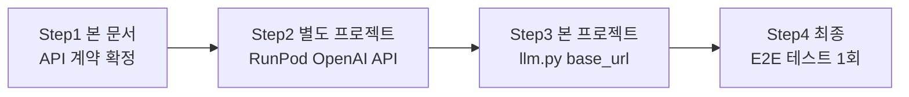
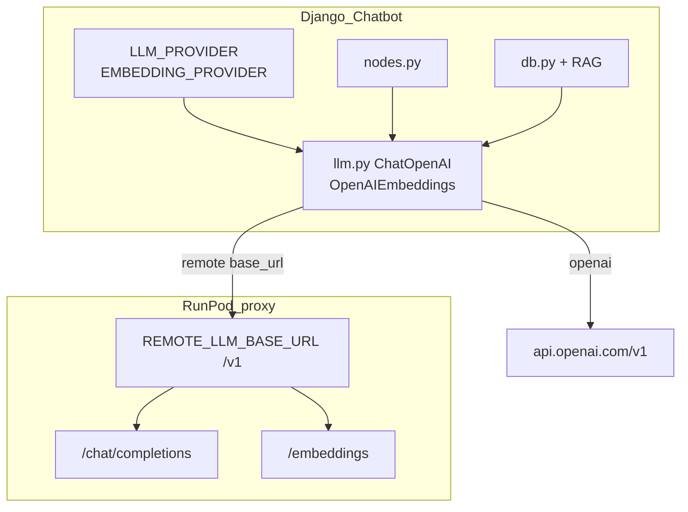
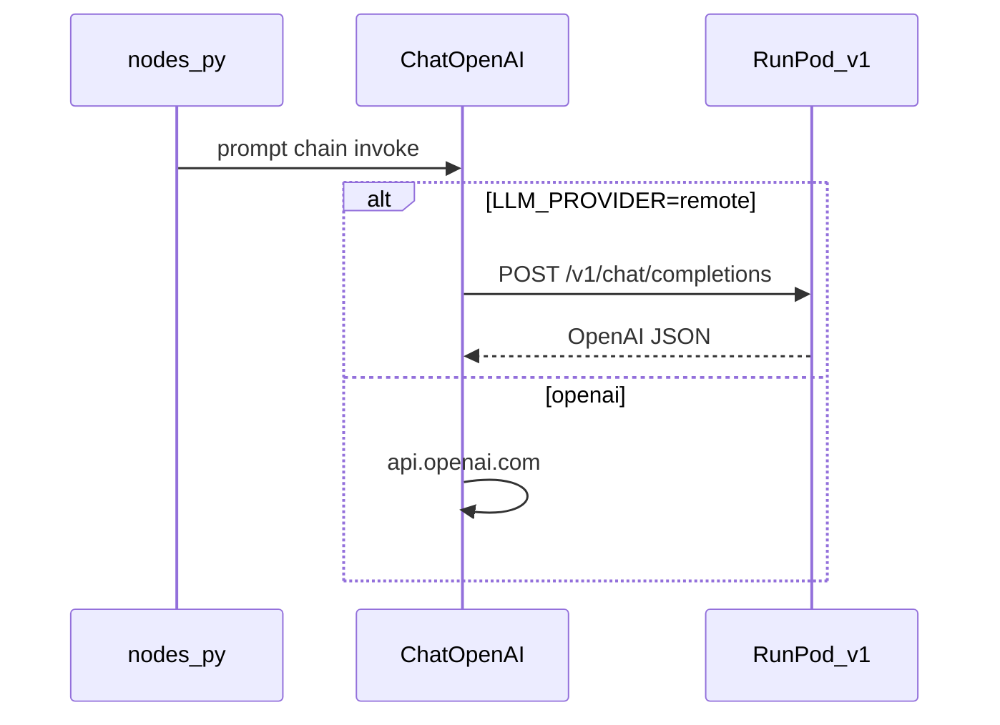

# 에픽 04 — RunPod LLM 연동 (OpenAI 호환 base_url)

챗봇의 **외부 LLM/API 호출 전부**(Chat 분류·답변 + RAG Embedding)를 OpenAI API 또는 RunPod **OpenAI 호환 서버** 중 **환경변수로 선택**한다.  
remote 시 LangChain `ChatOpenAI` / `OpenAIEmbeddings`의 **`base_url`** 로 RunPod proxy에 연결한다. 기본값은 기존 OpenAI 동작(`openai`).

**선행 조건:** [에픽00](에픽00-로그인-인증구현.md) 완료, [에픽03](에픽03-JWT-LLM-게이트.md) 권장 — 본 에픽과 **병행 구현 가능**

**다음 작업:** RunPod OpenAI 호환 API는 **별도 프로젝트**에서 구축 → 완료 후 본 프로젝트 `llm.py` 분기 + **최종 E2E 1회**

---

## 0. 팀 역할 · 4단계 워크플로



| Step | 담당 | 산출물 | 본 repo 범위 |
|------|------|--------|--------------|
| **1** | 본 팀 | 본 문서 — OpenAI API 계약 + env + 발신부 명세 | **문서** |
| **2** | **별도 프로젝트** | RunPod: `/v1/chat/completions`, `/v1/embeddings` (OpenAI v1 호환) | **범위 외** |
| **3** | 본 팀 | [`llm.py`](../backend/api/services/chatbot/llm.py) `base_url` 분기 + `.env` | 코드 (Step 2 완료 후) |
| **4** | 본 팀 + RunPod | 챗봇 E2E, full remote 시 OpenAI **0회** | 통합 테스트 **1회** |

> Step 1에서 **OpenAI v1 API 계약**을 고정한다. Step 2는 다른 저장소/팀에서 RunPod Pod(또는 DRF 프록시)를 구축하고, Step 3·4는 `REMOTE_LLM_BASE_URL`이 살아 있을 때 진행한다.

### 관련 파일 (발신부)

| 역할 | 경로 |
|------|------|
| LLM·Embedding 팩토리 | [`backend/api/services/chatbot/llm.py`](../backend/api/services/chatbot/llm.py) |
| env 상수 | [`backend/api/services/chatbot/constants.py`](../backend/api/services/chatbot/constants.py) |
| Chat 노드 (변경 없음) | [`backend/api/services/chatbot/nodes.py`](../backend/api/services/chatbot/nodes.py) |
| RAG 런타임 embed (변경 없음) | [`backend/api/services/chatbot/db.py`](../backend/api/services/chatbot/db.py) |
| RAG 배치 embed | [`backend/api/services/RAG/embedding.py`](../backend/api/services/RAG/embedding.py) |
| JWT 게이트 (독립) | [`backend/api/services/chatbot/llm_gate.py`](../backend/api/services/chatbot/llm_gate.py) |
| env 샘플 | [`.env.sample`](../.env.sample) |

---

## 1. 개요 및 설계 결정

### 목적

- 유료 OpenAI API 호출을 RunPod 자체 호스팅 모델로 **선택적** 대체
- **OpenAI 호환 API** + LangChain `base_url` — 커스텀 HTTP 어댑터 **불필요**
- Chat·Embedding provider를 env로 **독립** 제어 (hybrid 마이그레이션 가능)
- 챗봇 graph·nodes 코드는 **건드리지 않고** [`llm.py`](../backend/api/services/chatbot/llm.py)만 분기

### RunPod proxy + base_url

RunPod는 Pod를 **고정 proxy URL**로 노출한다 (Pod 재시작 시 호스트 일부 변경 가능).

```
https://8fgu9z9e1ki3un-8000.proxy.runpod.net/
```

발신부 env의 **`REMOTE_LLM_BASE_URL`** 은 proxy 호스트 + **`/v1`** 까지:

```env
REMOTE_LLM_BASE_URL=https://8fgu9z9e1ki3un-8000.proxy.runpod.net/v1
```

LangChain이 자동으로 붙이는 경로:

| 용도 | 최종 HTTP URL |
|------|----------------|
| Chat | `{REMOTE_LLM_BASE_URL}/chat/completions` |
| Embedding | `{REMOTE_LLM_BASE_URL}/embeddings` |

Chat / Embedding **모델 구분**은 OpenAI와 동일하게 request body의 **`model`** 필드 (`REMOTE_LLM_MODEL`, `REMOTE_EMBEDDING_MODEL`).

### 고정 전제 6가지

| # | 결정 | 이유 |
|---|------|------|
| 1 | **OpenAI v1 API 호환** + `base_url` | LangChain `ChatOpenAI` / `OpenAIEmbeddings` 재사용, 범용성 |
| 2 | **단일 `REMOTE_LLM_BASE_URL`** | RunPod proxy 호스트 하나; 모델은 `model` 필드로 선택 |
| 3 | **Chat + Embedding** 모두 provider 전환 | 외부 API 호출 전수 커버 |
| 4 | `LLM_PROVIDER` / `EMBEDDING_PROVIDER` **독립** | hybrid (chat remote + embed openai) 가능 |
| 5 | provider는 **프로세스 시작 시** 결정 | `nodes.py` import 시 싱글톤 — env 변경 후 `docker compose up -d backend` |
| 6 | `CHATBOT_REQUIRE_AUTH`와 **독립** | [에픽03](에픽03-JWT-LLM-게이트.md) JWT 게이트와 별도 env |

### 외부 호출 인벤토리

| # | 호출 시점 | 진입 함수 | provider env | remote 시 |
|---|-----------|-----------|--------------|-----------|
| 1 | classify | `get_classify_llm()` | `LLM_PROVIDER` | `POST .../v1/chat/completions` |
| 2 | extract·generate | `get_llm()` | `LLM_PROVIDER` | 동일 |
| 3 | RAG vector_search | `get_embedding_model().embed_query()` | `EMBEDDING_PROVIDER` | `POST .../v1/embeddings` |
| 4 | pgvectordb 배치 | `embed_documents()` | `EMBEDDING_PROVIDER` | 동일 |
| — | rerank | CrossEncoder | — | 로컬 CPU, **범위 외** |
| — | 레거시 | [`chat.py`](../backend/api/services/chat.py) | — | **범위 외** |

**선택적 호출:** graph 경로에 따라 `out_of_scope`·`keyword_search` 등은 embed **미호출** (기존 로직 유지).

### 범위 표

| 구분 | `openai` | `remote` (RunPod) |
|------|----------|-------------------|
| `get_llm()` | O | O |
| `get_classify_llm()` | O | O |
| `get_embedding_model()` | O | O |
| `RAG/embedding.py` 배치 | O | O |
| `CHATBOT_ENABLE_RERANK` | 기존 | 기존 |

---

## 2. 현재 상태 vs 목표

| 항목 | 현재 | 목표 |
|------|------|------|
| `llm.py` | OpenAI 고정 | provider 분기 + remote `base_url` |
| env | `OPENAI_API_KEY`만 | + `LLM_PROVIDER`, `EMBEDDING_PROVIDER`, `REMOTE_LLM_BASE_URL`, `REMOTE_*_MODEL` |
| RunPod | 미연동 | OpenAI 호환 `/v1` on proxy |
| 토글 | 없음 | `.env`만으로 openai ↔ remote |

---

## 3. API 계약 — RunPod 수신부 (Step 2 핸드오프)

**별도 프로젝트**에서 Pod(8000) 또는 DRF 프록시가 **OpenAI API v1** 을 그대로 제공한다.  
구현 방식은 자유 (vLLM OpenAI server, Ollama OpenAI mode, DRF → inference 래핑 등).

### 3-1. base URL

| env | 예 |
|-----|-----|
| `REMOTE_LLM_BASE_URL` | `https://8fgu9z9e1ki3un-8000.proxy.runpod.net/v1` |

trailing `/v1` **포함** (LangChain `base_url` 관례).

### 3-2. 필수 엔드포인트 (OpenAI v1)

| Method | Path | 용도 |
|--------|------|------|
| `POST` | `/v1/chat/completions` | classify, extract, generate |
| `POST` | `/v1/embeddings` | RAG 쿼리 + 배치 적재 |
| `GET` | `/v1/models` | 헬스·모델명 확인 (권장) |

### 3-3. `POST /v1/chat/completions`

**Request (OpenAI 표준):**

```json
{
  "model": "REMOTE_LLM_MODEL 값",
  "messages": [
    {"role": "system", "content": "..."},
    {"role": "user", "content": "스쿼트 자세 알려줘"}
  ],
  "temperature": 0.7
}
```

**Response (OpenAI 표준):**

```json
{
  "id": "chatcmpl-...",
  "object": "chat.completion",
  "choices": [{
    "index": 0,
    "message": {"role": "assistant", "content": "답변 텍스트"},
    "finish_reason": "stop"
  }],
  "usage": {"prompt_tokens": 0, "completion_tokens": 0, "total_tokens": 0}
}
```

발신부 LangChain은 `choices[0].message.content` 를 사용 — [`nodes.py`](../backend/api/services/chatbot/nodes.py) `StrOutputParser`와 호환.

### 3-4. `POST /v1/embeddings`

**Request:**

```json
{
  "model": "REMOTE_EMBEDDING_MODEL 값",
  "input": "벡터화할 텍스트"
}
```

배치:

```json
{
  "model": "REMOTE_EMBEDDING_MODEL 값",
  "input": ["청크1", "청크2"]
}
```

**Response:**

```json
{
  "object": "list",
  "data": [
    {"object": "embedding", "index": 0, "embedding": [0.01, -0.02]}
  ],
  "model": "...",
  "usage": {"prompt_tokens": 0, "total_tokens": 0}
}
```

**수신부 필수:** `data[].embedding` 길이 **1536** ([`schema.sql`](../backend/db/schema.sql) `vector(1536)`).

### 3-5. 인증

```env
REMOTE_API_KEY=your-shared-secret
```

- 발신: LangChain `api_key=REMOTE_API_KEY` → `Authorization: Bearer ...`
- RunPod 팀이 키 검사 생략 시 env 생략 가능

### 3-6. RunPod 팀 완료 기준 (curl)

```bash
BASE=https://8fgu9z9e1ki3un-8000.proxy.runpod.net/v1

curl "$BASE/models"

curl -X POST "$BASE/chat/completions" \
  -H "Content-Type: application/json" \
  -H "Authorization: Bearer $REMOTE_API_KEY" \
  -d '{"model":"YOUR_CHAT_MODEL","messages":[{"role":"user","content":"안녕"}],"temperature":0}'

curl -X POST "$BASE/embeddings" \
  -H "Content-Type: application/json" \
  -d '{"model":"YOUR_EMBED_MODEL","input":"스쿼트"}'
```

기대:
- chat → `choices[0].message.content` 비어 있지 않음
- embedding → `len(data[0].embedding) == 1536`

### 3-7. RunPod 서버 내부 (참고 — 본 repo 범위 외)

- Pod에 **Chat LLM** + **Embedding 모델** 설치
- proxy `https://…-8000.proxy.runpod.net` → Pod `:8000`
- `/v1/models`에 chat·embed 모델 id 노출 권장
- Pod 재시작 시 proxy URL 변경 → env `REMOTE_LLM_BASE_URL`만 갱신

---

## 4. 아키텍처





---

## 5. 벡터 DB · 재적재(re-embed) 정책

| 상황 | pgvectordb 재실행 |
|------|-------------------|
| Chat만 remote | **불필요** |
| Embedding remote, **동일** 모델·1536d (예: `text-embedding-3-small` 동급) | **불필요** |
| `REMOTE_EMBEDDING_MODEL` **변경** 또는 차원 변경 | **필수** — `python api/services/RAG/pgvectordb.py` |
| OpenAI → remote 전환 후 검색 품질 검증 | 선택 (smoke 1회) |

---

## 6. 발신부 구현 — Step 3 (코드, Step 2 완료 후)

### 6-1. 변경 범위

| 파일 | 변경 |
|------|------|
| [`constants.py`](../backend/api/services/chatbot/constants.py) | provider + remote env |
| [`llm.py`](../backend/api/services/chatbot/llm.py) | `_chat_model()`, `_embedding_model()` — remote 시 `base_url` |
| [`RAG/embedding.py`](../backend/api/services/RAG/embedding.py) | `get_embedding_model()` 재사용 (import 1줄) |
| [`.env`](../.env), [`.env.sample`](../.env.sample) | env 추가 |

**변경 없음:** `nodes.py`, `db.py`, `chatbot.py`, `graphs.py`, `llm_gate.py`, `views.py`, frontend

### 6-2. `constants.py` 추가 (예)

```python
# ────────────────────────────────────────────
# LLM provider (에픽 04)
# ────────────────────────────────────────────
LLM_PROVIDER = os.getenv("LLM_PROVIDER", "openai").strip().lower()
EMBEDDING_PROVIDER = os.getenv("EMBEDDING_PROVIDER", "").strip().lower() or LLM_PROVIDER

REMOTE_LLM_BASE_URL = os.getenv("REMOTE_LLM_BASE_URL", "").rstrip("/")
REMOTE_LLM_MODEL = os.getenv("REMOTE_LLM_MODEL", "")
REMOTE_EMBEDDING_MODEL = os.getenv("REMOTE_EMBEDDING_MODEL", "")
REMOTE_API_KEY = os.getenv("REMOTE_API_KEY", "")

if LLM_PROVIDER not in ("openai", "remote"):
    LLM_PROVIDER = "openai"
if EMBEDDING_PROVIDER not in ("openai", "remote"):
    EMBEDDING_PROVIDER = LLM_PROVIDER
```

### 6-3. `llm.py` (예 — 커스텀 어댑터 없음)

`constants.py`에서 `EMBEDDING_PROVIDER` 미설정·유효성 보정을 **모듈 로드 시 1회** 처리하므로, `_chat_model()`과 동일하게 **변수 직접 비교**만 하면 된다. 별도 `_resolve_embedding_provider()` 헬퍼는 불필요.

```python
from .constants import (
    OPENAI_LLM_MODEL, OPENAI_EMBEDDING_MODEL,
    LLM_TEMPERATURE, LLM_TEMPERATURE_CLASSIFY,
    LLM_PROVIDER, EMBEDDING_PROVIDER,
    REMOTE_LLM_BASE_URL, REMOTE_LLM_MODEL, REMOTE_EMBEDDING_MODEL, REMOTE_API_KEY,
)

def _chat_model(temperature: float) -> ChatOpenAI:
    if LLM_PROVIDER == "remote":
        return ChatOpenAI(
            model=REMOTE_LLM_MODEL,
            temperature=temperature,
            base_url=REMOTE_LLM_BASE_URL,
            api_key=REMOTE_API_KEY,
        )
    return ChatOpenAI(model=OPENAI_LLM_MODEL, temperature=temperature)

def _embedding_model() -> OpenAIEmbeddings:
    if EMBEDDING_PROVIDER == "remote":
        return OpenAIEmbeddings(
            model=REMOTE_EMBEDDING_MODEL,
            base_url=REMOTE_LLM_BASE_URL,
            api_key=REMOTE_API_KEY,
        )
    return OpenAIEmbeddings(model=OPENAI_EMBEDDING_MODEL)

def get_llm() -> ChatOpenAI:
    return _chat_model(LLM_TEMPERATURE)

def get_classify_llm() -> ChatOpenAI:
    return _chat_model(LLM_TEMPERATURE_CLASSIFY)

def get_embedding_model() -> OpenAIEmbeddings:
    return _embedding_model()
```

### 6-4. `RAG/embedding.py` (1곳)

`get_embedding_model()`을 재사용한다.  
[`pgvectordb.py`](../backend/api/services/RAG/pgvectordb.py)는 **Django `runserver` 없이** 컨테이너 기동 시 직접 실행되므로, `from api.services.chatbot.llm import ...` 전에 **`sys.path`에 backend 루트(`/app`)** 를 넣어야 한다.  
기존 RAG import용 path(`api/services`)만 있으면 `ModuleNotFoundError: No module named 'api'` 로 **backend 기동 자체가 실패**한다.

```python
import sys
import os

# RAG 스크립트(pgvectordb 등)는 Django 없이 실행 → backend 루트 path 추가
_BACKEND_ROOT = os.path.dirname(
    os.path.dirname(os.path.dirname(os.path.dirname(os.path.abspath(__file__))))
)
if _BACKEND_ROOT not in sys.path:
    sys.path.insert(0, _BACKEND_ROOT)
# RAG 패키지 import용 (api/services)
_RAG_PARENT = os.path.dirname(os.path.dirname(os.path.abspath(__file__)))
if _RAG_PARENT not in sys.path:
    sys.path.insert(0, _RAG_PARENT)

from api.services.chatbot.llm import get_embedding_model

def embed_documents(splits: list[Document]) -> tuple[list[str], list[list[float]]]:
    embedding_model = get_embedding_model()
    texts = [doc.page_content for doc in splits]
    vectors = embedding_model.embed_documents(texts)
    return texts, vectors
```

**Django 경로(`db.py` 등)** 는 앱 로드 시 `/app`이 path에 있으므로 위 `sys.path` 블록 없이도 `get_embedding_model()` import가 동작한다.

### 6-5. env 반영

**기본(`.env.sample`)은 OpenAI만 사용** — `LLM_PROVIDER=openai`, `EMBEDDING_PROVIDER=openai`.  
`REMOTE_*` 변수는 **주석 처리**해 두고, RunPod Step 2 완료 후 `provider=remote`로 전환할 때만 해제한다.

`.env` 변경 후 **`docker compose up -d backend`**. [에픽03 Step 5](에픽03-JWT-LLM-게이트.md) 참고.

---

## 7. 환경변수

| 변수 | 기본값 | 설명 |
|------|--------|------|
| `LLM_PROVIDER` | `openai` | Chat: `openai` \| `remote` |
| `EMBEDDING_PROVIDER` | *(미설정 → `LLM_PROVIDER`)* | Embed: `openai` \| `remote` |
| `REMOTE_LLM_BASE_URL` | *(미설정·주석)* | `provider=remote`일 때만 — RunPod proxy + `/v1` |
| `REMOTE_LLM_MODEL` | *(미설정·주석)* | `provider=remote`일 때만 — chat/completions `model` |
| `REMOTE_EMBEDDING_MODEL` | *(미설정·주석)* | `provider=remote`일 때만 — embeddings `model` (**1536**차원) |
| `REMOTE_API_KEY` | *(미설정·주석)* | `provider=remote`일 때만 — Bearer (선택) |
| `OPENAI_API_KEY` | — | provider=openai 쪽에 필요 |
| `CHATBOT_REQUIRE_AUTH` | `False` | [에픽03](에픽03-JWT-LLM-게이트.md) — **독립** |

### 조합 예시

```env
# ── OpenAI (기본·회귀 — .env.sample 기본값) ──
LLM_PROVIDER=openai
EMBEDDING_PROVIDER=openai
OPENAI_API_KEY=sk-...
# REMOTE_* 는 설정하지 않음 (또는 주석)

# ── Full remote (OpenAI API 0회 목표) ──
LLM_PROVIDER=remote
EMBEDDING_PROVIDER=remote
REMOTE_LLM_BASE_URL=https://8fgu9z9e1ki3un-8000.proxy.runpod.net/v1
REMOTE_LLM_MODEL=your-chat-model
REMOTE_EMBEDDING_MODEL=text-embedding-3-small
REMOTE_API_KEY=your-shared-secret

# ── Hybrid: Chat만 RunPod, Embedding은 OpenAI ──
LLM_PROVIDER=remote
EMBEDDING_PROVIDER=openai
REMOTE_LLM_BASE_URL=https://8fgu9z9e1ki3un-8000.proxy.runpod.net/v1
REMOTE_LLM_MODEL=your-chat-model
REMOTE_API_KEY=...
OPENAI_API_KEY=sk-...
```

---

## 8. 수동 검증

### 8-1. Phase 1 — API 계약 (Step 1)

- [ ] 본 문서 §3 OpenAI v1 계약 RunPod 팀 리뷰 OK

### 8-2. Phase 2 — RunPod (Step 2, 별도 프로젝트)

- [ ] §3-6 curl 전부 200
- [ ] embedding 벡터 길이 1536

### 8-3. Phase 3 — 발신부 (Step 3)

- [x] `llm.py` import OK
- [x] `_embedding_model()`이 `EMBEDDING_PROVIDER == "remote"` 직접 비교 (헬퍼 없음)
- [x] `embedding.py` — RAG 단독 실행 시 `sys.path`(backend 루트) + `get_embedding_model()` 동작
- [x] 기본 env(`openai` / `REMOTE_*` 미설정) — OpenAI만 사용, `base_url` 미설정
- [ ] unit test: `LLM_PROVIDER=remote` 시 `base_url=REMOTE_LLM_BASE_URL` (mock)

**컨테이너 기동 후 확인 (OpenAI 기본 env):**

```bash
docker compose ps backend
docker compose exec backend python -c "
from api.services.chatbot import constants as c
from api.services.chatbot.llm import get_llm, get_embedding_model
assert c.LLM_PROVIDER == 'openai'
assert c.EMBEDDING_PROVIDER == 'openai'
llm = get_llm(); emb = get_embedding_model()
print('providers', c.LLM_PROVIDER, c.EMBEDDING_PROVIDER)
print('chat model', getattr(llm, 'model_name', llm.model))
print('embed model', emb.model)
print('chat base_url', getattr(llm, 'openai_api_base', None))
print('embed base_url', getattr(emb, 'openai_api_base', None))
"
```

기대 (예):

```
providers openai openai
chat model gpt-4o-mini
embed model text-embedding-3-small
chat base_url None
embed base_url None
```

**RAG 배치 경로 (`pgvectordb` / `embedding.py` 단독):**

```bash
docker compose exec backend python -c "
import os; os.chdir('/app/api/services/RAG')
from embedding import embed_documents
from RAG.loader import load_exercises_as_documents
from RAG.splitter import split_documents
docs = load_exercises_as_documents()[:1]
splits = split_documents(docs)[:1]
texts, vectors = embed_documents(splits)
print('RAG embed OK: chunks=', len(texts), 'dim=', len(vectors[0]))
"
```

기대: `RAG embed OK: chunks= 1 dim= 1536`

**backend 기동 실패 시:** 로그에 `ModuleNotFoundError: No module named 'api'` → §6-4 `sys.path` 누락 여부 확인.

### 8-4. Phase 4 — 최종 E2E (Step 4, 1회)

| 케이스 | env | 기대 |
|--------|-----|------|
| OpenAI 회귀 | both `openai` | 기존과 동일 |
| Full remote | both `remote` | 챗봇 답변, OpenAI **0회** |
| Hybrid | llm `remote`, embed `openai` | chat만 RunPod |
| out_of_scope | `remote` | chat/completions만 |
| general RAG | embed `remote` | completions + embeddings |
| RunPod 다운 | `remote` | `LLM_ERROR_MESSAGE` |
| 에픽03 | `CHATBOT_REQUIRE_AUTH=True` + `remote` | 독립 동작 |

```bash
curl -X POST http://localhost:8000/api/sessions/1/messages/ \
  -H "Content-Type: application/json" \
  -d '{"device_uuid":"YOUR-UUID","content":"벤치프레스 가이드"}'
```

---

## 9. 구현 순서 치트시트

| Step | 담당 | 작업 | 완료 기준 |
|------|------|------|-----------|
| **1** | 본 팀 | OpenAI v1 API 계약 확정 | RunPod 팀 OK |
| **2** | 별도 프로젝트 | RunPod `/v1` OpenAI API | §3-6 curl PASS |
| **3** | 본 팀 | constants + llm.py + embedding.py | import OK |
| **4** | 본 팀 | `openai` 회귀 | E2E PASS |
| **5** | 본 팀 | full `remote` E2E | OpenAI 0회 |
| **6** | (선택) | embedding 모델 변경 | pgvectordb 재적재 |

---

## 10. 알려진 제약

1. **RunPod proxy URL 변경** — Pod 재배포 시 `REMOTE_LLM_BASE_URL` 갱신.
2. **OpenAI v1 호환 필수** — RunPod가 `/api/generate/` 등 커스텀 path만 제공하면 **본 방식 불가** (OpenAI `/v1` 구현 필요).
3. **모듈 로드 시 싱글톤** — env 변경 후 `docker compose up -d backend`.
4. **CrossEncoder rerank** — 로컬 CPU, 범위 외.
5. **레거시 [`chat.py`](../backend/api/services/chat.py)** — 미사용.

---

## 부록 A: 트러블슈팅

| 증상 | 원인 | 해결 |
|------|------|------|
| backend `Exited (1)`, `No module named 'api'` | `pgvectordb` → `embedding.py`가 Django 없이 실행되는데 backend 루트 미등록 | §6-4 `sys.path` (`_BACKEND_ROOT`) 추가 |
| `remote`인데 OpenAI 호출 | env 미반영 | `docker compose up -d backend` |
| 404 on chat/completions | `/v1` path 미구현 | RunPod에 OpenAI API 추가 |
| Connection refused | Pod 중단·URL 오류 | proxy URL·RunPod 대시보드 |
| embedding 차원 오류 | 1536 ≠ 출력 | `REMOTE_EMBEDDING_MODEL` 확인 |
| hybrid인데 embed도 remote | `EMBEDDING_PROVIDER` 미설정 | `EMBEDDING_PROVIDER=openai` |
| 404 model not found | `REMOTE_*_MODEL` 불일치 | `GET /v1/models` |

---

## 부록 B: 에픽03과 env 조합

| 환경 | `CHATBOT_REQUIRE_AUTH` | `LLM_PROVIDER` | `EMBEDDING_PROVIDER` |
|------|------------------------|----------------|----------------------|
| 로컬 개발 (OpenAI) | `False` | `openai` | `openai` |
| 로컬 개발 (full remote) | `False` | `remote` | `remote` |
| hybrid | `False` | `remote` | `openai` |
| 운영 | `True` | `remote` | `remote` |

JWT LLM 게이트와 provider env는 **완전히 독립**이다.

---

## 부록 C: OpenAI base_url 동작 (발신부)

LangChain `ChatOpenAI(base_url=REMOTE_LLM_BASE_URL)` 는 OpenAI SDK와 동일하게:

- Chat → `POST {base_url}/chat/completions`
- Embed → `POST {base_url}/embeddings`

RunPod proxy 호스트가 고정되어 있어도 **`/v1` + OpenAI path** 만 맞으면 추가 코드 없이 연동된다.
