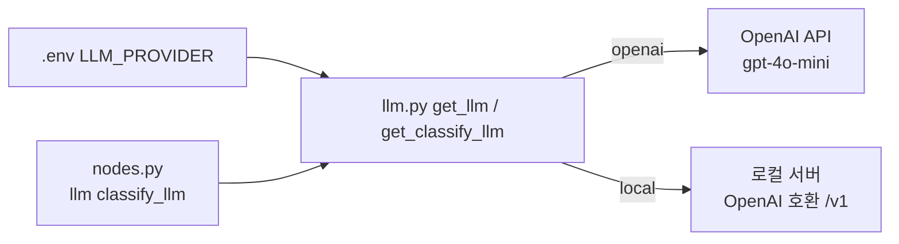
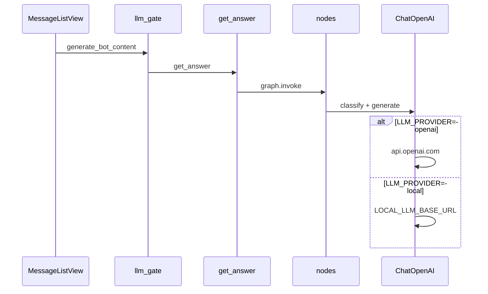

# 에픽 04 — 로컬 LLM 연동 (OpenAI 호환)

챗봇의 **답변·분류 LLM**을 OpenAI API 또는 외부 서버의 **OpenAI 호환 로컬 모델** 중 환경변수로 선택한다. 개발 중 상태이므로 기본값은 기존 OpenAI 동작이다.

**선행 조건:** [에픽00](에픽00-로그인-인증구현.md) 완료, [에픽03](에픽03-JWT-LLM-게이트.md) 권장 — 본 에픽과 **병행 구현 가능**

관련 파일:

- 상수: [`backend/api/services/chatbot/constants.py`](../backend/api/services/chatbot/constants.py)
- LLM 팩토리: [`backend/api/services/chatbot/llm.py`](../backend/api/services/chatbot/llm.py)
- 노드: [`backend/api/services/chatbot/nodes.py`](../backend/api/services/chatbot/nodes.py)
- RAG 임베딩(범위 외): [`backend/api/services/RAG/embedding.py`](../backend/api/services/RAG/embedding.py)
- 레거시(범위 외): [`backend/api/services/chat.py`](../backend/api/services/chat.py)

---

## 1. 개요 및 설계 결정 요약

### 목적

- `LLM_PROVIDER=openai|local` 로 챗봇 LLM 백엔드 전환
- 로컬 서버는 **OpenAI Chat Completions 호환** HTTP API (Ollama OpenAI 모드, vLLM, LM Studio 등)
- 미설정·오류 시 **OpenAI 기본** 유지

### 고정 전제 4가지

| # | 결정 | 이유 |
|---|------|------|
| 1 | LangChain `ChatOpenAI` + `base_url` 재사용 | 코드 변경 최소, OpenAI·로컬 동일 인터페이스 |
| 2 | **답변 LLM + 분류 LLM**만 전환 | `get_llm`, `get_classify_llm` — RAG 임베딩은 OpenAI 유지 |
| 3 | provider는 **프로세스 시작 시** 결정 | `nodes.py` 모듈 로드 시 싱글톤 — 변경 시 재시작 |
| 4 | `CHATBOT_REQUIRE_AUTH`와 **독립** | 에픽 03 JWT 게이트와 별도 env |

### 범위 표

| 구분 | OpenAI API | 로컬 LLM (본 에픽) |
|------|------------|-------------------|
| `get_llm()` | O | O |
| `get_classify_llm()` | O | O |
| `get_embedding_model()` | O (항상 OpenAI) | X |
| `RAG/embedding.py` 배치 | O | X |
| `CHATBOT_ENABLE_RERANK` | 기존 | 기존 (별도) |

---

## 2. 현재 상태 vs 목표

| 항목 | 현재 | 목표 |
|------|------|------|
| `llm.py` | `ChatOpenAI(model=gpt-4o-mini)` 고정 | provider 분기 |
| env | `OPENAI_API_KEY`만 | + `LLM_PROVIDER`, `LOCAL_LLM_*` |
| 로컬 서버 | 미연동 | `base_url`로 외부 서버 호출 |
| 토글 | 없음 | `.env`만으로 openai ↔ local |

---

## 3. 아키텍처



### 요청 경로 (챗봇 메시지 1건)



---

## 4. 백엔드 구현 — 타이핑 순서

### 4-1. `backend/api/services/chatbot/constants.py` 추가

```python
# backend/api/services/chatbot/constants.py — 추가

# openai | local
LLM_PROVIDER = os.getenv("LLM_PROVIDER", "openai").strip().lower()

# 로컬 OpenAI-호환 서버 (예: http://192.168.0.10:11434/v1 for Ollama)
LOCAL_LLM_BASE_URL = os.getenv("LOCAL_LLM_BASE_URL", "http://127.0.0.1:11434/v1")
LOCAL_LLM_MODEL = os.getenv("LOCAL_LLM_MODEL", "llama3.2")
LOCAL_LLM_API_KEY = os.getenv("LOCAL_LLM_API_KEY", "local-dev-key")

# provider=local 일 때도 OpenAI 모델명 상수는 LOCAL_LLM_MODEL로 대체됨
```

---

### 4-2. `backend/api/services/chatbot/llm.py` 리팩터

```python
# backend/api/services/chatbot/llm.py
from langchain_openai import ChatOpenAI, OpenAIEmbeddings

from .constants import (
    OPENAI_LLM_MODEL,
    OPENAI_EMBEDDING_MODEL,
    LLM_TEMPERATURE,
    LLM_TEMPERATURE_CLASSIFY,
    LLM_PROVIDER,
    LOCAL_LLM_BASE_URL,
    LOCAL_LLM_MODEL,
    LOCAL_LLM_API_KEY,
)


def _chat_model(temperature: float) -> ChatOpenAI:
    """provider에 따라 ChatOpenAI 인스턴스 생성."""
    if LLM_PROVIDER == "local":
        return ChatOpenAI(
            model=LOCAL_LLM_MODEL,
            temperature=temperature,
            base_url=LOCAL_LLM_BASE_URL,
            api_key=LOCAL_LLM_API_KEY,
        )
    # default: openai
    return ChatOpenAI(
        model=OPENAI_LLM_MODEL,
        temperature=temperature,
    )


def get_llm() -> ChatOpenAI:
    """ChatOpenAI 모델 반환 (답변 생성용)"""
    return _chat_model(LLM_TEMPERATURE)


def get_classify_llm() -> ChatOpenAI:
    """ChatOpenAI 모델 반환 (분류 전용 - 결정론적)"""
    return _chat_model(LLM_TEMPERATURE_CLASSIFY)


def get_embedding_model() -> OpenAIEmbeddings:
    """OpenAI 임베딩 모델 반환 — provider와 무관, 항상 OpenAI."""
    return OpenAIEmbeddings(model=OPENAI_EMBEDDING_MODEL)
```

**주의:** `LLM_PROVIDER`에 `openai`·`local` 외 값이 오면 `openai`로 fallback 하도록 검증을 추가할 수 있다:

```python
if LLM_PROVIDER not in ("openai", "local"):
    LLM_PROVIDER = "openai"  # constants 로드 시 또는 _chat_model 내부
```

---

### 4-3. `nodes.py` — 변경 없음 (동작 이해용)

```python
# backend/api/services/chatbot/nodes.py — import 시 1회 생성
llm = get_llm()
classify_llm = get_classify_llm()
```

모듈 import 시점에 LLM이 고정된다. **`.env` 변경 후 반드시 Django 프로세스 재시작.**

개발 중 provider를 자주 바꿀 경우(선택): lazy singleton 패턴 — 본 에픽 **필수 아님**.

---

### 4-4. `.env` / `docker-compose.yml`

#### 로컬 개발 — OpenAI (기본)

```env
LLM_PROVIDER=openai
OPENAI_API_KEY=sk-...
```

#### 로컬 개발 — Ollama 예시

Ollama는 OpenAI 호환 API를 `http://localhost:11434/v1` 에 제공한다.

```env
LLM_PROVIDER=local
LOCAL_LLM_BASE_URL=http://host.docker.internal:11434/v1
LOCAL_LLM_MODEL=llama3.2
LOCAL_LLM_API_KEY=ollama
OPENAI_API_KEY=sk-...   # 임베딩·RAG용으로 여전히 필요
```

Docker 컨테이너에서 호스트 Ollama 접근:

- Windows/Mac: `host.docker.internal`
- Linux: `extra_hosts` 또는 호스트 IP

```yaml
# docker-compose.yml — backend 서비스 예시 (선택)
environment:
  LLM_PROVIDER: ${LLM_PROVIDER:-openai}
  LOCAL_LLM_BASE_URL: ${LOCAL_LLM_BASE_URL:-http://host.docker.internal:11434/v1}
  LOCAL_LLM_MODEL: ${LOCAL_LLM_MODEL:-llama3.2}
```

---

## 5. 프론트엔드 구현

**변경 없음.** LLM provider는 백엔드 전용 설정이다.

---

## 6. 외부 로컬 서버 준비 (참고)

### Ollama

```bash
ollama pull llama3.2
ollama serve
# OpenAI 호환: http://localhost:11434/v1
```

### vLLM (OpenAI 호환)

```bash
python -m vllm.entrypoints.openai.api_server \
  --model meta-llama/Llama-3.2-3B-Instruct \
  --port 8001
```

`.env`:

```env
LLM_PROVIDER=local
LOCAL_LLM_BASE_URL=http://127.0.0.1:8001/v1
LOCAL_LLM_MODEL=meta-llama/Llama-3.2-3B-Instruct
```

### LM Studio

로컬 서버 탭에서 OpenAI 호환 서버 시작 → 표시된 URL을 `LOCAL_LLM_BASE_URL`에 설정.

---

## 7. 환경변수 요약

| 변수 | 기본값 | 설명 |
|------|--------|------|
| `LLM_PROVIDER` | `openai` | `openai` 또는 `local` |
| `LOCAL_LLM_BASE_URL` | `http://127.0.0.1:11434/v1` | OpenAI 호환 API 루트 (`/v1` 포함) |
| `LOCAL_LLM_MODEL` | `llama3.2` | 로컬 서버에 로드된 모델명 |
| `LOCAL_LLM_API_KEY` | `local-dev-key` | 서버가 키 검사 안 하면 임의 문자열 |
| `OPENAI_API_KEY` | — | `openai` 모드 필수; `local` 모드에서도 **임베딩/RAG**에 필요 |
| `CHATBOT_REQUIRE_AUTH` | `False` | 에픽 03 — 본 에픽과 독립 |

---

## 8. 수동 검증

### 8-1. OpenAI 모드 (회귀)

```env
LLM_PROVIDER=openai
```

1. 백엔드 재시작
2. ConsultPage에서 운동 질문 → 정상 답변
3. 서버 로그에 OpenAI 호출 (또는 네트워크 egress)

### 8-2. Local 모드

```env
LLM_PROVIDER=local
LOCAL_LLM_BASE_URL=http://127.0.0.1:11434/v1
LOCAL_LLM_MODEL=llama3.2
```

1. Ollama(또는 vLLM) 기동 확인:

```bash
curl http://127.0.0.1:11434/v1/models
```

2. 백엔드 재시작
3. 챗봇 메시지 POST → 로컬 모델 응답 (느릴 수 있음)
4. OpenAI 대시보드에 **챗 완성 요청 없음** (임베딩 검색은 여전히 OpenAI일 수 있음)

### 8-3. curl 챗봇 (에픽 2·3 적용 후)

```bash
curl -X POST http://localhost:8000/api/sessions/1/messages/ \
  -H "Content-Type: application/json" \
  -d '{"device_uuid":"YOUR-UUID","content":"벤치프레스 가이드"}'
```

### 8-4. 실패 시나리오

| 시나리오 | 기대 동작 |
|----------|-----------|
| `local`인데 서버 다운 | `llm_gate` except → 「오류가 발생했습니다」 bot 메시지 |
| 잘못된 `LOCAL_LLM_MODEL` | 동일 |
| `LLM_PROVIDER=local` + RAG 질문 | 벡터 검색(OpenAI embedding) 후 로컬 LLM 답변 생성 |

### 8-5. 브라우저 체크리스트

- [ ] `openai`: 기존과 동일 품질·속도
- [ ] `local`: 답변 생성됨 (분류 노드 포함)
- [ ] provider 변경 후 **재시작 없이** 바꾸면 → 동작 안 바뀜 (재시작 필요 확인)
- [ ] `CHATBOT_REQUIRE_AUTH`와 조합 테스트 (에픽 03)

---

## 9. 구현 순서 치트시트

| Step | 작업 | 완료 기준 |
|------|------|-----------|
| **1** | `constants.py` LLM_PROVIDER 등 | import OK |
| **2** | `llm.py` `_chat_model` | 단위로 local/openai 인스턴스 |
| **3** | `.env` 예시 + docker-compose | 팀 공유 |
| **4** | Ollama/vLLM 로컬 기동 | `/v1/models` 200 |
| **5** | `LLM_PROVIDER=local` E2E | 챗봇 답변 |
| **6** | `openai` 회귀 | 기존 동작 |

---

## 10. 알려진 제약 및 향후 확장

### 제약

1. **임베딩은 OpenAI 고정**  
   로컬만 쓰는 환경에서는 `OPENAI_API_KEY` 없이 RAG 검색이 실패할 수 있다. 완전 오프라인은 별도 에픽.

2. **모듈 로드 시 LLM 싱글톤**  
   hot reload(`runserver` autoreload)는 env 변경을 반영할 수 있으나, Docker 운영에서는 restart 명시.

3. **로컬 모델 품질·한국어**  
   분류(`QUERY_TYPES`) 오분류 가능 — `LOCAL_LLM_MODEL` 튜닝 필요.

4. **레거시 `chat.py`, `rag.py`**  
   미사용. 수정 범위 밖.

### 향후 확장

- 로컬 임베딩 provider (`LOCAL_EMBEDDING_*`)
- `nodes.py` lazy LLM reload
- 헬스체크 엔드포인트 `GET /api/health/llm/`

---

## 부록 A: 트러블슈팅

| 증상 | 원인 | 해결 |
|------|------|------|
| `local`인데 OpenAI 호출 | env 미반영·오타 | `LLM_PROVIDER=local`, 재시작 |
| Connection refused | URL·포트 오류 | `LOCAL_LLM_BASE_URL`, 방화벽 |
| Docker에서 Ollama 접근 실패 | localhost = 컨테이너 자신 | `host.docker.internal` |
| 404 model not found | `LOCAL_LLM_MODEL` 불일치 | `curl .../v1/models`로 이름 확인 |
| 빈 답변 | 로컬 모델 컨텍스트 부족 | 더 큰 모델 또는 프롬프트 단순화 |
| RAG만 실패 | embedding OpenAI 키 | `OPENAI_API_KEY` 설정 |
| 분류만 이상 | temperature=0인데 모델 미지원 | 다른 로컬 모델 시도 |

---

## 부록 B: `ChatOpenAI` + `base_url` 동작 원리

LangChain `ChatOpenAI`는 `base_url`이 설정되면 OpenAI SDK와 동일하게 **Chat Completions** 엔드포인트를 해당 호스트로 보낸다. 로컬 서버는 다음을 지원해야 한다:

- `POST {base_url}/chat/completions`
- 요청/응답 JSON 형식 OpenAI v1 호환

Ollama, vLLM, LM Studio는 이 계약을 따르므로 **추가 HTTP 클라이언트 코드 없이** 전환 가능하다.

---

## 부록 C: env 조합 예시

```env
# 개발 — 게스트 허용 + OpenAI
LLM_PROVIDER=openai
CHATBOT_REQUIRE_AUTH=False
OPENAI_API_KEY=sk-...

# 개발 — 로컬 LLM 실험
LLM_PROVIDER=local
LOCAL_LLM_BASE_URL=http://127.0.0.1:11434/v1
LOCAL_LLM_MODEL=llama3.2
CHATBOT_REQUIRE_AUTH=False
OPENAI_API_KEY=sk-...   # RAG embedding

# 스테이징 — 로그인 필수 + OpenAI
LLM_PROVIDER=openai
CHATBOT_REQUIRE_AUTH=True
OPENAI_API_KEY=sk-...
```
