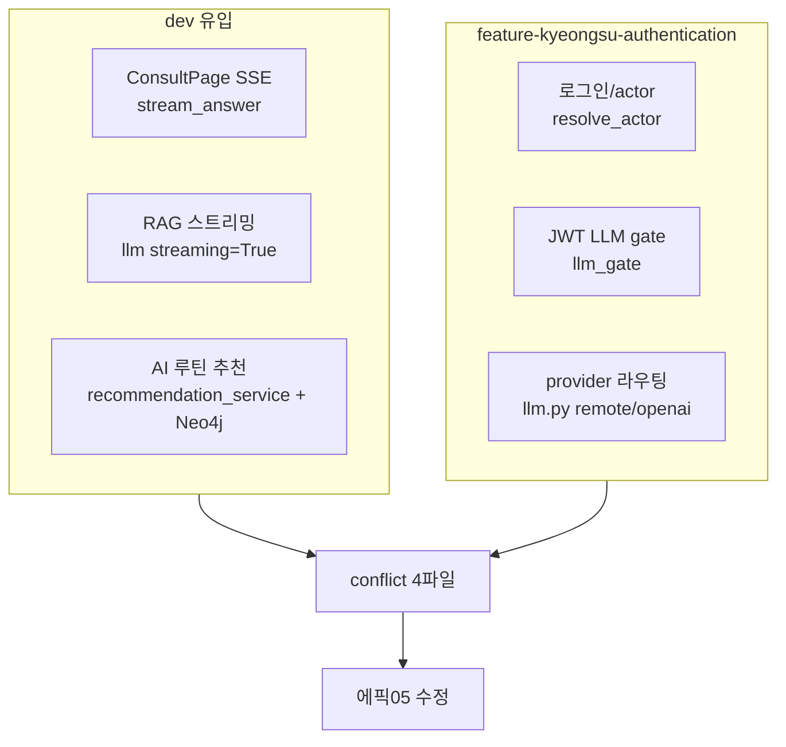
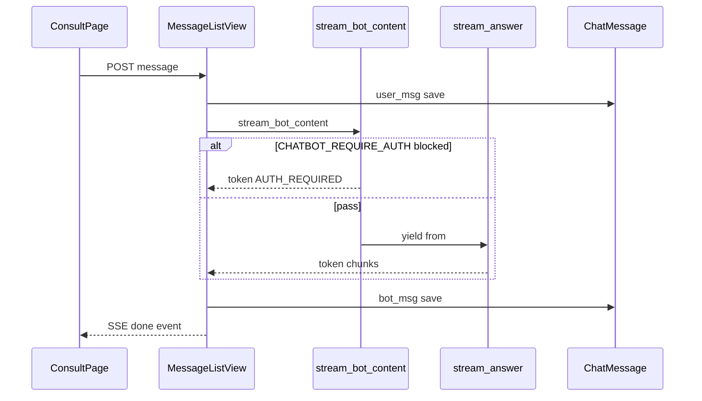

# 에픽 05 — dev 머지 및 동작 수정

`feature-kyeongsu-authentication` 브랜치에 `dev`를 머지한 뒤, conflict 해결·동작 수정·코드 검수 과정에서 발견된 이슈와 조치를 정리한다.

**선행:** [에픽03-JWT-LLM-게이트.md](에픽03-JWT-LLM-게이트.md), [에픽04-로컬-LLM-연동.md](에픽04-로컬-LLM-연동.md)

**관련 커밋:** merge `88f3439`, 후속 `042ff20` (RoutinePage credentials)

---

## 0. 요약

| 구분 | 내용 |
|------|------|
| 머지 | `dev` → `feature-kyeongsu-authentication` (SSE 챗봇, AI 루틴 추천, RAG 등) |
| conflict 4파일 | `views.py`, `llm.py`, `embedding.py`, `RoutinePage.jsx` |
| 핵심 조치 | JWT gate를 **SSE** 경로(`stream_bot_content`)에 연결, provider + streaming 병합, RoutinePage 양쪽 기능 병합 |
| 문서 갱신 | 본 문서 신규, [에픽03](에픽03-JWT-LLM-게이트.md) `stream_bot_content` 기준 delta |

---

## 1. dev에서 들어온 기능 (배경)

머지 대상(`5ce0553` 계열)과 feature 브랜치 기존 작업이 **같은 파일·같은 API**를 수정해 conflict가 발생했다.



| 영역 | dev 변경 | feature 쪽 기존 |
|------|----------|-----------------|
| 챗봇 POST | `StreamingHttpResponse` + `stream_answer` | `generate_bot_content` / JWT gate |
| LLM | `get_llm(streaming=True)` OpenAI 고정 | `_chat_model()` provider 분기 |
| RAG embed | import 단순화 시도 | `get_embedding_model()` |
| RoutinePage | AI 추천·HumanReview·`disableAutoSave` | `authUser` 재조회·로그인 UI |
| Backend | `RoutineRecommendView`, `routine_recommender.py` | actor·migration |

---

## 2. Conflict 파일 및 해결 원칙

| 파일 | 충돌 내용 | 해결 원칙 |
|------|-----------|-----------|
| [`backend/api/views.py`](../backend/api/views.py) | 비스트리밍 vs SSE | user 선저장 + `stream_bot_content` |
| [`backend/api/services/chatbot/llm.py`](../backend/api/services/chatbot/llm.py) | provider vs `streaming=True` | `_chat_model(..., streaming=)` + `get_llm`만 True |
| [`backend/api/services/RAG/embedding.py`](../backend/api/services/RAG/embedding.py) | import | `get_embedding_model` 유지, 미사용 `split_documents` 제거 |
| [`frontend/src/pages/RoutinePage.jsx`](../frontend/src/pages/RoutinePage.jsx) | 3곳 | HEAD auth + incoming AI/`disableAutoSave` **병합** |

---

## 3. 세션 타임라인 — 문제와 처리

| # | 문제 | 원인 | 조치 | 상태 |
|---|------|------|------|------|
| 1 | LLM **이중 호출** | `generate_bot_content` + `stream_answer` 동시 잔존 | views에서 sync 경로 제거 | 완료 |
| 2 | JWT gate **우회** | `stream_bot_content` 미연결, `stream_answer` 직접 호출 | views import/호출을 gate로 통일 | 완료 |
| 3 | `test_llm_gate` ImportError | `generate_bot_content` 삭제 후 테스트 미갱신 | `StreamBotContentTests` 4건 | 완료 |
| 4 | `llm.py` conflict | provider vs streaming | `_chat_model` + `get_llm(streaming=True)` | 완료 |
| 5 | `embedding.py` conflict | import 양쪽 | `get_embedding_model`만 유지 | 완료 |
| 6 | RoutinePage 3 conflict | auth vs AI 추천 | effect·props·시그니처 병합 | 완료 |
| 7 | AI 승인 저장 시 guest | 부모 `saveRoutineToDb`에 `credentials` 없음 | `credentials: 'include'` 추가 (`042ff20`) | 완료 |
| 8 | Django import 실패 | `NEO4J_URI` import 시점 필수 | `.env` 보완 또는 lazy import | **후속** |
| 9 | `.env.sample` 불완전 | DB/Django 누락, `LLM_PROVIDER` 중복 | sample 통합 | **후속** |
| 10 | `split_style` 하드코딩 | `buildSurveyPayload` | `splitStyle` state 사용 | **후속** |
| 11 | 추천 API actor | `device_uuid`만 user_id | `resolve_actor` 연동 | **후속** |

---

## 4. 코드 스냅샷 (최종본)

아래는 merge + 수정 후 **저장소 기준** 핵심 코드이다. 전체 파일은 링크로 이동한다.

### 4-1. JWT gate — `stream_bot_content`

파일: [`backend/api/services/chatbot/llm_gate.py`](../backend/api/services/chatbot/llm_gate.py)

```python
def stream_bot_content(request: HttpRequest, user_content: str, session_id: int):
    """
    게이트 통과 시 stream_answer(), 차단 시 AUTH_REQUIRED_MESSAGE를 token/done으로 반환.
    """
    if not should_run_llm(request):
        print('[llm_gate] LLM blocked: auth required (CHATBOT_REQUIRE_AUTH=True)')
        yield ("token", AUTH_REQUIRED_MESSAGE)
        yield ("done", AUTH_REQUIRED_MESSAGE)
        return

    yield from stream_answer(user_content, session_id)
```

- **왜:** 에픽03 gate를 dev SSE 응답 형식(`token`/`done`)에 맞춤. 차단 시에도 LLM 미호출.
- **레거시:** `generate_bot_content`(sync `get_answer`)는 제거됨.

---

### 4-2. 챗봇 POST — SSE + user 선저장

파일: [`backend/api/views.py`](../backend/api/views.py) `MessageListView.post` (L202–242)

```python
        user_msg = ChatMessage.objects.create(
            session_id=session_id,
            sender='user',
            content=content,
        )

        def event_stream():
            full_answer = ""
            try:
                for token_type, token_content in stream_bot_content(request, content, session_id):
                    if token_type == "token":
                        yield f"data: {json.dumps({'type': 'token', 'content': token_content}, ensure_ascii=False)}\n\n"
                    elif token_type == "done":
                        full_answer = token_content
            except Exception as exc:
                ...
            bot_msg = ChatMessage.objects.create(
                session_id=session_id,
                sender='bot',
                content=full_answer or '답변을 생성할 수 없습니다.',
            )
            yield f"data: {json.dumps({'type': 'done', 'user_message_id': user_msg.message_id, 'bot_message_id': bot_msg.message_id}, ensure_ascii=False)}\n\n"

        return StreamingHttpResponse(event_stream(), content_type='text/event-stream; charset=utf-8', ...)
```

- **왜:** user 메시지를 스트림 전에 저장해 `done` 이벤트에 ID 전달. ConsultPage SSE와 맞춤.

---

### 4-3. LLM provider + streaming

파일: [`backend/api/services/chatbot/llm.py`](../backend/api/services/chatbot/llm.py)

```python
def _chat_model(temperature: float, *, streaming: bool = False) -> ChatOpenAI:
    if LLM_PROVIDER == "remote":
        return ChatOpenAI(..., streaming=streaming)
    return ChatOpenAI(model=OPENAI_LLM_MODEL, temperature=temperature, streaming=streaming)

def get_llm() -> ChatOpenAI:
    """ChatOpenAI 모델 반환 (답변 생성용 / streaming 활성화)"""
    return _chat_model(LLM_TEMPERATURE, streaming=True)

def get_classify_llm() -> ChatOpenAI:
    return _chat_model(LLM_TEMPERATURE_CLASSIFY)  # streaming=False
```

- **왜:** 에픽04 provider 분기 유지 + dev의 LangGraph `AIMessageChunk` 스트리밍.

---

### 4-4. RAG embedding

파일: [`backend/api/services/RAG/embedding.py`](../backend/api/services/RAG/embedding.py)

```python
from api.services.chatbot.llm import get_embedding_model

def embed_documents(docs: list[Document]) -> tuple[list[str], list[list[float]]]:
    embedding_model = get_embedding_model()
    texts = [doc.page_content for doc in docs]
    vectors = embedding_model.embed_documents(texts)
    return texts, vectors
```

- **왜:** 배치·런타임 embed 모두 `llm.get_embedding_model()`로 provider 통일.

---

### 4-5. RoutinePage merge

**로그인 후 루틴 재조회** (L1017–1022):

```javascript
  useEffect(() => {
    if (authUser) {
      loadWeeklyRoutine()
    }
  }, [authUser])
```

**RoutineCheckView props** (L1305–1307):

```jsx
          authUser={authUser}
          onLoginClick={() => navigate('/login')}
          disableAutoSave={!isApproved}
```

**시그니처** (L2213–2216):

```javascript
function RoutineCheckView({
  ...
  initialWorkoutRoutine, initialDailyNotes, authUser, onLoginClick,
  disableAutoSave = false
}) {
```

**AI 승인 저장 credentials** (L1074–1078):

```javascript
    const res = await fetch(`${API_URL}/api/routines/`, {
      method: 'POST',
      headers: { 'Content-Type': 'application/json' },
      credentials: 'include',
      body: JSON.stringify(payload),
    })
```

- **왜:** HEAD 회원 동기화 + dev AI 검토 전 auto-save 차단 + 로그인 시 `user_id` 저장.

---

### 4-6. 단위 테스트

파일: [`backend/api/tests/test_llm_gate.py`](../backend/api/tests/test_llm_gate.py)

| 클래스 | 케이스 |
|--------|--------|
| `ShouldRunLlmTests` | env off/on, 유효·무효 JWT (4건) |
| `StreamBotContentTests` | 차단 시 stream 미호출, env off/on stream 위임, 예외 전파 (4건) |

실행:

```bash
cd backend
python manage.py test api.tests.test_llm_gate -v 2
```

> **주의:** `views.py`가 `routine_recommender`를 import하므로 `NEO4J_*` env 없으면 Django check 자체가 실패할 수 있다. §7 P0 참고.

---

## 5. 머지 후 챗봇 아키텍처



---

## 6. 검증 체크리스트

### 코드

- [ ] conflict 마커 (`<<<<<<<` 등) repo 전체 0건
- [ ] `grep stream_bot_content backend/api/views.py` — import + 호출 존재
- [ ] `grep generate_bot_content` — 프로덕션 코드 없음 (테스트·구 문서만 허용)

### 자동 (NEO4J env 설정 후)

- [ ] `python manage.py check`
- [ ] `python manage.py test api.tests.test_llm_gate`

### 수동

- [ ] ConsultPage: SSE 토큰 + `done` 이벤트
- [ ] `CHATBOT_REQUIRE_AUTH=True`: 게스트 차단 메시지
- [ ] RoutinePage: 로그인 후 `loadWeeklyRoutine` 재조회
- [ ] AI 추천: 검토 전 auto-save 없음 → 승인 후 DB 저장
- [ ] 로그인 + AI 승인: POST `/api/routines/` Request에 `sessionid` Cookie, DB `user_id` 확인

---

## 7. 후속 작업 (다음 PR)

| 우선순위 | 항목 | 권장 조치 |
|----------|------|-----------|
| **P0** | `NEO4J_URI` import 시 Django 기동 실패 | `.env`에 Neo4j/Groq 추가 **또는** `routine_recommender` lazy import |
| **P0** | `.env.sample` DB/Django 누락 | DB·Django·Neo4j·OpenAI·CHATBOT 통합, `LLM_PROVIDER` 키 중복 제거 |
| **P1** | docker `backend` → `neo4j` depends_on | compose healthcheck 연동 |
| **P2** | `buildSurveyPayload` `split_style: 'bodybuilding'` | `splitStyle` state 사용 |
| **P2** | 추천 API `user_id=device_uuid` | `resolve_actor(request)` 연동 |
| **P2** | recommend/review fetch | 필요 시 `credentials: 'include'` |
| **P3** | `loadWeeklyRoutine` 2회 호출 | `getMe` 완료 후 1회 로드 등 최적화 |

Neo4j env 예시는 [실행가이드.md](실행가이드.md) § Neo4j 참고.

---

## 8. 관련 파일 인덱스

| 역할 | 경로 |
|------|------|
| 챗봇 SSE View | [`backend/api/views.py`](../backend/api/views.py) |
| JWT gate | [`backend/api/services/chatbot/llm_gate.py`](../backend/api/services/chatbot/llm_gate.py) |
| 스트리밍 RAG | [`backend/api/services/chatbot/chatbot.py`](../backend/api/services/chatbot/chatbot.py) |
| LLM factory | [`backend/api/services/chatbot/llm.py`](../backend/api/services/chatbot/llm.py) |
| Gate 테스트 | [`backend/api/tests/test_llm_gate.py`](../backend/api/tests/test_llm_gate.py) |
| Routine UI | [`frontend/src/pages/RoutinePage.jsx`](../frontend/src/pages/RoutinePage.jsx) |
| Consult SSE | [`frontend/src/pages/ConsultPage.jsx`](../frontend/src/pages/ConsultPage.jsx) |
| AI 추천 bridge | [`backend/api/services/routine_recommender.py`](../backend/api/services/routine_recommender.py) |
| 에픽03 (gate 상세) | [에픽03-JWT-LLM-게이트.md](에픽03-JWT-LLM-게이트.md) |

---

## 9. 에픽03 문서와의 관계

에픽03은 **JWT gate 설계·`should_run_llm`** 을 다룬다. 에픽05 머지 이후 런타임 진입점은 **`stream_bot_content` + SSE** 이다.

- `generate_bot_content` / sync `JsonResponse` — **제거됨** (에픽03 문서 §4 Step 3·4는 delta 갱신됨)
- `should_run_llm` / `CHATBOT_REQUIRE_AUTH` — **변경 없음**
