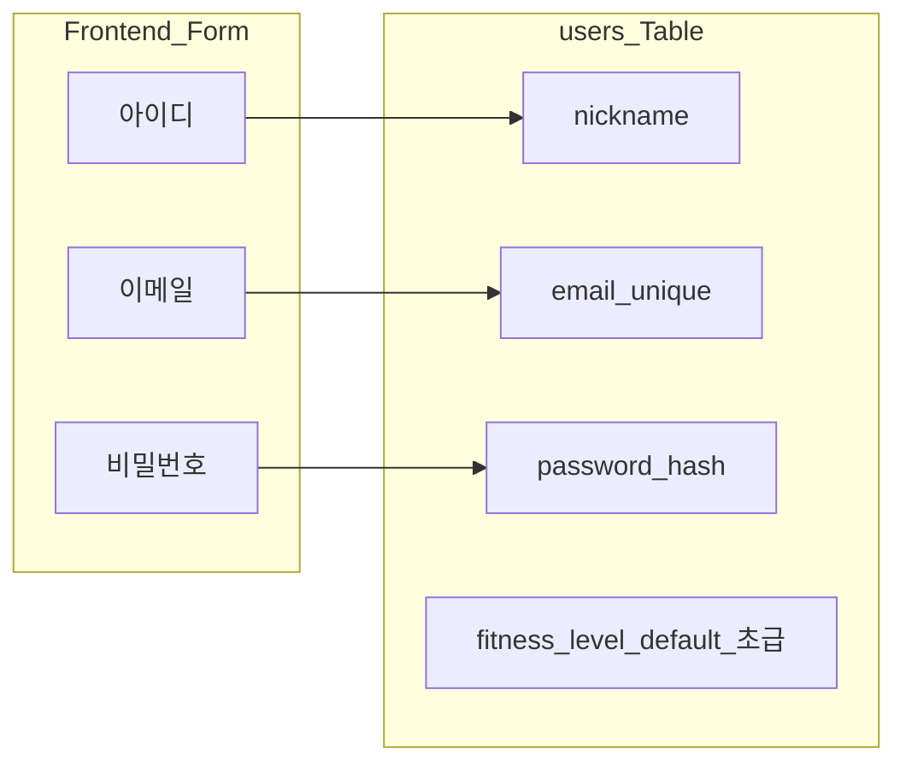
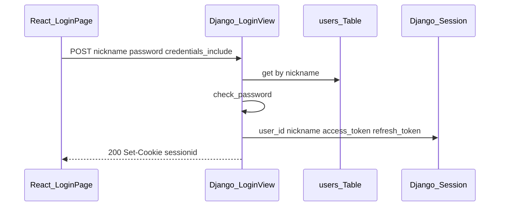

# 인증 구현 가이드

회원가입·로그인·로그아웃을 직접 타이핑하며 구현하기 위한 문서다.  
참조 repo [wynn3312/django_chat_api](https://github.com/wynn3312/django_chat_api)의 세션+JWT 패턴을 현재 프로젝트 `AppUser` 모델에 맞게 변환한 내용이다.

관련 파일:

- 모델: `backend/api/models.py`
- 서비스(비즈니스 로직): `backend/api/services/` (`auth_service.py` 등)
- DB 스키마: `backend/db/schema.sql`
- 프론트: `frontend/src/pages/LoginPage.jsx`, `frontend/src/pages/RegisterPage.jsx`
- 배포 설정: `docs/배포준비.md` (API URL, CORS 등)

---

## 1. 개요 및 설계 결정 요약

### 목적

- 기본 **회원가입 / 로그인 / 로그아웃** API 구현
- 인증 상태를 **Django 세션**으로 유지하고, JWT를 **세션에 종속** 저장
- React SPA(`LoginPage`, `RegisterPage`)와 연동

### 고정 전제 3가지

| # | 결정 | 이유 |
|---|------|------|
| 1 | 프론트 `아이디` → `AppUser.nickname` | DB에 `username` 컬럼 없음. `user_id`는 자동 증가 PK |
| 2 | 가입 시 `nickname` / `email` **앱 레벨 중복 검사** | `nickname`은 DB unique가 아님 |
| 3 | `make_password` / `check_password`로 `password_hash` 처리 | `AUTH_USER_MODEL` 없이 Django 표준 해시 사용 |

### models.py 변경 없음

`AppUser`는 `managed = False`이며 기존 `users` 테이블을 그대로 쓴다. **신규 필드 추가·마이그레이션 불필요.**

```python
# backend/api/models.py — 변경하지 않음
class AppUser(models.Model):
    user_id = models.AutoField(primary_key=True)
    email = models.CharField(max_length=255, unique=True)
    password_hash = models.CharField(max_length=255)
    nickname = models.CharField(max_length=50)
    fitness_level = models.CharField(max_length=10, choices=FITNESS_LEVEL, default='초급')
    created_at = models.DateTimeField(auto_now_add=True)
```

### 참조 repo와의 한 줄 차이

| django_chat_api | 현재 프로젝트 |
|-----------------|---------------|
| `CustomUser` + `AUTH_USER_MODEL` + `authenticate()` | `AppUser` 직접 조회 + `check_password()` |
| `login(request, user)` | `request.session['user_id']` 수동 저장 |
| 테이블 `custom_user` | 테이블 `users` (기존 DB) |

---

## 2. 참조 repo vs 현재 프로젝트 비교

### 사용자 모델 비교

| 항목 | django_chat_api `CustomUser` | 현재 `AppUser` |
|------|------------------------------|----------------|
| 상속 | `AbstractBaseUser` + `PermissionsMixin` | `models.Model` |
| 로그인 식별자 | `name` (unique, `USERNAME_FIELD`) | `nickname` (non-unique) |
| 이메일 | `email` (unique) | `email` (unique) |
| 비밀번호 | `password` (`set_password`) | `password_hash` (수동 해시) |
| Django Auth 연동 | O (`AUTH_USER_MODEL`) | X |
| 테이블 관리 | Django migration | `managed = False` |

### 필드 매핑



### 프론트 state → API body 매핑

| 화면 | React state | API JSON 키 | DB 컬럼 |
|------|-------------|-------------|---------|
| 로그인 | `userId` | `nickname` | `nickname` |
| 로그인 | `password` | `password` | `password_hash` (검증) |
| 회원가입 | `userId` | `nickname` | `nickname` |
| 회원가입 | `email` | `email` | `email` |
| 회원가입 | `password` | `password` | `password_hash` (저장) |

가입 시 `fitness_level`은 입력받지 않고 DB 기본값 `'초급'`을 사용한다.

### `authenticate()` / `login()`을 쓸 수 없는 이유

- `AUTH_USER_MODEL`이 설정되어 있지 않다.
- `AppUser`는 Django 인증 사용자가 아니다.
- 대신 `backend/api/services/auth_service.py` **서비스 레이어**에서 `AppUser.objects.get(nickname=...)` + `check_password()`로 검증한다.

---

## 3. 인증 아키텍처 (세션 + JWT 종속)

### 참조 repo 패턴

`django_chat_api` 로그인 성공 시:

1. `login(request, user)` → `sessionid` 쿠키 발급
2. `request.session['access_token']`, `request.session['refresh_token']` 저장

로그아웃 시 세션 키 삭제 + `logout(request)` → JWT도 함께 소멸.

### 현재 프로젝트 적용

`login()` 없이 동일한 **세션-JWT 종속** 구조를 만든다.

| 세션 키 | 값 |
|---------|-----|
| `user_id` | `AppUser.user_id` |
| `nickname` | `AppUser.nickname` |
| `access_token` | JWT access |
| `refresh_token` | JWT refresh |

### 로그인 시퀀스



### 게스트(`device_uuid`)와 병행 정책

**1단계(본 문서 범위):**

- 가입/로그인/로그아웃 API만 추가
- 기존 `ConsultPage`, `RoutinePage`의 `device_uuid` API는 **그대로 유지**

**다음 단계(범위 밖):**

- 로그인 사용자의 `user_id`를 `chat_sessions`, `weekly_schedulers`에 연결
- 게스트 데이터 → 회원 데이터 마이그레이션

---

## 4. 백엔드 구현 — 타이핑 순서

### 4-1. `backend/requirements.txt` 수정

`djangorestframework-simplejwt`를 추가한다.

```txt
django==4.2.29
djangorestframework
djangorestframework-simplejwt
django-cors-headers
psycopg2-binary
python-dotenv
openai
```

설치:

```bash
cd backend
pip install -r requirements.txt
```

---

### 4-2. `backend/api/services/auth_service.py` (신규 생성)

인증 비즈니스 로직을 views와 분리한다. views는 HTTP만, 검증·DB·JWT는 **서비스 레이어**에서 처리한다.  
기존 `backend/api/services/chat.py`, `rag.py`와 동일하게 `backend/api/services/` 아래에 둔다.

```python
# backend/api/services/auth_service.py
from django.contrib.auth.hashers import check_password, make_password
from django.core.exceptions import ValidationError
from django.core.validators import validate_email
from rest_framework_simplejwt.tokens import RefreshToken

from api.models import AppUser


class AuthError(ValueError):
    """인증/가입 검증 실패. 메시지를 그대로 API error로 반환한다."""


def _validate_register(nickname: str, email: str, password: str) -> None:
    nickname = (nickname or '').strip()
    email = (email or '').strip()

    if len(nickname) < 4:
        raise AuthError('아이디는 4자 이상 입력해야 합니다.')
    if not password:
        raise AuthError('비밀번호는 필수 입력값입니다.')
    if AppUser.objects.filter(nickname=nickname).exists():
        raise AuthError('이미 존재하는 아이디입니다.')
    if AppUser.objects.filter(email=email).exists():
        raise AuthError('이미 존재하는 이메일입니다.')
    try:
        validate_email(email)
    except ValidationError as exc:
        raise AuthError('유효한 이메일 주소를 입력해야 합니다.') from exc


def create_user(nickname: str, email: str, password: str) -> AppUser:
    """회원가입. 성공 시 AppUser 반환, 실패 시 AuthError."""
    _validate_register(nickname, email, password)
    return AppUser.objects.create(
        nickname=nickname.strip(),
        email=email.strip().lower(),
        password_hash=make_password(password),
    )


def authenticate_user(nickname: str, password: str) -> AppUser:
    """로그인 검증. 성공 시 AppUser 반환, 실패 시 AuthError."""
    nickname = (nickname or '').strip()
    if not nickname or not password:
        raise AuthError('아이디와 비밀번호를 입력해 주세요.')

    try:
        user = AppUser.objects.get(nickname=nickname)
    except AppUser.DoesNotExist:
        raise AuthError('아이디 또는 비밀번호가 일치하지 않습니다.')

    if not check_password(password, user.password_hash):
        raise AuthError('아이디 또는 비밀번호가 일치하지 않습니다.')

    return user


def issue_tokens_for_app_user(user: AppUser) -> dict:
    """AUTH_USER_MODEL 없이 user_id, nickname을 JWT claim에 넣는다."""
    refresh = RefreshToken()
    refresh['user_id'] = user.user_id
    refresh['nickname'] = user.nickname
    return {
        'access': str(refresh.access_token),
        'refresh': str(refresh),
    }


def bind_user_to_session(request, user: AppUser) -> None:
    """세션에 사용자 정보 + JWT를 함께 저장한다."""
    tokens = issue_tokens_for_app_user(user)
    request.session['user_id'] = user.user_id
    request.session['nickname'] = user.nickname
    request.session['access_token'] = tokens['access']
    request.session['refresh_token'] = tokens['refresh']
    request.session.save()


def clear_session(request) -> None:
    """로그아웃. 세션 전체 삭제 → JWT도 함께 소멸."""
    request.session.flush()


def get_session_user(request) -> AppUser | None:
    """세션의 user_id로 AppUser 조회. 없거나 삭제된 유저면 None."""
    user_id = request.session.get('user_id')
    if not user_id:
        return None
    try:
        return AppUser.objects.get(user_id=user_id)
    except AppUser.DoesNotExist:
        return None
```

#### 함수 계약 요약

| 함수 | 입력 | 출력 | 실패 |
|------|------|------|------|
| `create_user` | nickname, email, password | `AppUser` | `AuthError` |
| `authenticate_user` | nickname, password | `AppUser` | `AuthError` |
| `bind_user_to_session` | request, user | None | — |
| `get_session_user` | request | `AppUser \| None` | — |
| `clear_session` | request | None | — |

---

### 4-3. `backend/api/auth_views.py` (신규 생성)

JSON API 뷰 5개: CSRF 쿠키 발급, 가입, 로그인, 로그아웃, 내 정보.

```python
# backend/api/auth_views.py
import json

from django.http import JsonResponse
from django.utils.decorators import method_decorator
from django.views import View
from django.views.decorators.csrf import ensure_csrf_cookie

from api.services.auth_service import (
    AuthError,
    authenticate_user,
    bind_user_to_session,
    clear_session,
    create_user,
    get_session_user,
)


def _parse_json(request) -> dict:
    try:
        return json.loads(request.body.decode('utf-8'))
    except (json.JSONDecodeError, UnicodeDecodeError):
        return {}


@method_decorator(ensure_csrf_cookie, name='dispatch')
class CsrfCookieView(View):
    """SPA가 CSRF 토큰 쿠키를 받기 위한 엔드포인트."""

    def get(self, request):
        return JsonResponse({'ok': True})


class RegisterView(View):
    def post(self, request):
        data = _parse_json(request)
        try:
            user = create_user(
                nickname=data.get('nickname', ''),
                email=data.get('email', ''),
                password=data.get('password', ''),
            )
        except AuthError as exc:
            return JsonResponse({'error': str(exc)}, status=400)

        return JsonResponse({
            'user_id': user.user_id,
            'nickname': user.nickname,
            'email': user.email,
        }, status=201)


class LoginView(View):
    def post(self, request):
        data = _parse_json(request)
        try:
            user = authenticate_user(
                nickname=data.get('nickname', ''),
                password=data.get('password', ''),
            )
            bind_user_to_session(request, user)
        except AuthError as exc:
            return JsonResponse({'error': str(exc)}, status=401)

        return JsonResponse({
            'user_id': user.user_id,
            'nickname': user.nickname,
        })


class LogoutView(View):
    def post(self, request):
        clear_session(request)
        return JsonResponse({'ok': True})


class MeView(View):
    def get(self, request):
        user = get_session_user(request)
        if not user:
            return JsonResponse({'error': '로그인이 필요합니다.'}, status=401)

        return JsonResponse({
            'user_id': user.user_id,
            'nickname': user.nickname,
            'email': user.email,
        })
```

---

### 4-4. `backend/config/settings.py` 수정

아래 항목을 **파일 하단에 추가**한다.

```python
# backend/config/settings.py — 추가할 설정

INSTALLED_APPS = [
    # ... 기존 항목 ...
    'rest_framework_simplejwt',  # INSTALLED_APPS에 추가
]

CORS_ALLOW_CREDENTIALS = True

SESSION_COOKIE_SAMESITE = 'Lax'
SESSION_COOKIE_HTTPONLY = True

from datetime import timedelta

SIMPLE_JWT = {
    'ACCESS_TOKEN_LIFETIME': timedelta(minutes=30),
    'REFRESH_TOKEN_LIFETIME': timedelta(days=7),
}
```

**왜 필요한가:**

- `CORS_ALLOW_CREDENTIALS`: React(`localhost:5173`)가 `sessionid` 쿠키를내려면 필수
- `SESSION_COOKIE_SAMESITE = 'Lax'`: 개발 환경 크로스 오리진에서 쿠키 전송 허용
- `SIMPLE_JWT`: 세션에 저장할 JWT 만료 시간

`CORS_ALLOWED_ORIGINS`는 이미 `localhost:5173`이 지정되어 있으므로 `CORS_ALLOW_ALL_ORIGINS`는 쓰지 않는다.

---

### 4-5. `backend/config/urls.py` 수정

auth URL 5개를 등록한다.

```python
# backend/config/urls.py
from django.contrib import admin
from django.urls import path

from api.views import (
    ExerciseListView,
    MessageListView,
    RoutineView,
    SessionDetailView,
    SessionListView,
)
from api.auth_views import (
    CsrfCookieView,
    LoginView,
    LogoutView,
    MeView,
    RegisterView,
)

urlpatterns = [
    path('admin/', admin.site.urls),
    # 기존 API
    path('api/exercises/', ExerciseListView.as_view()),
    path('api/sessions/', SessionListView.as_view()),
    path('api/sessions/<int:session_id>/', SessionDetailView.as_view()),
    path('api/sessions/<int:session_id>/messages/', MessageListView.as_view()),
    path('api/routines/', RoutineView.as_view()),
    # 인증 API (신규)
    path('api/auth/csrf/', CsrfCookieView.as_view()),
    path('api/auth/register/', RegisterView.as_view()),
    path('api/auth/login/', LoginView.as_view()),
    path('api/auth/logout/', LogoutView.as_view()),
    path('api/auth/me/', MeView.as_view()),
]
```

---

## 5. API 스펙

### 공통

- Content-Type: `application/json`
- 인증 API는 `credentials: 'include'` (쿠키 전송) 필요
- POST 요청은 CSRF 토큰 헤더 필요 (6절 참고)
- 에러 응답 형식: `{"error": "메시지"}`

### 엔드포인트

| 엔드포인트 | Method | Body | 성공 응답 |
|------------|--------|------|-----------|
| `/api/auth/csrf/` | GET | — | `200 {"ok": true}` + `csrftoken` 쿠키 |
| `/api/auth/register/` | POST | `{nickname, email, password}` | `201 {user_id, nickname, email}` |
| `/api/auth/login/` | POST | `{nickname, password}` | `200 {user_id, nickname}` + `sessionid` 쿠키 |
| `/api/auth/logout/` | POST | — (쿠키) | `200 {"ok": true}` |
| `/api/auth/me/` | GET | — (쿠키) | `200 {user_id, nickname, email}` |

### 에러 HTTP 상태코드

| 상황 | 상태코드 | error 예시 |
|------|----------|------------|
| 가입 검증 실패 | 400 | `아이디는 4자 이상 입력해야 합니다.` |
| 중복 아이디/이메일 | 400 | `이미 존재하는 아이디입니다.` |
| 로그인 실패 | 401 | `아이디 또는 비밀번호가 일치하지 않습니다.` |
| 미로그인 me 조회 | 401 | `로그인이 필요합니다.` |

### curl 검증 예시

Windows PowerShell / Git Bash 기준. 쿠키 파일 `cookies.txt`를 사용한다.

```bash
# 0. CSRF 쿠키 받기
curl -c cookies.txt http://localhost:8000/api/auth/csrf/

# CSRF 토큰 추출 (Linux/Mac)
CSRF=$(grep csrftoken cookies.txt | awk '{print $7}')

# 1. 회원가입
curl -b cookies.txt -c cookies.txt \
  -H "Content-Type: application/json" \
  -H "X-CSRFToken: $CSRF" \
  -d '{"nickname":"testuser","email":"test@example.com","password":"testpass1234"}' \
  http://localhost:8000/api/auth/register/

# 2. 로그인 (sessionid 쿠키 발급)
curl -b cookies.txt -c cookies.txt \
  -H "Content-Type: application/json" \
  -H "X-CSRFToken: $CSRF" \
  -d '{"nickname":"testuser","password":"testpass1234"}' \
  http://localhost:8000/api/auth/login/

# 3. 내 정보 (세션 필요)
curl -b cookies.txt http://localhost:8000/api/auth/me/

# 4. 로그아웃
curl -b cookies.txt -c cookies.txt \
  -X POST \
  -H "X-CSRFToken: $CSRF" \
  http://localhost:8000/api/auth/logout/

# 5. 로그아웃 후 me → 401 확인
curl -b cookies.txt http://localhost:8000/api/auth/me/
```

---

## 6. 프론트엔드 구현 — 타이핑 순서

### 6-1. `frontend/src/api/auth.js` (신규 생성)

auth 전용 fetch 래퍼. **반드시 `credentials: 'include'`** 를 사용한다.  
기존 `ConsultPage`의 `device_uuid` fetch와 분리한다.

```javascript
// frontend/src/api/auth.js
const API_URL = import.meta.env.VITE_API_URL || 'http://localhost:8000'

function getCookie(name) {
  const match = document.cookie.match(new RegExp(`(^| )${name}=([^;]+)`))
  return match ? decodeURIComponent(match[2]) : ''
}

async function ensureCsrfCookie() {
  await fetch(`${API_URL}/api/auth/csrf/`, { credentials: 'include' })
}

async function authFetch(path, options = {}) {
  await ensureCsrfCookie()
  const csrfToken = getCookie('csrftoken')
  const headers = {
    'Content-Type': 'application/json',
    ...(csrfToken ? { 'X-CSRFToken': csrfToken } : {}),
    ...options.headers,
  }
  const res = await fetch(`${API_URL}${path}`, {
    ...options,
    headers,
    credentials: 'include',
  })
  const data = await res.json().catch(() => ({}))
  if (!res.ok) {
    throw new Error(data.error || `요청 실패 (${res.status})`)
  }
  return data
}

export function register({ nickname, email, password }) {
  return authFetch('/api/auth/register/', {
    method: 'POST',
    body: JSON.stringify({ nickname, email, password }),
  })
}

export function login({ nickname, password }) {
  return authFetch('/api/auth/login/', {
    method: 'POST',
    body: JSON.stringify({ nickname, password }),
  })
}

export function logout() {
  return authFetch('/api/auth/logout/', { method: 'POST' })
}

export function getMe() {
  return authFetch('/api/auth/me/')
}
```

#### CSRF 처리 옵션

| 방식 | 설명 | 권장 |
|------|------|------|
| **CSRF 토큰 헤더** (위 코드) | `/api/auth/csrf/`로 쿠키 받은 뒤 `X-CSRFToken` 전송 | **권장 (운영)** |
| `@csrf_exempt` | auth views에 데코레이터 추가, 프론트 CSRF 생략 | 개발 초기 빠른 테스트용만 |

`CsrfViewMiddleware`가 활성화되어 있으므로 (`backend/config/settings.py`), POST without CSRF는 403이 난다.

---

### 6-2. `frontend/src/pages/RegisterPage.jsx` 수정

`handleRegister`에 API 호출과 에러 표시를 추가한다.

```jsx
// frontend/src/pages/RegisterPage.jsx — 추가/변경할 부분
import { useState } from 'react'
import { useNavigate } from 'react-router-dom'
import { register } from '../api/auth'

export default function RegisterPage() {
  const navigate = useNavigate()
  const [userId, setUserId] = useState('')
  const [email, setEmail] = useState('')
  const [password, setPassword] = useState('')
  const [error, setError] = useState('')
  const [loading, setLoading] = useState(false)

  const handleRegister = async (e) => {
    e.preventDefault()
    setError('')
    setLoading(true)
    try {
      await register({
        nickname: userId,   // 아이디 → nickname
        email,
        password,
      })
      navigate('/login')
    } catch (err) {
      setError(err.message)
    } finally {
      setLoading(false)
    }
  }

  // ... inputStyle, labelStyle, buttonStyle 기존 유지 ...

  return (
    // ... 기존 레이아웃 ...
    <form onSubmit={handleRegister} style={{ display: 'flex', flexDirection: 'column', gap: 16 }}>
      {error && (
        <p style={{ color: '#ff6b6b', fontSize: 13, margin: 0 }}>{error}</p>
      )}
      {/* 기존 input 필드 3개 유지 */}
      <button type="submit" style={buttonStyle} disabled={loading}>
        {loading ? '처리 중...' : '가입'}
      </button>
      {/* 돌아가기 버튼 기존 유지 */}
    </form>
  )
}
```

---

### 6-3. `frontend/src/pages/LoginPage.jsx` 수정

```jsx
// frontend/src/pages/LoginPage.jsx — 추가/변경할 부분
import { useState } from 'react'
import { useNavigate } from 'react-router-dom'
import { login } from '../api/auth'

export default function LoginPage() {
  const navigate = useNavigate()
  const [userId, setUserId] = useState('')
  const [password, setPassword] = useState('')
  const [error, setError] = useState('')
  const [loading, setLoading] = useState(false)

  const handleLogin = async (e) => {
    e.preventDefault()
    setError('')
    setLoading(true)
    try {
      await login({
        nickname: userId,   // 아이디 → nickname
        password,
      })
      navigate('/')
    } catch (err) {
      setError(err.message)
    } finally {
      setLoading(false)
    }
  }

  // form 안에 error 표시 + disabled 버튼 (RegisterPage와 동일 패턴)
}
```

---

### 6-4. `frontend/src/components/Navbar.jsx` (선택)

로그인 상태에 따라 버튼을 바꾼다.

```jsx
// frontend/src/components/Navbar.jsx — 추가할 로직 예시
import { useEffect, useState } from 'react'
import { getMe, logout } from '../api/auth'

export default function Navbar() {
  const [user, setUser] = useState(null)

  useEffect(() => {
    getMe()
      .then(setUser)
      .catch(() => setUser(null))
  }, [])

  const handleLogout = async () => {
    await logout()
    setUser(null)
    navigate('/')
  }

  // user가 있으면: "{nickname}님" + 로그아웃 버튼
  // user가 없으면: 기존 로그인 / 회원가입 버튼
}
```

`getMe()`는 미로그인 시 401이므로 `.catch(() => setUser(null))`로 게스트 처리한다.

---

## 7. 설정 체크리스트

구현 후 아래를 순서대로 확인한다.

- [ ] `pip install -r requirements.txt` — `djangorestframework-simplejwt` 설치됨
- [ ] `INSTALLED_APPS`에 `rest_framework_simplejwt` 추가
- [ ] `CORS_ALLOW_CREDENTIALS = True` 설정
- [ ] `CORS_ALLOWED_ORIGINS`에 프론트 주소 포함 (`http://localhost:5173`)
- [ ] `SESSION_COOKIE_SAMESITE = 'Lax'` (개발 환경)
- [ ] 프론트 auth fetch에 `credentials: 'include'` 적용
- [ ] `VITE_API_URL`이 백엔드 주소와 일치 (`docs/배포준비.md` 2절 참고)
- [ ] Django 서버 재시작 후 curl 검증 통과

---

## 8. 수동 검증 절차

### 백엔드

1. `python manage.py runserver` 실행
2. curl로 **csrf → register → login → me → logout → me(401)** 순서 확인
3. DB에서 `users` 테이블에 row 생성·`password_hash`가 평문이 아닌지 확인

```sql
SELECT user_id, nickname, email, left(password_hash, 20) FROM users ORDER BY user_id DESC LIMIT 1;
```

### 프론트엔드

1. `npm run dev` 실행
2. 회원가입 → 로그인 페이지 리다이렉트 확인
3. 로그인 → 홈(`/`) 이동 확인
4. DevTools → Application → Cookies → `sessionid`, `csrftoken` 존재 확인
5. (Navbar 연동 시) 닉네임 표시 / 로그아웃 동작 확인

### 실패 시 자주 나는 오류

| 증상 | 원인 | 해결 |
|------|------|------|
| 403 Forbidden (POST) | CSRF 토큰 누락 | `auth.js`의 `ensureCsrfCookie` + `X-CSRFToken` 확인 |
| 쿠키가 안 붙음 | CORS credentials 미설정 | `CORS_ALLOW_CREDENTIALS = True` |
| CORS 에러 | origin 불일치 | `CORS_ALLOWED_ORIGINS`에 프론트 URL 추가 |
| 401 로그인 직후 me 실패 | sessionid 미전송 | `credentials: 'include'` 확인 |

---

## 9. 알려진 제약 및 향후 확장

### 제약

1. **`nickname` DB unique 없음**  
   앱 레벨 중복 검사로 가입을 막지만, DB에 직접 insert하면 중복 닉네임이 생길 수 있다. 로그인 시 `get()`이 `MultipleObjectsReturned`를 낼 수 있다.  
   장기적으로 `schema.sql`에 `nickname UNIQUE` 추가를 검토한다 (본 문서 범위 밖).

2. **`AUTH_USER_MODEL` 미사용**  
   Django admin / `authenticate()` / `@login_required`를 그대로 쓸 수 없다. 세션 `user_id` 기반으로 직접 처리한다.

3. **`device_uuid` API 미연동**  
   로그인해도 상담·루틴 API는 여전히 `device_uuid`로 동작한다. 회원 데이터와 게스트 데이터가 분리된다.

### 향후 확장 (다음 작업)

- 로그인 시 `ChatSession.user_id`, `WeeklyScheduler.user_id` 연결
- 게스트 `device_uuid` 데이터를 회원 계정으로 이전
- JWT refresh API (`session['refresh_token']` 사용)
- `nickname UNIQUE` DB 제약 추가

---

## 10. 구현 순서 치트시트

| Day | 작업 | 완료 기준 |
|-----|------|-----------|
| **Day 1** | `requirements.txt` + `services/auth_service.py` + `RegisterView` + urls | curl register 201 |
| **Day 2** | `auth_views.py` 나머지 + `settings.py` + curl 전체 | login → me → logout 검증 |
| **Day 3** | `auth.js` + `LoginPage` + `RegisterPage` | UI에서 가입·로그인 동작 |
| **Day 4** | `Navbar` 로그인 상태 + 에러 처리 | 닉네임 표시 / 로그아웃 |

---

## 부록 A: 개발용 CSRF 우회 (빠른 테스트만)

운영에서는 사용하지 않는다. auth POST가 403으로 막혀 초기 디버깅이 어려울 때만 임시 적용한다.

```python
# backend/api/auth_views.py
from django.views.decorators.csrf import csrf_exempt
from django.utils.decorators import method_decorator

@method_decorator(csrf_exempt, name='dispatch')
class RegisterView(View):
    ...

@method_decorator(csrf_exempt, name='dispatch')
class LoginView(View):
    ...

@method_decorator(csrf_exempt, name='dispatch')
class LogoutView(View):
    ...
```

이 경우 `auth.js`에서 `ensureCsrfCookie`와 `X-CSRFToken`을 생략해도 된다. **Day 3 이전에 제거하고 6-1절 CSRF 방식으로 되돌릴 것.**

---

## 부록 B: 참조 repo 핵심 코드 발췌

`django_chat_api` 로그인 (변환 전 원본 패턴):

```python
# django_chat_api/user/views.py (참고용)
user = authenticate(request, name=username, password=password)
login(request, user)
tokens = CustomTokenObtainPairSerializer.get_token(user)
request.session["access_token"] = str(tokens.access_token)
request.session["refresh_token"] = str(tokens)
```

현재 프로젝트 변환:

```python
# backend/api/auth_views.py LoginView (변환 후)
user = authenticate_user(nickname=..., password=...)
bind_user_to_session(request, user)
# bind_user_to_session 내부에서 session[user_id, nickname, access_token, refresh_token] 저장
```

`authenticate_user` + `bind_user_to_session`이 참조 repo의 `authenticate` + `login` + JWT 세션 저장을 합친 역할이다.
